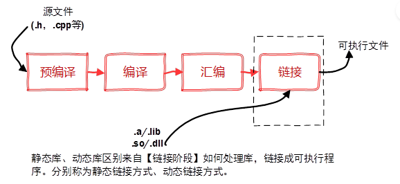
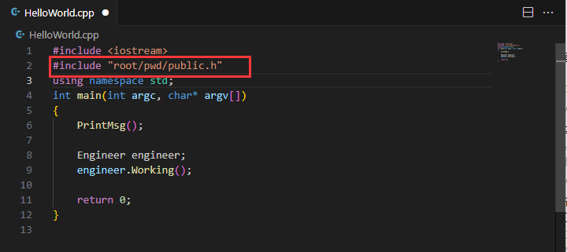
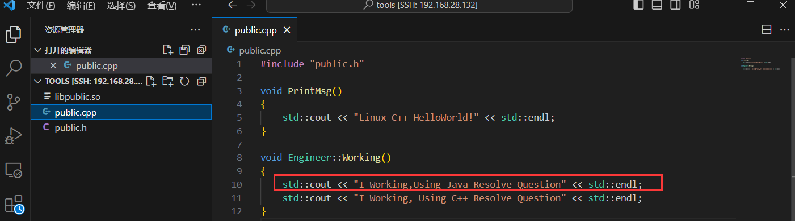
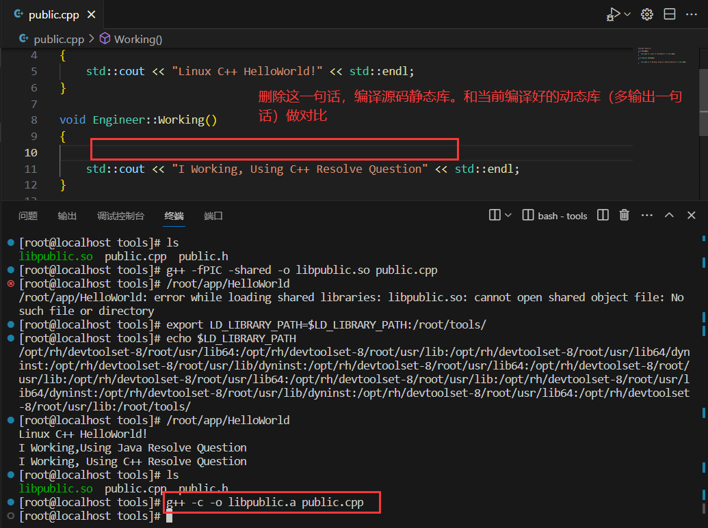

# 多文件编译

C++程序往往都是多`.cpp`文件组合编程，我们可以通过`g++` 来编译多个`.cpp` 文件。

编译语法：

```
g++ -o 源文件清单
```

```c
// public.h
#ifndef PUBLIC_H_INCLUDE
#define PUBLIC_H_INCLUDE
#include <iostream>
void PrintMsg();

class Engineer
{
public:
	void Working();

};

#endif // !PUBLIC_H_INCLUDE

```

```c
// public.cpp
#include "public.h"

void PrintMsg()
{
	std::cout << "Linux C++ HelloWorld!" << std::endl;
}

void Engineer::Working()
{
	std::cout << "I Working, Using C++ Resolve Question" << std::endl;
}

```

```c
//HelloWorld.cpp
#include <iostream>
#include "public.h"
using namespace std;
int main(int argc, char* argv[])
{
    PrintMsg();

    Engineer engineer;
    engineer.Working();

    return 0;
}

```

```shell
# 编译Hello.cpp public.cpp 成可执行文件HelloWorld
[root@localhost ~]# g++ -o HelloWorld HelloWorld.cpp public.cpp 
[root@localhost ~]# ./HelloWorld 
Linux C++ HelloWorld!
I Working, Using C++ Resolve Question
[root@localhost ~]# 
```


# 编译优化

如果你是一个`WINDOWS` 程序员，因为`VS` 的存在，很多优化工作都不再需要你做了，但如果在Linux平台，则编译优化取舍由你负责。

```
gcc/g++ [附加命令参数]  [目标文件名1] [目标文件名2]
```

附加命令参数：

```shell
-o 指定输出的文件名，这个名称不能和源文件同名。如果不给出这个选项，则生成可执行文件a.out。

-O[n]:编译、链接过程中进行优化处理，生成的可执行程序效率将更高。
	-O0： 不做任何优化，这是默认的编译选项。 
	-O1： 对程序做部分编译优化，对于大函数，优化编译占用稍微多的时间和相当大的内存。使用本项优化，编译器会尝试减小生成代码的尺寸，以及缩短执行时间，需要占用大量编译时间的优化。 
	-O2： 这是推荐的优化等级。与O1比较而言，O2优化增加了编译时间的基础上，提高了生成代码的执行效率。
	注意，如果使用了优化选项：1）编译的时间将更长；2）目标程序不可调试；3）有效果，但是不可能显著提升程序的性能。
```

```shell
# 分别执行三个不同的优化级别，对程序进行编译优化。
[root@localhost ~]# g++ -o HelloWorld HelloWorld.cpp public.cpp -O0
[root@localhost ~]# g++ -o HelloWorld_1 HelloWorld.cpp public.cpp -O1
[root@localhost ~]# g++ -o HelloWorld_2 HelloWorld.cpp public.cpp -O2
#查下结果，可以看到优化级别不同，最终比较直观看到生成的可执行文件大小不同
[root@localhost ~]# ll
总用量 22344
-rw-r--r--. 1 root root      254 12月 11 18:57 \
-rw-------. 1 root root     2789 12月 11 17:06 anaconda-ks.cfg
drwxr-xr-x. 5 root root      176 12月 11 23:57 compressOps
-rw-r--r--. 1 root root      270 12月 11 19:56 create_database.sql
-rw-r--r--. 1 root root        0 12月 11 17:34 DM
-rw-r--r--. 1 root root       20 12月 11 17:22 file
-rw-r--r--. 1 root root       24 12月 11 17:23 file2
-rw-r--r--. 1 root root       48 12月 11 19:35 happy.txt.gz
-rwxr-xr-x. 1 root root     9128 12月 14 05:50 HelloWorld
-rwxr-xr-x. 1 root root     9080 12月 14 05:51 HelloWorld_1
-rwxr-xr-x. 1 root root     9136 12月 14 05:51 HelloWorld_2
-rw-r--r--. 1 root root      192 12月 14 05:31 HelloWorld.cpp
-rw-r--r--. 1 root root        0 12月 11 19:53 hi.txt
-rw-r--r--. 1 root root       13 12月 11 19:40 log
-rw-r--r--. 1 root root       38 12月 11 19:35 merge
-rw-r--r--. 1 root root 22790924 12月 11 18:07 night.wav
-rw-------. 1 root root     2069 12月 11 17:06 original-ks.cfg
-rw-r--r--. 1 root root      202 12月 14 05:33 public.cpp
-rw-r--r--. 1 root root      182 12月 14 05:31 public.h
drwxr-xr-x. 3 root root       19 12月 11 20:21 work

```

总的来说，如果我们想调试程序，就最好还是不要使用G++的编译优化选项。默认直接采用默认优化选项就可以了。

# 动态库和静态库

在介绍动态库和静态库之前我们还是来回顾下，编译链接的过程。

**在Linux中，g++的编译可以分为一下四个步骤：**

- 预处理：在预处理阶段主要负责的是头文件的展开、去掉注释、宏替换、条件编译等。以#号开头的是预处理指令比如说，#define #if #include...... 此阶段执行完毕，产生【.i文件】

```c
g++ -E mytest.c -o test.i
```

- 编译： 此阶段完成语法和语义分析，然后生成中间代码，此中间代码是汇编代码，但是还不可执行，gcc编译的中间文件是[.s]文件。在此阶段会出现各种语法和语义错误，特别要小心未定义的行为，这往往是致命的错误。

```
gcc -S test.i -o test.s
```

- 链接：  此阶段完成文件中调用的各种函数跟静态库和动态库的连接，并将它们一起打包合并形成目标文件，即可执行文件。此阶段由链接器完成。

```c
gcc test.o -o test
```

从以上四个阶段来看，我们要使用自己制作的库或者别人的库，一定是汇编完后产生的.o文件，我们只需要对这个.o文件进行链接就可以了；



在Linux中，我们可以通过`ldd` 命令来查看可执行程序所依赖的库。此外对于某一个库程序，我们可以通过`file` 命令来查看器详细的信息。

```c
 ldd 可执行程序文件名 
 file 库
```

那么在开发中我们辨别它采用的是哪一种库呢？

- 在Linux中，以 .so 结尾的后缀，是动态库；以 .a 结尾的是静态库  

- 在Windows中，以 .dll 结尾的后缀，是动态库；以 .lib 结尾的是静态库  

注意，在Linux中，约定规则很重要，库文件名名字通常是`libxxx.so 和 libxxx.a`，然则库的真实名字：去掉lib前缀，去掉 .a 、.so后缀，剩下的才是库的名称，这点在对动态库和程序进行链接的时候，十分重要！


库其实就是一个二进制文件，想要使用库（给别人使用自己的制作的库或者使用别人的库）一定是由三个部分组成：库文件、头文件、文档说明；一般这个库文件就是函数的定义，头文件就是函数声明，我们只需要将这些打包好，别人使用我们头文件所给的接口就行。

制作静态库语法：

```shell
g++ -c -o 静态库名称[libxxx.a] 源文件清单
-xxx表示静态库名称
```

使用静态库规范语法：

```shell
 g++ -o 可执行文件名 源文件清单  -L 静态库所在目录  -l 静态库名称
```

之所以打包出来叫静态库，是因为程序在编译时会把库文件的二进制代码链接到目标程序中。所以我们把这种整合方式称为静态链接。如果多个程序中用到了同一静态库中的函数或类，就实际会存在多份拷贝。

静态库特点：

- 静态库的链接是在编译时期完成的，执行的时候代码加载速度快。
- 会导致编译出来的目标程序的可执行文件比较大，浪费空间。
- 程序的更新和发布不方便，如果某一个静态库更新了，所有使用它的程序都需要重新编译。

下面我们来动手，制作一个静态库，并和源文件进行整合链接。

```shell

[root@localhost ~]# mkdir tools app
[root@localhost ~]# cp public.h public.cpp ./tools/
[root@localhost ~]# cp HelloWorld.cpp ./a
anaconda-ks.cfg  app/             
[root@localhost ~]# cp HelloWorld.cpp ./app/
[root@localhost ~]# ls ./tools/
public.cpp  public.h
[root@localhost ~]# ls ./app/
HelloWorld.cpp
[root@localhost ~]# cd tools/
# 编译静态库
[root@localhost tools]# g++ -c -o libpublic.a public.cpp 
[root@localhost tools]# ls 
libpublic.a  public.cpp  public.h
[root@localhost tools]# pwd
/root/tools
[root@localhost tools]# 
```

修改`HelloWorld.cpp` 头文件指向，并将HelloWorld.cpp和静态库一起进行编译成可执行文件。

```shell
# 不改头文件直接编译会找不到public.h的头文件的
[root@localhost app]# g++ -o HelloWorld  HelloWorld.cpp /root/tools/libpublic.a 
HelloWorld.cpp:2:10: fatal error: public.h: No such file or directory
 #include "public.h"
          ^~~~~~~~~~
compilation terminated.
#静态库和cpp一起编译
[root@localhost app]# g++ -o HelloWorld  HelloWorld.cpp /root/tools/libpublic.a 
[root@localhost app]# ./HelloWorld 
Linux C++ HelloWorld!
I Working, Using C++ Resolve Question
[root@localhost app]# 
# 官方推荐的编译写法 
[root@localhost app]# g++ -o HelloWorld HelloWorld.cpp -L /root/tools -l public
[root@localhost app]# ./HelloWorld 
Linux C++ HelloWorld!
I Working, Using C++ Resolve Question
[root@localhost app]# 
```



了解了静态库和程序的整合之后，我们继续学习和动态库和程序的整合工作。

制作动态库语法：

```shell
 g++ -fPIC -shared -o  动态库[libxxx.so] 源文件清单
-xxx 表示动态库名称
-fPIC 作用是告知编译器 生成位置无关代码（编译产生的代码没有绝对位置，只有相对位置）；从而可以在任意地方调用生成的动态库。
-shared 目的是使源码编译成动态库 .so 文件
```

使用动态库语法：

```shell
 g++ -o 可执行文件名 源文件清单  -L 动态库所在目录  -l 动态库名称
 
 # 处理，cannot open shared object file: No such file or directory
 export LD_LIBRARY_PATH=$LD_LIBRARY_PATH:动态库所在目录
```

之所以打包出来叫动态库，是因为程序在编译时不会把库文件的二进制代码链接到目标程序中，而是在运行时候才被载入。如果多个进程中用到了同一动态库中的函数或类，那么在内存中只有一份，避免了空间浪费问题。

动态库特点：

- 程序在运行的过程中，需要用到动态库的时候才把动态库的二进制代码载入内存。
- 可以实现进程之间的代码共享，因此动态库也称为共享库。
- 程序升级比较简单，不需要重新编译程序，只需要更新动态库就行了。

```shell
# 制作动态库
[root@localhost tools]# ls
libpublic.a  public.cpp  public.h
[root@localhost tools]# rm -rf libpublic.a 
[root@localhost tools]# ls
public.cpp  public.h
[root@localhost tools]# g++ -fPIC -shared -o libpublic.so public.cpp 
[root@localhost tools]# ls
libpublic.so  public.cpp  public.h

# 把动态库 和程序一起编译，这种做法是把动态库当成了静态库来用，不符合规范不推荐。
[root@localhost tools]# cd ../app/
[root@localhost app]# g++ -o HelloWorld HelloWorld.cpp /root/tools/libpublic.so 
[root@localhost app]# ./HelloWorld 
Linux C++ HelloWorld!
I Working, Using C++ Resolve Question
[root@localhost app]# 

#采用规范写法来把动态库和程序做编译，运行会报错，不能加载共享库！解决方法：提前设置LD_LIBRARY_PATH环境变量
[root@localhost app]# rm -rf HelloWorld
[root@localhost app]# ls
HelloWorld.cpp
[root@localhost app]# g++ -o HelloWorld  HelloWorld.cpp -L /root/tools/ -l public
[root@localhost app]# ./HelloWorld 
./HelloWorld: error while loading shared libraries: libpublic.so: cannot open shared object file: No such file or directory
[root@localhost app]# 

# 设置LD_LIBRARY_PATH环境变量
[root@localhost app]# echo $LD_LIBRARY_PATH
/opt/rh/devtoolset-8/root/usr/lib64:/opt/rh/devtoolset-8/root/usr/lib:/opt/rh/devtoolset-8/root/usr/lib64/dyninst:/opt/rh/devtoolset-8/root/usr/lib/dyninst:/opt/rh/devtoolset-8/root/usr/lib64:/opt/rh/devtoolset-8/root/usr/lib:/opt/rh/devtoolset-8/root/usr/lib64:/opt/rh/devtoolset-8/root/usr/lib:/opt/rh/devtoolset-8/root/usr/lib64/dyninst:/opt/rh/devtoolset-8/root/usr/lib/dyninst:/opt/rh/devtoolset-8/root/usr/lib64:/opt/rh/devtoolset-8/root/usr/lib

#注意，在追击环境变量内容的时候， 等号前后不要加空格，不然会出现如下错误!
[root@localhost app]# export LD_LIBRARY_PATH = $LD_LIBRARY_PATH:/root/tools/
bash: export: `=': not a valid identifier
bash: export: `/opt/rh/devtoolset-8/root/usr/lib64:/opt/rh/devtoolset-8/root/usr/lib:/opt/rh/devtoolset-8/root/usr/lib64/dyninst:/opt/rh/devtoolset-8/root/usr/lib/dyninst:/opt/rh/devtoolset-8/root/usr/lib64:/opt/rh/devtoolset-8/root/usr/lib:/opt/rh/devtoolset-8/root/usr/lib64:/opt/rh/devtoolset-8/root/usr/lib:/opt/rh/devtoolset-8/root/usr/lib64/dyninst:/opt/rh/devtoolset-8/root/usr/lib/dyninst:/opt/rh/devtoolset-8/root/usr/lib64:/opt/rh/devtoolset-8/root/usr/lib:/root/tools/': not a valid identifier
[root@localhost app]# export LD_LIBRARY_PATH=$LD_LIBRARY_PATH:/root/tools/
[root@localhost app]# echo $LD_LIBRARY_PATH
/opt/rh/devtoolset-8/root/usr/lib64:/opt/rh/devtoolset-8/root/usr/lib:/opt/rh/devtoolset-8/root/usr/lib64/dyninst:/opt/rh/devtoolset-8/root/usr/lib/dyninst:/opt/rh/devtoolset-8/root/usr/lib64:/opt/rh/devtoolset-8/root/usr/lib:/opt/rh/devtoolset-8/root/usr/lib64:/opt/rh/devtoolset-8/root/usr/lib:/opt/rh/devtoolset-8/root/usr/lib64/dyninst:/opt/rh/devtoolset-8/root/usr/lib/dyninst:/opt/rh/devtoolset-8/root/usr/lib64:/opt/rh/devtoolset-8/root/usr/lib:/root/tools/
#再跑程序就可以了！
[root@localhost app]# ./HelloWorld 
Linux C++ HelloWorld!
I Working, Using C++ Resolve Question

#查可执行文件依赖的库（静态库、动态库）
[root@localhost app]# ldd HelloWorld
        linux-vdso.so.1 =>  (0x00007ffeba5c3000)
        libpublic.so => /root/tools/libpublic.so (0x00007f1f9a286000)
        libstdc++.so.6 => /lib64/libstdc++.so.6 (0x00007f1f99f7e000)
        libm.so.6 => /lib64/libm.so.6 (0x00007f1f99c7c000)
        libgcc_s.so.1 => /lib64/libgcc_s.so.1 (0x00007f1f99a66000)
        libc.so.6 => /lib64/libc.so.6 (0x00007f1f99698000)
        /lib64/ld-linux-x86-64.so.2 (0x00007f1f9a488000)
 #查库（动态库、静态库）信息：
[root@localhost app]# file /root/tools/libpublic.so 
/root/tools/libpublic.so: ELF 64-bit LSB shared object, x86-64, version 1 (SYSV), dynamically linked, BuildID[sha1]=205fa99414f8029a0afc10b614f927a016b89c21, not stripped
[root@localhost app]# 
```

修改动态库源文件的实现，再重新编译动态库，相比于静态库，不再需要再做一次链接工作。程序会自动的更新。



```shell
# 重新编译动态库，直接跑程序，可以看到程序输出内容更新了！
[root@localhost tools]# ls
libpublic.so  public.cpp  public.h
[root@localhost tools]# g++ -fPIC -shared -o libpublic.so public.cpp 
[root@localhost tools]# /root/app/HelloWorld 
/root/app/HelloWorld: error while loading shared libraries: libpublic.so: cannot open shared object file: No such file or directory
[root@localhost tools]# export LD_LIBRARY_PATH=$LD_LIBRARY_PATH:/root/tools/
[root@localhost tools]# echo $LD_LIBRARY_PATH
/opt/rh/devtoolset-8/root/usr/lib64:/opt/rh/devtoolset-8/root/usr/lib:/opt/rh/devtoolset-8/root/usr/lib64/dyninst:/opt/rh/devtoolset-8/root/usr/lib/dyninst:/opt/rh/devtoolset-8/root/usr/lib64:/opt/rh/devtoolset-8/root/usr/lib:/opt/rh/devtoolset-8/root/usr/lib64:/opt/rh/devtoolset-8/root/usr/lib:/opt/rh/devtoolset-8/root/usr/lib64/dyninst:/opt/rh/devtoolset-8/root/usr/lib/dyninst:/opt/rh/devtoolset-8/root/usr/lib64:/opt/rh/devtoolset-8/root/usr/lib:/root/tools/
[root@localhost tools]# /root/app/HelloWorld 
Linux C++ HelloWorld!
I Working,Using Java Resolve Question
I Working, Using C++ Resolve Question
[root@localhost tools]# 
```

如果说，动态库和静态库同时存在的话，编译器实际会优先使用动态库。下面我们来验证下这个优先级情况。



```shell
# 改了源码实现，并把源码编译成静态库
[root@localhost tools]# ls
libpublic.so  public.cpp  public.h
[root@localhost tools]# g++ -c -o libpublic.a public.cpp 
[root@localhost tools]# cd ../app/
[root@localhost app]# ls
HelloWorld  HelloWorld.cpp
[root@localhost app]# rm -rf HelloWorld
# 库名是什么的问题？ libpulic.a libpublic.so 库名都是 public 输错命令会报 : cannot find -llibpublic
[root@localhost app]# g++ -o HelloWorld HelloWorld.cpp -L /root/tools/ -l libpublic
/opt/rh/devtoolset-8/root/usr/libexec/gcc/x86_64-redhat-linux/8/ld: cannot find -llibpublic
collect2: error: ld returned 1 exit status
# 验证编译器是用的动态库还是静态库的选择
[root@localhost app]# g++ -o HelloWorld HelloWorld.cpp -L /root/tools/ -l public
[root@localhost app]# ./HelloWorld 
Linux C++ HelloWorld!
I Working,Using Java Resolve Question
I Working, Using C++ Resolve Question
[root@localhost app]# 
```

最后总结一下，如果动态库和静态库同时存在，编译器将优先使用动态库。并且建议使用动态库和程序整合的方式。