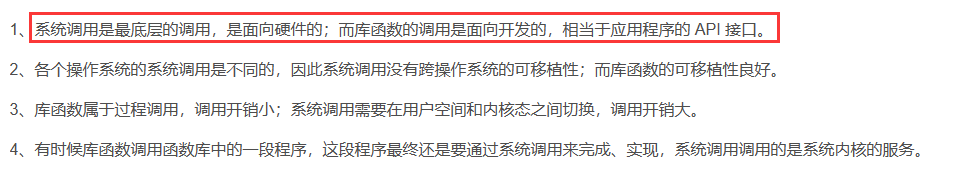

# Linux时间、目录、系统错误、目录文件基操 基础得会啊

# Linux的时间操作

UNIX操作系统根据计算机产生的年代把1970年1月1日作为UNIX的纪元时间，1970年1月1日是时间的中间点，将从1970年1月1日起经过的秒数用一个整数存放。

## time_t别名

time_t用于表示时间类型，它是一个long类型的别名，在`<time.h>`文件中定义，表示从1970年1月1日0时0分0秒到现在的秒数。

```c
typedef long time_t;
```

## time()库函数


time()库函数用于获取操作系统的当前时间。

包含头文件：`<time.h>`

声明：

```c
time_t time(time_t *tloc);
```

有两种调用方法：

```c
time_t now=time(0);    		// 将空地址传递给time()函数，并将time()返回值赋给变量now
```

或

```c
time_t now; time(&now);   // 将变量now的地址作为参数传递给time()函数。
```

## tm结构体

time_t是一个长整数，不符合人类的使用习惯，需要转换成tm结构体，tm结构体在`<time.h>`中声明。

如下

```c
struct tm
{
  int tm_year;	// 年份：其值等于实际年份减去1900
  int tm_mon;	// 月份：取值区间为[0,11]，其中0代表一月，11代表12月
  int tm_mday;	// 日期：一个月中的日期，取值区间为[1,31]
  int tm_hour; 	// 时：取值区间为[0,23]
  int tm_min;	// 分：取值区间为[0,59]
  int tm_sec;     	// 秒：取值区间为[0,59]
  int tm_wday;	// 星期：取值区间为[0,6]，其中0代表星期天，6代表星期六
  int tm_yday;	// 从每年的1月1日开始算起的天数：取值区间为[0,365] 
  int tm_isdst;   // 夏令时标识符，该字段意义不大
};
```

这个结构体可以很方便利用`sprinf_s` 组装成符合程序员所在国家的日期表示字符串，比如 `2022-10-01 15:30:25`   或者 `Oct 1,2022 15:30:25`

## localtime库函数

localtime()函数用于把time_t表示的时间转换为tm结构体表示的时间。

localtime()函数不是线程安全的，localtime_r()是线程安全的。

包含头文件：`<time.h>`

函数声明：

```c
struct tm *localtime(const time_t *timep);
struct tm *localtime_r(const time_t *timep, struct tm *result);
```

示例：

```c
#include <sys/types.h>
#include<sys/stat.h>
#include<fcntl.h>
#include<unistd.h>
#include<iostream>
#include <sys/ioctl.h>
#include<fcntl.h>
#include <time.h>      // 时间操作的头文件。
using namespace std;

int main()
{
  // 获取当前时间，存放在now中。
  time_t now=time(0);            
  cout << "now=" << now << endl;  // 显示当前时间，1970年1月1日到现在的秒数 =>专业点叫时间戳

// 把整数的时间转换成tm结构体。
  tm tmnow;
  localtime_r(&now,&tmnow);       

  // 根据tm结构体拼接成中国人习惯的字符串格式。
  string stime = to_string(tmnow.tm_year+1900)+"-"
               + to_string(tmnow.tm_mon+1)+"-"
               + to_string(tmnow.tm_mday)+" "
               + to_string(tmnow.tm_hour)+":"
               + to_string(tmnow.tm_min)+":"
               + to_string(tmnow.tm_sec);

  cout << "stime=" << stime << endl;
}
```

## mktime库函数

mktime()函数的功能与localtime()函数相反，用于把tm结构体时间转换为time_t时间。

包含头文件：`<time.h>`

函数声明：

```c
time_t mktime(struct tm *tm);
```

该函数主要用于时间的运算，比如：把2022-03-01 00:00:25加30分钟。


解决思路：这样可以绕开考虑闰年的问题~~~

- 1）解析字符串格式的时间，转换成tm结构体；

- 2）用mktime()函数把tm结构体转换成time_t时间；

- 3）把time_t时间加30*60秒；

- 4）用localtime_r()函数把time_t时间转换成tm结构体；

- 5）把tm结构体转换成字符串。

## gettimeofday()库函数

用于获取1970年1月1日到现在的秒和当前秒中已逝去的微秒数，可以用于程序的计时。

包含头文件：`<sys/time.h>`


函数声明：

```c
int gettimeofday(struct timeval *tv, struct timezone *tz);
```

```c
struct timeval 
{
  time_t      tv_sec;    	/* 1970-1-1到现在的秒数 */
  suseconds_t tv_usec;   	/* 当前秒中，已逝去的微秒数 */
}; 

struct timezone
{        			 /* 在实际开发中，派不上用场 */
  int tz_minuteswest;   	/* minutes west of Greenwich */ 
  int tz_dsttime;         	/* type of DST correction */
}; 
```

示例：

```c

#include<iostream>
#include <sys/time.h>  // gettimeofday()需要的头文件。
using namespace std;

int main()
{
  timeval start,end,tv;

    // 计时开始
  gettimeofday(&start, 0 ); 

   //呀呀呀，你的业务逻辑，for一波带走~~~~ 
  for (int ii=0;ii<1000000000;ii++)
    ;
  // 计时结束
  gettimeofday(&end, 0 );   


  // 计算消耗的时长。
  tv.tv_usec=end.tv_usec-start.tv_usec;
  tv.tv_sec=end.tv_sec-start.tv_sec;
  
  if (tv.tv_usec<0)
  {
    tv.tv_usec=1000000-tv.tv_usec;
    tv.tv_sec--;
  }

  cout << "耗时：" << tv.tv_sec << "秒和" << tv.tv_usec << "微秒。\n";
}
```

## 程序睡眠

如果需要把程序`挂起`一段时间，可以使用sleep()和usleep()两个库函数。

包含头文件：`<unistd.h>`

函数声明：

```c
unsigned int sleep(unsigned int seconds); //单位秒
int usleep(useconds_t usec); //单位微秒
```

# Linux的目录操作


## 几个简单的目录操作函数


**获取当前工作目录**

包含头文件：`<unistd.h>`

```c
char *getcwd(char *buf, size_t size); 
char *get_current_dir_name(void);
```

```c

#include <iostream>
#include <unistd.h>
using namespace std;

int main()
{
 // linux系统目录的最大长度是255。
  char path1[256];   
  getcwd(path1,256);
  cout << "path1=" << path1 << endl;

    //底层会动态分配内存，需要开发手动释放！
  char *path2 = get_current_dir_name();
  cout << "path2=" << path2 << endl;
  free(path2);   // 注意释放内存。 底层通过malloc()分配，所以用free()来释放。
}
```

**切换工作目录**

包含头文件：`<unistd.h>`

```c
int chdir(const char *path);
```

返回值：0-成功；其它-失败（目录不存在或没有权限）。


**创建目录**

包含头文件：`<sys/stat.h>`

```c
int mkdir(const char *pathname, mode_t mode);
```

pathname-目录名。

mode-访问权限，如0755，不要省略前置的0。


返回值：0-成功；其它-失败（上级目录不存在或没有权限），上级目录不存在的意思时你想创建`/tmp/aaa/bbb ` 那么前提是他的上级目录 `/tmp/aaa ` 必须存在！


**删除目录**

包含头文件：` <unistd.h>`

```c
int rmdir(const char *path);
```

path-目录名。

返回值：0-成功；其它-失败（目录不存在或没有权限）。

## 获取目录中文件的列表

文件存放在目录中，在处理文件之前，必须先知道目录中有哪些文件，所以要获取目录中文件的列表。


**包含头文件**

`#include <dirent.h>`


**相关的库函数**

- 第一步，用opendir()函数打开目录。

```c
DIR *opendir(const char *pathname);
```

成功-返回目录的地址，失败-返回空地址。


- 第二步，用readdir()函数循环的读取目录。

```c
struct dirent *readdir(DIR *dirp);
```

成功-返回struct dirent结构体的地址，失败-返回空地址。

- 第三步，用closedir()关闭目录。

```c
int closedir(DIR *dirp);
```


**数据结构**


目录指针：

DIR *目录指针变量名;


每次调用readdir()，函数返回struct dirent的地址，存放了本次读取到的内容。

```c
struct dirent
{
   long d_ino;     // inode number 索引节点号。
   off_t d_off;    // offset to this dirent 在目录文件中的偏移。
   unsigned short d_reclen;     		// length of this d_name 文件名长度。
   unsigned char d_type;         		// the type of d_name 文件类型。
   char d_name [NAME_MAX+1];    // file name文件名，最长255字符。
};
```

重点关注结构体的d_name和d_type成员。


d_name-文件名或目录名。

d_type-文件的类型，有多种取值，最重要的是8和4，8-常规文件（A regular file）；4-子目录（A directory），其它的暂时不关心。注意，d_name的数据类型是字符，不可直接显示。


示例：

```c

#include <iostream>
#include <dirent.h>
using namespace std;

int main(int argc,char *argv[])
{
  if (argc != 2) { cout << "Using ./demo 目录名\n"; return -1; }

  DIR *dir;   // 定义目录指针。
  struct dirent *stdinfo=nullptr;   // 用于存放从目录中读取到的内容。

  // 打开目录。
  if ( (dir=opendir(argv[1])) == nullptr ) return -1;

  //循环读取目录    
  while (1)
  {
    // 读取一项内容并显示出来。
    if ((stdinfo=readdir(dir)) == nullptr) break;

    cout << "文件名=" << stdinfo->d_name << "，文件类型=" << (int)stdinfo->d_type << endl;
  }

 // 关闭目录指针。
  closedir(dir);  
}
```


# Linux的系统错误

在C++程序中，如果调用了库函数，可以通过函数的返回值判断调用是否成功。

其实，还有一个整型的全局变量errno，存放了函数调用过程中产生的错误代码。

如果调用库函数失败，可以通过errno的值来查找原因，这也是调试程序的一个重要方法。

errno在`<errno.h>`中声明。

配合 strerror()和perror()两个库函数，可以查看出错的详细信息。

## strerror()库函数

strerror() 在`<string.h>`中声明，用于获取错误代码对应的详细信息。

```c
char *strerror(int errnum);                       	// 非线程安全。
int strerror_r(int errnum, char *buf, size_t buflen);		// 线程安全。
```

gcc8.3.1一共有133个错误代码。


示例一：

```c
#include <iostream>
#include <cstring>
using namespace std;
 
int main()
{
  // gcc8.3.1一共有133个错误代码。

  //我们可以跑一个循环，直接错误码 找 错误详情  
  int ii;
  for(ii=0;ii<150;ii++)		
  {
    cout << ii << ":" << strerror(ii) << endl; 
  }
}
```

示例二：

```c
#include <iostream>
#include <cstring>
#include <cerrno>
#include <sys/stat.h>
using namespace std;

int main()
{
  int iret=mkdir("/tmp/aaa",0755);

  cout << "iret=" << iret << endl;
  cout << errno << ":" << strerror(errno) << endl;
}
```

```
# 第一次跑，返回值为0，并且错误码为0，错误码含义表示成功！
[root@localhost my_learn_test]# ./demo
iret=0
0:Success
[root@localhost my_learn_test]# 

# 说明目录以及创建好了，这个时候再跑，因为该目录存在的原因，必然函数执行失败，看下结果！
# 返回值变成了-1，并且错误码变成了17，错误码含义为文件已存在
[root@localhost my_learn_test]# ./demo
iret=-1
17:File exists
[root@localhost my_learn_test]# 

#这时候，我去修改源码，再跑！
```

```c
#include <iostream>
#include <cstring>
#include <cerrno>
#include <sys/stat.h>
using namespace std;

int main()
{
  int iret=mkdir("/tmp/aaa/bb/cc/dd",0755); //创建的目录，上级目录不存在！

  cout << "iret=" << iret << endl;
  cout << errno << ":" << strerror(errno) << endl;
}
```

```c
//可知，函数执行失败返回值必然是-1，错误码这回又变成2了，含义为没有这样的文件和目录
[root@localhost my_learn_test]# g++ -o demo demo.cpp
[root@localhost my_learn_test]# ./demo 
iret=-1
2:No such file or directory
[root@localhost my_learn_test]# 
```

## perror()库函数

perror() 在<stdio.h>中声明，用于在控制台显示最近一次系统错误的详细信息，在实际开发中，服务程序在后台运行，通过控制台显示错误信息意义不大。（对调试程序略有帮助）

```c
void perror(const char *s); //就等价于在windows控制台(举例啊) linux的shell终端打印一行数据而已
```

## 注意事项


**调用库函数失败不一定会设置errno**


并不是全部的库函数在调用失败时都会设置errno的值，以man手册为准（一般来说，不属于系统调用的函数不会设置errno，属于系统调用的函数才会设置errno）。什么是系统调用？百度"库函数和系统调用的区别"。





**errno不能作为调用库函数失败的标志**


errno的值只有在库函数调用发生错误时才会被设置，当库函数调用成功时，errno的值不会被修改，不会主动的置为 0。


在实际开发中，判断函数执行是否成功还得靠函数的返回值，只有在返回值是失败的情况下，才需要关注errno的值。

```c
#include <iostream>
#include <cstring>
#include <cerrno>
#include <sys/stat.h>
using namespace std;

int main()
{
    int iret=mkdir("/tmp/aaa/bb/cc/dd",0755); 
    if(iret != 0)
    {
        //实际开发中，只有函数执行失败了，这个errno, strerror() perror() 才有使用的意义！
        cout << "iret=" << iret << endl;
        cout << errno << ":" << strerror(errno) << endl;
        perror("错误！调用mkdir()失败！须新建的目录路径 /tmp/aaa/bb/cc/dd");
    }
    
    iret=mkdir("/tmp/dd",0755);
  	if (ireet!=0)
   {
    	cout << "iret=" << iret << endl;
    	cout << errno << ":" << strerror(errno) << endl;
    	perror("调用mkdir(/tmp/dd)失败");
  	}

}
```


# 目录和文件的更多操作

## access()库函数

access()函数用于判断当前用户对目录或文件的存取权限。

包含头文件：`#include <unistd.h>`

函数声明：

```c
int access(const char *pathname, int mode);
```

参数说明：

- pathname	目录或文件名。
- mode 	需要判断的存取权限。在头文件`<unistd.h>`中的预定义如下：
  - \#define R_OK 4 // 判断是否有读权限。
  - \#define W_OK	2 // 判断是否有写权限。
  - \#define X_OK 1 // 判断是否有执行权限。
  - \#define F_OK 0 	// 判断是否存在。

返回值：

当pathname满足mode权限返回0，不满足返回-1，errno被设置。

在实际开发中，access()函数主要用于判断目录或文件是否存在。


## stat()库函数


**stat结构体**

struct stat结构体用于存放目录或文件的详细信息，如下：

```c
struct stat
{
  dev_t st_dev;   	// 文件的设备编号。
  ino_t st_ino;   		// 文件的i-node。
  mode_t st_mode; 	// 文件的类型和存取的权限。
  nlink_t st_nlink;   	// 连到该文件的硬连接数目，刚建立的文件值为1。
  uid_t st_uid;   		// 文件所有者的用户识别码。
  gid_t st_gid;   		// 文件所有者的组识别码。
  dev_t st_rdev;  	// 若此文件为设备文件，则为其设备编号。
  off_t st_size;  		// 文件的大小，以字节计算。
  size_t st_blksize;	// I/O 文件系统的I/O 缓冲区大小。
  size_t st_blocks;  	// 占用文件区块的个数。
  time_t st_atime;  	// 文件最近一次被存取或被执行的时间，
 					// 在用mknod、 utime、read、write 与tructate 时改变。
  time_t st_mtime;  	// 文件最后一次被修改的时间，
					// 在用mknod、 utime 和write 时才会改变。
  time_t st_ctime;  	// 最近一次被更改的时间，在文件所有者、组、 权限被更改时更新。
};
```

struct stat结构体的成员变量比较多，重点关注st_mode、st_size和st_mtime成员。注意：st_mtime是一个整数表示的时间，需要程序员自己写代码转换格式。


st_mode成员的取值很多，用以下两个宏来判断：

- S_ISREG(st_mode) // 是否为普通文件，如果是，返回真。 
- S_ISDIR(st_mode) // 是否为目录，如果是，返回真。


**stat()库函数**


包含头文件：`#include <sys/stat.h>`

函数声明：

```c
int stat(const char *path, struct stat *buf);
```

stat()函数获取path参数指定目录或文件的详细信息，保存到buf结构体中。

返回值：0-成功，-1-失败，errno被设置。


示例：

```c
#include<stdio.h>
#include<iostream>
#include<cstdio>
#include<sys/stat.h>
#include<unistd.h>
#include<cstring>
using namespace std;

int main(int argc,char *argv[])
{
  if (argc != 2)  { cout << "Using:./demo 文件或目录名\n"; return -1; }

  struct stat st;  // 存放目录或文件详细信息的结构体。

  // 获取目录或文件的详细信息
  if (stat(argv[1],&st) != 0)
  {
    cout << "stat(" << argv[1] << "):" << strerror(errno) << endl; return -1;
  }

  if (S_ISREG(st.st_mode))
    cout << argv[1] << "是一个文件(" << "mtime=" << st.st_mtime << ",size=" << st.st_size << ")\n";
  if (S_ISDIR(st.st_mode))
    cout << argv[1] << "是一个目录(" << "mtime=" << st.st_mtime << ",size=" << st.st_size << ")\n";
}
```

```c
[root@localhost my_learn_test]# g++ -o demo demo.cpp
[root@localhost my_learn_test]# ./demo demo.cpp
demo.cpp是一个文件(mtime=1709375956,size=867)
```

## utime()库函数

utime()函数用于修改目录或文件的时间。

包含头文件：

`#include <sys/types.h>`

`#include <utime.h>`


函数声明：

```c
int utime(const char *filename, const struct utimbuf *times);
```

utime()函数用来修改参数filename的st_atime和st_mtime。如果参数times为空地址，则设置为当前时间。结构utimbuf 声明如下：

```c
struct utimbuf
{
  time_t actime;
  time_t modtime;
};
```

返回值：0-成功，-1-失败，errno被设置。


## rename()库函数

rename()函数用于重命名目录或文件，相当于操作系统的mv命令。

包含头文件：`#include <stdio.h>`

函数声明：

```c
int rename(const char *oldpath, const char *newpath);
```

参数说明：

oldpath 原目录或文件名。

newpath 目标目录或文件名。

返回值：0-成功，-1-失败，errno被设置。

## remove()库函数


remove()函数用于删除目录或文件，相当于操作系统的rm命令。

包含头文件：`#include <stdio.h>`

函数声明：

```c
int remove(const char *pathname);
```

参数说明：

pathname 待删除的目录或文件名。

返回值：0-成功，-1-失败，errno被设置。

