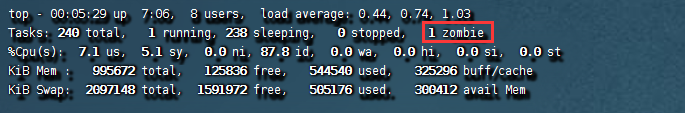
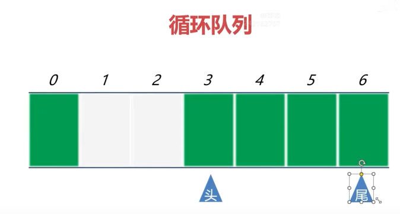
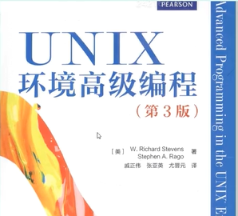

剑指进程和进程控制

# Linux的信号

## 信号的基本概念 

信号（signal）是软件中断，是进程之间相互传递消息的一种方法，用于通知进程发生了事件，但是，不能给进程传递任何数据。

信号产生的原因有很多，在Shell中，可以用kill和killall命令发送信号：

```cpp
kill -信号的类型 进程编号
killall -信号的类型 进程名
```

写一个demo程序，在窗口1编译运行。

```cpp
//demo.cpp
#include <unistd.h>
#include <iostream>
using namespace std;
int main()
{
    while (true)
    {
        cout << "执行了一次任务 \n";
        sleep(1);
    }
    
}
```

```shell
连接主机...
连接主机成功
Last login: Thu Dec 14 06:46:09 2023 from 192.168.28.1
[root@localhost ~]# cd /root/project/demo/my_learn_test
[root@localhost my_learn_test]# g++ -o demo demo.cpp
[root@localhost my_learn_test]# ./demo 
执行了一次任务 
执行了一次任务 
执行了一次任务 
执行了一次任务 
执行了一次任务 
执行了一次任务 
执行了一次任务 
执行了一次任务 
执行了一次任务 
执行了一次任务 
执行了一次任务 
执行了一次任务 
执行了一次任务 
执行了一次任务 
执行了一次任务 
执行了一次任务 
执行了一次任务 
执行了一次任务 
执行了一次任务 
执行了一次任务 
执行了一次任务 
执行了一次任务 
执行了一次任务 
执行了一次任务 
执行了一次任务 
执行了一次任务 
执行了一次任务 
执行了一次任务 
执行了一次任务 
执行了一次任务 
执行了一次任务 
已终止
[root@localhost my_learn_test]# ./demo 
执行了一次任务 
执行了一次任务 
执行了一次任务 
执行了一次任务 
执行了一次任务 
执行了一次任务 
执行了一次任务 
执行了一次任务 
执行了一次任务 
执行了一次任务 
执行了一次任务 
执行了一次任务 
执行了一次任务 
执行了一次任务 
已终止
[root@localhost my_learn_test]# ./demo 
执行了一次任务 
执行了一次任务 
执行了一次任务 
执行了一次任务 
执行了一次任务 
执行了一次任务 
执行了一次任务 
挂起
[root@localhost my_learn_test]# ./demo 
执行了一次任务 
执行了一次任务 
执行了一次任务 
执行了一次任务 
执行了一次任务 
执行了一次任务 
执行了一次任务 
浮点数例外(吐核)
[root@localhost my_learn_test]# 

```

在另外一个窗口2执行killall命令，可以看到进程被终止运行。实际上是我们通过信号来让程序退出的。-15 是 killall 命令的缺省参数，同样上述操作，也可以杀死进程。

还可以发送其他信号，比如说发送1的信息，可以让进程挂起。再来发送8的信息，看看效果。

```shell
连接主机...
连接主机成功
Last login: Fri Mar  8 19:33:38 2024 from 192.168.28.1
[root@localhost ~]# cd /root/project/demo/my_learn_test
[root@localhost my_learn_test]# killall demo
[root@localhost my_learn_test]# killall -15 demo
[root@localhost my_learn_test]# killall -1 demo
[root@localhost my_learn_test]# killall -8 demo
[root@localhost my_learn_test]# 

```


## 信号的类型 

信号名和信号值这两个一个东西，你用值也行，用他的宏定义也ok.加粗重点关注。

|  信号名   | 信号值 | 默认处理动作 |                  发出信号的原因                   |
| :-------: | :----: | :----------: | :-----------------------------------------------: |
|  SIGHUP   |   1    |      A       |             终端挂起或者控制进程终止              |
| `SIGINT`  |  `2`   |     `A`      |                 `键盘中断Ctrl+c`                  |
|  SIGQUIT  |   3    |      C       |                键盘的退出键被按下                 |
|  SIGILL   |   4    |      C       |                     非法指令                      |
|  SIGABRT  |   6    |      C       |             由abort(3)发出的退出指令              |
|  SIGFPE   |   8    |      C       |                     浮点异常                      |
| `SIGKILL` |  `9`   |    `AEF`     |       `采用 kill -9 进程编号 强制杀死进程`        |
| `SIGSEGV` |  `11`  |    `CEF`     | `无效的内存引用 （数组越界、操作空指针和野指针）` |
|  SIGPIPE  |   13   |      A       |        管道破裂，写一个没有读端口的管道。         |
| `SIGALRM` |   14   |      A       |          `由闹钟alarm()函数 发出的信号`           |
| `SIGTERM` |  `15`  |     `A`      |  `采用 kill 进程编号 或 killall 程序名 通知程序`  |
|  SIGUSR1  |   10   |      A       |                  用户自定义信号1                  |
|  SIGUSR2  |   12   |      A       |                  用户自定义信号2                  |
| `SIGCHLD` |  `17`  |     `B`      |                 `子进程结束信号`                  |
|  SIGCONT  |   18   |              |            进程继续（曾被停止的进程）             |
|  SIGSTOP  |   19   |     DEF      |                     终止进程                      |
|  SIGTSTP  |   20   |      D       |            控制终端（tty）上按下停止键            |
|  SIGTTIN  |   21   |      D       |             后台进程企图从控制终端读              |
|  SIGTTOU  |   22   |      D       |             后台进程企图从控制终端写              |
|   其它    |  <=64  |      A       |                    自定义信号                     |

处理动作一项中的字母含义如下：

- A 缺省的动作是终止进程。
- B 缺省的动作是忽略此信号，将该信号丢弃，不做处理。
- C 缺省的动作是终止进程并进行内核映像转储（core dump）。
- D 缺省的动作是停止进程，进入停止状态的程序还能重新继续，一般是在调试的过程中。
- E 信号不能被捕获。
- F 信号不能被忽略。

```c++
#include <unistd.h>
#include <iostream>
#include <signal.h>
using namespace std;

void func(int signum)
{
    cout << "收到了信号:" << signum << endl; 

}
int main()
{
   //对信号进行捕获
    signal(1,func);
    signal(15,func);
    signal(9,func);  //试图捕获9的信号

    //对信号进行忽略
    signal(2,SIG_IGN);

    while (true)
    {

        cout << "执行了一次任务 \n";
        sleep(1);
    }
    
}
```

```shell
[root@localhost my_learn_test]# g++ -o demo demo.cpp
[root@localhost my_learn_test]# ./demo
执行了一次任务 
执行了一次任务 
执行了一次任务 
执行了一次任务 
执行了一次任务 
执行了一次任务 
执行了一次任务 
收到了信号:1
执行了一次任务 
执行了一次任务 
执行了一次任务 
执行了一次任务 
执行了一次任务 
执行了一次任务 
执行了一次任务 
执行了一次任务 
执行了一次任务 
执行了一次任务 
执行了一次任务 
已杀死
[root@localhost my_learn_test]# 

```

```shell
[root@localhost my_learn_test]# killall -1 demo
[root@localhost my_learn_test]# killall -9 demo
[root@localhost my_learn_test]# 

```

可以看到，信号9，根本就不能捕获处理得到。

```cpp
#include <unistd.h>
#include <iostream>
#include <signal.h>
using namespace std;

void func(int signum)
{
    cout << "收到了信号:" << signum << endl; 

}
int main()
{
   //对信号进行捕获
    signal(1,func);
    signal(15,func);
    signal(9,func);  //试图捕获9的信号

    //对信号进行忽略
    signal(2,SIG_IGN);
    signal(9,SIG_IGN); //试图忽略9的信号

    while (true)
    {

        cout << "执行了一次任务 \n";
        sleep(1);
    }
    
}
```

```shell
[root@localhost my_learn_test]# g++ -o demo demo.cpp
[root@localhost my_learn_test]# ./demo
执行了一次任务 
执行了一次任务 
执行了一次任务 
执行了一次任务 
执行了一次任务 
执行了一次任务 
执行了一次任务 
执行了一次任务 
执行了一次任务 
执行了一次任务 
执行了一次任务 
执行了一次任务 
执行了一次任务 
执行了一次任务 
执行了一次任务 
执行了一次任务 
执行了一次任务 
执行了一次任务 
执行了一次任务 
执行了一次任务 
执行了一次任务 
执行了一次任务 
已杀死
[root@localhost my_learn_test]# 

```

```shell
[root@localhost my_learn_test]# killall -2 demo
[root@localhost my_learn_test]# killall -9 demo
[root@localhost my_learn_test]# 

```

可以看到9的信号，也不能被忽略。

```cpp
#include <unistd.h>
#include <iostream>
#include <signal.h>
using namespace std;

void func(int signum)
{
    cout << "收到了信号:" << signum << endl; 

}
int main()
{
   //对信号进行捕获
    signal(1,func);
    signal(15,func);
    signal(9,func);  //试图捕获9的信号

    //对信号进行忽略
    signal(2,SIG_IGN);
    signal(9,SIG_IGN); //试图忽略9的信号


    alarm(5); //闹钟（定时器），5秒后将向本程序发送14的信号

    while (true)
    {

        cout << "执行了一次任务 \n";
        sleep(1);
    }
}
```

```shell
[root@localhost my_learn_test]# g++ -o demo demo.cpp
[root@localhost my_learn_test]# ./demo
执行了一次任务 
执行了一次任务 
执行了一次任务 
执行了一次任务 
执行了一次任务 
闹钟
[root@localhost my_learn_test]# 

```

可以看到过了5秒，闹钟响了，程序退出。

```cpp
#include <unistd.h>
#include <iostream>
#include <signal.h>
using namespace std;

void func(int signum)
{
    cout << "收到了信号:" << signum << endl; 
}
void func1(int signum)
{
    cout << "闹钟响了，执行定时任务.\n";
    alarm(5);
}
int main()
{
   //对信号进行捕获
    signal(1,func);
    signal(15,func);
    signal(9,func);  //试图捕获9的信号

    //对信号进行忽略
    signal(2,SIG_IGN);
    signal(9,SIG_IGN); //试图忽略9的信号


    alarm(5); //闹钟（定时器），5秒后将向本程序发送14的信号
    signal(14,func1);//设置定时任务函数

    while (true)
    {

        cout << "执行了一次任务 \n";
        sleep(1);
    }
    
}
```

```shell
[root@localhost my_learn_test]# g++ -o demo demo.cpp
[root@localhost my_learn_test]# ./demo
执行了一次任务 
执行了一次任务 
执行了一次任务 
执行了一次任务 
执行了一次任务 
闹钟响了，执行定时任务.
执行了一次任务 
执行了一次任务 
执行了一次任务 
执行了一次任务 
执行了一次任务 
闹钟响了，执行定时任务.
执行了一次任务 
执行了一次任务 
执行了一次任务 
执行了一次任务 
已杀死
[root@localhost my_learn_test]# 

```

```shell
[root@localhost my_learn_test]# killall -9 demo
```

可以看到闹钟，每5秒响一次，走定时任务处理函数。

```cpp
#include <unistd.h>
#include <iostream>
#include <signal.h>
using namespace std;

void func(int signum)
{
    cout << "收到了信号:" << signum << endl; 
}
void func1(int signum)
{
    cout << "闹钟响了，执行定时任务.\n";
    //alarm(5); 没有这行，则闹钟只响1次
}
int main()
{
   //对信号进行捕获
    signal(1,func);
    signal(15,func);
    signal(9,func);  //试图捕获9的信号

    //对信号进行忽略
    signal(2,SIG_IGN);
    signal(9,SIG_IGN); //试图忽略9的信号


    alarm(5); //闹钟（定时器），5秒后将向本程序发送14的信号
    signal(14,func1);//设置定时任务函数

    while (true)
    {

        cout << "执行了一次任务 \n";
        sleep(1);
    }
    
}
```


## 信号的处理

进程对信号的处理方法有三种：

- 对该信号的处理采用系统的默认操作，大部分的信号的默认操作是终止进程。
- 设置信号的处理函数，收到信号后，由该函数来处理。
- 忽略某个信号，对该信号不做任何处理，就像未发生过一样。

signal()函数可以设置程序对信号的处理方式。

函数声明：

```c
sighandler_t signal(int signum, sighandler_t handler);
```

参数signum表示信号的编号（信号的值）。

参数handler表示信号的处理方式，有三种情况：

- SIG_DFL：恢复参数signum信号的处理方法为默认行为。 
- 一个自定义的处理信号的函数，函数的形参是信号的编号。
- SIG_IGN：忽略参数signum所指的信号。


```cpp
#include <unistd.h>
#include <iostream>
#include <signal.h>
using namespace std;

//自定义信号处理函数
void func(int signum)
{
    cout << "收到了信号:" << signum << endl; 
}
int main()
{
    //进程收到1 Or 15的信号，即刻执行func回调
    signal(1,func);
    signal(15,func);

    while (true)
    {

        cout << "执行了一次任务 \n";
        sleep(1);
    }
    
}
```

```shell
[root@localhost my_learn_test]# g++ -o demo demo.cpp
[root@localhost my_learn_test]# ./demo
执行了一次任务 
执行了一次任务 
执行了一次任务 
执行了一次任务 
执行了一次任务 
执行了一次任务 
执行了一次任务 
执行了一次任务 
执行了一次任务 
执行了一次任务 
执行了一次任务 
执行了一次任务 
执行了一次任务 
收到了信号:15
执行了一次任务 
执行了一次任务 
执行了一次任务 
执行了一次任务 
执行了一次任务 
执行了一次任务 
执行了一次任务 
执行了一次任务 
执行了一次任务 
执行了一次任务 
执行了一次任务 
执行了一次任务 
执行了一次任务 
执行了一次任务 
执行了一次任务 
收到了信号:1
执行了一次任务 
执行了一次任务 
执行了一次任务 
执行了一次任务 
执行了一次任务 
执行了一次任务 
执行了一次任务 
执行了一次任务 
执行了一次任务 
执行了一次任务 

[root@localhost my_learn_test]# 

```

```shell
[root@localhost my_learn_test]# killall -15 demo
[root@localhost my_learn_test]# killall -1 demo
[root@localhost my_learn_test]# killall -2 demo
[root@localhost my_learn_test]# 
```

可以看到，15，1信号，被我们自定义的信号处理函数处理了，没用指定`signal`,则信号走默认的处理回调。大部分的信号的默认处理回调都是杀死进程。


```cpp
#include <unistd.h>
#include <iostream>
#include <signal.h>
using namespace std;

//自定义信号处理函数
void func(int signum)
{
    cout << "收到了信号:" << signum << endl; 
}
int main()
{
    //进程收到1 Or 15的信号，即刻执行func回调
    signal(1,func);
    signal(15,func);

    //忽略2的信号，不做任何回应处理
    signal(2,SIG_IGN);

    while (true)
    {

        cout << "执行了一次任务 \n";
        sleep(1);
    }
    
}
```

```shell
[root@localhost my_learn_test]# g++ -o demo demo.cpp
[root@localhost my_learn_test]# ./demo
执行了一次任务 
执行了一次任务 
执行了一次任务 
执行了一次任务 
执行了一次任务 
执行了一次任务 
执行了一次任务 
执行了一次任务 
执行了一次任务 
执行了一次任务 
执行了一次任务 
执行了一次任务 
执行了一次任务 
执行了一次任务 
执行了一次任务 
执行了一次任务 
执行了一次任务 
执行了一次任务 
执行了一次任务 
执行了一次任务 
执行了一次任务 
执行了一次任务 
执行了一次任务 
执行了一次任务 
执行了一次任务 
执行了一次任务 
退出(吐核)
[root@localhost my_learn_test]#  

```

```shell
[root@localhost my_learn_test]# killall -2 demo
[root@localhost my_learn_test]# killall -3 demo
[root@localhost my_learn_test]# 
```

可以，其不受理2的信号了。再发送3的信号，直接进程退出。终止运行！

```cpp
#include <unistd.h>
#include <iostream>
#include <signal.h>
using namespace std;

//自定义信号处理函数
void func(int signum)
{
    cout << "收到了信号:" << signum << endl; 

    //恢复信号的处理回调函数 为系统默认，即走系统默认的处理逻辑
    signal(signum,SIG_DFL);
}
int main()
{
    //进程收到1 Or 15的信号，即刻执行func回调
    signal(1,func);
    signal(15,func);

    //忽略2的信号，不做任何回应处理
    signal(2,SIG_IGN);

    while (true)
    {

        cout << "执行了一次任务 \n";
        sleep(1);
    }
    
}
```

```shell
#include <unistd.h>
#include <iostream>
#include <signal.h>
using namespace std;

//自定义信号处理函数
void func(int signum)
{
    cout << "收到了信号:" << signum << endl; 

    //恢复信号的处理回调函数 为系统默认，即走系统默认的处理逻辑，将在下一次时生效
    signal(signum,SIG_DFL);
}
int main()
{
    //进程收到1 Or 15的信号，即刻执行func回调
    signal(1,func);
    signal(15,func);

    //忽略2的信号，不做任何回应处理
    signal(2,SIG_IGN);

    while (true)
    {

        cout << "执行了一次任务 \n";
        sleep(1);
    }
    
}
```

```shell
[root@localhost my_learn_test]# g++ -o demo demo.cpp
[root@localhost my_learn_test]# ./demo
执行了一次任务 
执行了一次任务 
执行了一次任务 
执行了一次任务 
执行了一次任务 
执行了一次任务 
执行了一次任务 
收到了信号:1
执行了一次任务 
执行了一次任务 
执行了一次任务 
执行了一次任务 
执行了一次任务 
执行了一次任务 
执行了一次任务 
执行了一次任务 
执行了一次任务 
挂起
[root@localhost my_learn_test]# 

```

```shell
[root@localhost my_learn_test]# killall -1 demo
[root@localhost my_learn_test]# killall -1 demo
[root@localhost my_learn_test]# 
```

第一次收到了1的信号，走我们的自定义回调func进行处理，内部将信号1的处理方法恢复为默认行为，再发送一次1的信号，可以看到新程挂起了。


## 信号有什么用

服务程序运行在后台，如果想让中止它，杀掉不是个好办法，因为进程被杀的时候，是突然死亡，没有安排善后工作。


如果向服务程序发送一个信号，服务程序收到信号后，调用一个函数，在函数中编写善后的代码，程序就可以有计划的退出。


如果向服务程序发送0的信号，可以检测程序是否存活。


## 信号应用示例 

```cpp
#include <iostream>
#include <unistd.h>
#include <signal.h>
using namespace std;

void EXIT(int sig)
{
  cout << "收到了信号：" << sig << endl;
  cout << "正在释放资源，程序将退出......\n";

  // 以下是释放资源的代码。

  cout << "程序退出。\n";
  exit(0);  // 进程退出。
}

int main(int argc,char *argv[])
{
  // 忽略全部的信号，防止程序被信号异常中止。
  for (int ii=1;ii<=64;ii++) 
  {
    signal(ii,SIG_IGN);
  }

  // 如果收到2和15的信号（Ctrl+c和kill、killall），本程序将主动退出。
  signal(2,EXIT); 
  signal(15,EXIT);

  while (true)
  {
    cout << "执行了一次任务。\n";
    sleep(1);
  }
}
```

```shell
[root@localhost my_learn_test]# g++ -o demo demo.cpp
[root@localhost my_learn_test]# ./demo
执行了一次任务。
执行了一次任务。
执行了一次任务。
执行了一次任务。
^C收到了信号：2
正在释放资源，程序将退出......
程序退出。
[root@localhost my_learn_test]# 
```

```shell
[root@localhost my_learn_test]# ./demo
执行了一次任务。
执行了一次任务。
执行了一次任务。
执行了一次任务。
执行了一次任务。
执行了一次任务。
执行了一次任务。
执行了一次任务。
执行了一次任务。
执行了一次任务。
执行了一次任务。
执行了一次任务。
收到了信号：15
正在释放资源，程序将退出......
程序退出。
[root@localhost my_learn_test]# 

```

```shell
[root@localhost my_learn_test]# killall -15  demo
[root@localhost my_learn_test]# 

```

可以看到，我们现在可以终止一个进程退出时，做一些资源释放的工作了。

```shell
[root@localhost my_learn_test]# killall -0 demo
demo: no process found
[root@localhost my_learn_test]# killall -0 demo

```

```shell
[root@localhost my_learn_test]# ps -ef|grep demo
root      60744   5571  0 20:22 pts/3    00:00:00 grep --color=auto demo
[root@localhost my_learn_test]# ./demo
执行了一次任务。
执行了一次任务。
执行了一次任务。
执行了一次任务。
执行了一次任务。
执行了一次任务。
执行了一次任务。
```

可以看到进程没有启动，则会返回`demo: no process found` 如果进程启动正在运行，则啥也不返回。

## 发送信号

Linux操作系统提供了kill和killall命令向进程发送信号，在程序中，可以用kill()函数向其它进程发送信号。


函数声明：

```cpp
int kill(pid_t pid, int sig);
```

kill()函数将参数sig指定的信号给参数pid 指定的进程。

参数pid 有几种情况：

- pid>0 将信号传给进程号为pid 的进程。
- pid=0 将信号传给和当前进程相同进程组的所有进程，常用于父进程给子进程发送信号，注意，发送信号者进程也会收到自己发出的信号。
- pid=-1 将信号广播传送给系统内所有的进程，例如系统关机时，会向所有的登录窗口广播关机信息。


sig：准备发送的信号代码，假如其值为0则没有任何信号送出，但是系统会执行错误检查，通常会利用sig值为零来检验某个进程是否仍在运行。


返回值说明： 成功执行时，返回0；失败返回-1，errno被设置。


# 进程终止

有8种方式可以中止进程，其中5种为正常终止，它们是：

- 在main()函数用return返回；
- 在任意函数中调用exit()函数；
- 在任意函数中调用`_exit()`或`_Exit()`函数；
- 最后一个线程从其启动例程（线程主函数）用return返回；
- 在最后一个线程中调用pthread_exit()返回；

异常终止有3种方式，它们是：

- 调用abort()函数中止；
- 接收到一个信号；
- 最后一个线程对取消请求做出响应。

```cpp
#include <iostream>
#include <unistd.h>
#include <signal.h>
using namespace std;

void func2()
{
    cout << "调用了func2().\n";
    exit(0); 
}
void func1()
{
  cout << "调用了func1()。\n";
  func2();
  cout << "回到了func1()函数.\n";
}

int main(int argc,char *argv[])
{

  func1(); 
  cout << "回到了main函数。\n";
}
```

```shell
[root@localhost my_learn_test]# g++ -o demo demo.cpp
[root@localhost my_learn_test]# ./demo
调用了func1()。
调用了func2().
[root@localhost my_learn_test]# 
```

使用函数直接终止，不会回到func1()和main()中了，直接线程退出。

```cpp
#include <iostream>
#include <unistd.h>
#include <signal.h>
using namespace std;

void func2()
{
    cout << "调用了func2().\n";
    //exit(0);
    return; 
}
void func1()
{
  cout << "调用了func1()。\n";
  func2();
  cout << "回到了func1()函数.\n";
}

int main(int argc,char *argv[])
{

  func1(); 
  cout << "回到了main函数。\n";
}
```

```shell
[root@localhost my_learn_test]# g++ -o demo demo.cpp
[root@localhost my_learn_test]# ./demo
调用了func1()。
调用了func2().
回到了func1()函数.
回到了main函数。
[root@localhost my_learn_test]# 

```

return，直接返回当前函数级，不会像exit()函数一样直接终止线程。


## 进程终止的状态


在main()函数中，return的返回值即终止状态，如果没有return语句或调用exit()，那么该进程的终止状态是0。

在Shell中，查看进程终止的状态：echo $?


正常终止进程的3个函数（`exit()`和`_Exit()`是由ISO C说明的，`_exit()`是由POSIX说明的）。

```cpp
void exit(int status);
void _exit(int status);
void _Exit(int status);
```

status也是进程终止的状态。

如果进程被异常终止，终止状态为非0。  实际开发中，进程终止状态获取会用在服务程序的调度、日志和监控。

```c++
#include <iostream>
#include <unistd.h>
#include <signal.h>
using namespace std;

void func2()
{
    cout << "调用了func2().\n";
    //exit(0);
    return; 
}
void func1()
{
  cout << "调用了func1()。\n";
  func2();
  cout << "回到了func1()函数.\n";
}

int main(int argc,char *argv[])
{

  //func1(); 
  //cout << "回到了main函数。\n";
}
```


```c++
#include <iostream>
#include <unistd.h>
#include <signal.h>
using namespace std;

void func2()
{
    cout << "调用了func2().\n";
    //exit(0);
    return; 
}
void func1()
{
  cout << "调用了func1()。\n";
  func2();
  cout << "回到了func1()函数.\n";
}

int main(int argc,char *argv[])
{

  //func1(); 
  //cout << "回到了main函数。\n";
}
```

```shell
[root@localhost my_learn_test]# g++ -o demo demo.cpp
[root@localhost my_learn_test]# ./demo
[root@localhost my_learn_test]# echo $?
0
[root@localhost my_learn_test]# g++ -o demo demo.cpp
[root@localhost my_learn_test]# ./demo
[root@localhost my_learn_test]# echo $?
1
[root@localhost my_learn_test]# 

```

我们可以通过shell终端，来查看进程终止的状态。

```c++
#include <iostream>
#include <unistd.h>
#include <signal.h>
using namespace std;

void func2()
{
    cout << "调用了func2().\n";
    //exit(0);
    return; 
}
void func1()
{
  cout << "调用了func1()。\n";
  func2();
  cout << "回到了func1()函数.\n";
}

int main(int argc,char *argv[])
{

  //func1(); 
  //cout << "回到了main函数。\n";
  //return 1;
    exit(0);
}
```

```cpp
#include <iostream>
#include <unistd.h>
#include <signal.h>
using namespace std;

void func2()
{
    cout << "调用了func2().\n";
    //exit(0);
    return; 
}
void func1()
{
  cout << "调用了func1()。\n";
  func2();
  cout << "回到了func1()函数.\n";
}

int main(int argc,char *argv[])
{

  //func1(); 
  //cout << "回到了main函数。\n";
  //return 1;
    exit(5);
}
```

```shell
[root@localhost my_learn_test]# g++ -o demo demo.cpp
[root@localhost my_learn_test]# ./demo
[root@localhost my_learn_test]# echo $?
0
[root@localhost my_learn_test]# g++ -o demo demo.cpp
[root@localhost my_learn_test]# ./demo
[root@localhost my_learn_test]# echo $?
5
[root@localhost my_learn_test]# 

```

可以自行指定终止状态。

## 资源释放的问题

retrun表示函数返回，会调用局部对象的析构函数，main()函数中的return还会调用全局对象的析构函数。


**exit()表示终止进程，不会调用局部对象的析构函数，只调用全局对象的析构函数。**


exit()会执行清理工作，然后退出，_exit()和_Exit()直接退出，不会执行任何清理工作。

```cpp
#include <iostream>
#include <unistd.h>
#include <signal.h>
using namespace std;

struct AA
{
   string name;
   AA(const string& str):name(str){}
   ~AA()
   {
    cout << name << "调用了析构函数.\n";
   }
};

AA a1("对象a1"); //用return终止进程，则会底层会调用 局部对象的析构，全局对象的析构
int main(int argc,char *argv[])
{
    AA a2("对象a2");
    return 0;
}
```

```cpp
#include <iostream>
#include <unistd.h>
#include <signal.h>
using namespace std;

struct AA
{
   string name;
   AA(const string& str):name(str){}
   ~AA()
   {
    cout << name << "调用了析构函数.\n";
   }
};

AA a1("对象a1");
int main(int argc,char *argv[])
{
    AA a2("对象a2"); //exit 只调用了全局对象的析构函数，没有调用局部对象的析构函数
    //return 0;
    exit(0);
}
```

```shell
[root@localhost my_learn_test]# g++ -o demo demo.cpp
[root@localhost my_learn_test]# ./demo
对象a2调用了析构函数.
对象a1调用了析构函数.
[root@localhost my_learn_test]# g++ -o demo demo.cpp
[root@localhost my_learn_test]# ./demo
对象a1调用了析构函数.
[root@localhost my_learn_test]# 
```

```cpp
#include <iostream>
#include <unistd.h>
#include <signal.h>
using namespace std;

struct AA
{
   string name;
   AA(const string& str):name(str){}
   ~AA()
   {
    cout << name << "调用了析构函数.\n";
   }
};

AA a1("对象a1");
int main(int argc,char *argv[])
{
    AA a2("对象a2"); 
    //return 0;
    //exit(0);
    _exit(0);

}
```

```cpp
[root@localhost my_learn_test]# g++ -o demo demo.cpp
[root@localhost my_learn_test]# ./demo
[root@localhost my_learn_test]# 
```

## 进程的终止函数

进程可以用`atexit()`函数登记终止函数（最多32个），这些函数将由exit()自动调用。

```cpp
int atexit(void (*function)(void));
```

`exit()`调用终止函数的顺序与登记时相反。 进程退出前的收尾工作.

```cpp
#include <iostream>
#include <unistd.h>
#include <signal.h>
using namespace std;

void func1()
{
    cout << "调用了 func1()\n";
}
void func2()
{
    cout << "调用了 func2()\n";
}

int main(int argc,char *argv[])
{
    atexit(func1); //登记第一个进程终止函数
    atexit(func2); //登记第二个进程终止函数
    return 0;
}
```

```c++
#include <iostream>
#include <unistd.h>
#include <signal.h>
using namespace std;

void func1()
{
    cout << "调用了 func1()\n";
}
void func2()
{
    cout << "调用了 func2()\n";
}

int main(int argc,char *argv[])
{
    atexit(func1); //登记第一个进程终止函数
    atexit(func2); //登记第二个进程终止函数
    //return 0;
    exit(1);
}
```

```cpp
#include <iostream>
#include <unistd.h>
#include <signal.h>
using namespace std;

void func1()
{
    cout << "调用了 func1()\n";
}
void func2()
{
    cout << "调用了 func2()\n";
}

int main(int argc,char *argv[])
{
    atexit(func1); //登记第一个进程终止函数
    atexit(func2); //登记第二个进程终止函数
    //return 0;
    //exit(1);
    _exit(1);
}
```

```shell
[root@localhost my_learn_test]# g++ -o demo demo.cpp
[root@localhost my_learn_test]# ./demo
调用了 func2()
调用了 func1()
[root@localhost my_learn_test]# g++ -o demo demo.cpp
[root@localhost my_learn_test]# ./demo
调用了 func2()
调用了 func1()
[root@localhost my_learn_test]# g++ -o demo demo.cpp
[root@localhost my_learn_test]# ./demo
[root@localhost my_learn_test]# 
```

这样，我们就可以弥补线程通过`exit()`退出时，对一些对象做释放资源的工作了。


# 调用可执行程序

Linux提供了system()函数和exec函数族，在C++程序中，可以执行其它的程序（二进制文件、操作系统命令或Shell脚本）。


## system()函数

system()函数提供了一种简单的执行程序的方法，把需要执行的程序和参数用一个字符串传给system()函数就行了。

函数的声明：

```cpp
int system(const char * string);
```

system()函数的返回值比较麻烦。

- 如果执行的程序不存在，system()函数返回非0；
- 如果执行程序成功，并且被执行的程序终止状态是0，system()函数返回0；
- 如果执行程序成功，并且被执行的程序终止状态不是0，system()函数返回非0。

```cpp
#include <iostream>
#include <unistd.h>
#include <signal.h>
using namespace std;


int main(int argc,char *argv[])
{
    int ret = system("/bin/ls -l /tmp");
    cout << "ret = " << ret << endl;
    perror("system");
}
```

```shell
[root@localhost my_learn_test]# /bin/ls -l /tmp
总用量 440
drwxr-xr-x. 2 root        root             6 3月   2 02:02 aaa
drwxr-xr-x. 2 root        root             6 2月  23 16:48 appInsights-nodeAIF-d9b70cd4-b9f9-4d70-929b-a071c400b217
drwx------. 2 wangnaixing wangnaixing     24 3月   8 16:59 ssh-FsqpWRkssfVR
drwx------. 2 wangnaixing wangnaixing     25 3月   2 00:20 ssh-gov8lKswLXm4
drwx------. 3 root        root            17 3月   8 16:59 systemd-private-08849c671a744fc58b269342d6e7745b-bolt.service-Xnmz35
drwx------. 3 root        root            17 3月   8 16:59 systemd-private-08849c671a744fc58b269342d6e7745b-chronyd.service-k1DXcf
drwx------. 3 root        root            17 3月   8 16:59 systemd-private-08849c671a744fc58b269342d6e7745b-colord.service-MUgN0i
drwx------. 3 root        root            17 3月   8 16:59 systemd-private-08849c671a744fc58b269342d6e7745b-cups.service-JOoIOg
drwx------. 3 root        root            17 3月   8 16:59 systemd-private-08849c671a744fc58b269342d6e7745b-fwupd.service-Zyjl9A
drwx------. 3 root        root            17 3月   8 16:59 systemd-private-08849c671a744fc58b269342d6e7745b-rtkit-daemon.service-Etwduv
drwx------. 3 root        root            17 3月   2 00:20 systemd-private-c4d8b922a6e44c1a96336382fed6a9ee-fwupd.service-Z8kXGy
drwx------. 2 wangnaixing wangnaixing      6 3月   2 00:20 tracker-extract-files.1000
drwx------. 2 root        root             6 3月   8 16:59 vmware-root_595-4013788883
drwxr-xr-x. 2 root        root             6 3月   2 02:54 vscode-typescript0
-rw-------. 1 root        root        224250 3月   2 23:38 yum_save_tx.2024-03-02.23-38.E5atOk.yumtx
-rw-------. 1 root        root        224250 3月   8 17:01 yum_save_tx.2024-03-08.17-01.Hv04ex.yumtx
[root@localhost my_learn_test]# g++ -o demo demo.cpp
[root@localhost my_learn_test]# ./demo
总用量 440
drwxr-xr-x. 2 root        root             6 3月   2 02:02 aaa
drwxr-xr-x. 2 root        root             6 2月  23 16:48 appInsights-nodeAIF-d9b70cd4-b9f9-4d70-929b-a071c400b217
drwx------. 2 wangnaixing wangnaixing     24 3月   8 16:59 ssh-FsqpWRkssfVR
drwx------. 2 wangnaixing wangnaixing     25 3月   2 00:20 ssh-gov8lKswLXm4
drwx------. 3 root        root            17 3月   8 16:59 systemd-private-08849c671a744fc58b269342d6e7745b-bolt.service-Xnmz35
drwx------. 3 root        root            17 3月   8 16:59 systemd-private-08849c671a744fc58b269342d6e7745b-chronyd.service-k1DXcf
drwx------. 3 root        root            17 3月   8 16:59 systemd-private-08849c671a744fc58b269342d6e7745b-colord.service-MUgN0i
drwx------. 3 root        root            17 3月   8 16:59 systemd-private-08849c671a744fc58b269342d6e7745b-cups.service-JOoIOg
drwx------. 3 root        root            17 3月   8 16:59 systemd-private-08849c671a744fc58b269342d6e7745b-fwupd.service-Zyjl9A
drwx------. 3 root        root            17 3月   8 16:59 systemd-private-08849c671a744fc58b269342d6e7745b-rtkit-daemon.service-Etwduv
drwx------. 3 root        root            17 3月   2 00:20 systemd-private-c4d8b922a6e44c1a96336382fed6a9ee-fwupd.service-Z8kXGy
drwx------. 2 wangnaixing wangnaixing      6 3月   2 00:20 tracker-extract-files.1000
drwx------. 2 root        root             6 3月   8 16:59 vmware-root_595-4013788883
drwxr-xr-x. 2 root        root             6 3月   2 02:54 vscode-typescript0
-rw-------. 1 root        root        224250 3月   2 23:38 yum_save_tx.2024-03-02.23-38.E5atOk.yumtx
-rw-------. 1 root        root        224250 3月   8 17:01 yum_save_tx.2024-03-08.17-01.Hv04ex.yumtx
ret = 0
system: Success
[root@localhost my_learn_test]# 

```


```cpp
//demo1.cpp
#include <iostream>
#include <unistd.h>
using namespace std;

int main(int argc,char *argv[])
{
    cout << "运行了 demo1.\n";
    return 0;
}
```

```cpp
//demo1.cpp
#include <iostream>
#include <unistd.h>
using namespace std;

int main(int argc,char *argv[])
{
    cout << "运行了 demo1.\n";
   // return 0;
   return 5;
}
```

```cpp
//demo1.cpp
#include <iostream>
#include <unistd.h>
using namespace std;

int main(int argc,char *argv[])
{
    cout << "运行了 demo1.\n";
   // return 0;
    //return 5;
    return 8;
}
```

```cpp
//demo.cpp
#include <iostream>
#include <unistd.h>
#include <signal.h>
using namespace std;


int main(int argc,char *argv[])
{
    int ret = system("/root/project/demo/my_learn_test/demo1");
    cout << "ret = " << ret << endl;
    perror("system");
}
```

```cpp
[root@localhost my_learn_test]# g++ -o demo demo.cpp
[root@localhost my_learn_test]# g++ -o demo1 demo1.cpp
[root@localhost my_learn_test]# ./demo
运行了 demo1.
ret = 0
system: Success
[root@localhost my_learn_test]# g++ -o demo1 demo1.cpp
[root@localhost my_learn_test]# ./demo
运行了 demo1.
ret = 1280
system: Success
[root@localhost my_learn_test]# g++ -o demo1 demo1.cpp
[root@localhost my_learn_test]# ./demo
运行了 demo1.
ret = 2048
system: Success
[root@localhost my_learn_test]# 

```

可以看到system()的返回值，额，不是这么友好！！

## exec函数族

exec函数族提供了另一种在进程中调用程序（二进制文件或Shell脚本）的方法。

exec函数族的声明如下：

```cpp
int execl(const char *path, const char *arg, ...);
int execlp(const char *file, const char *arg, ...);
int execle(const char *path, const char *arg,...,char * const envp[]);
int execv(const char *path, char *const argv[]);
int execvp(const char *file, char *const argv[]);
int execvpe(const char *file, char *const argv[],char *const envp[]);
```

在实际开发中，重点使用：

```cpp
int execl(const char *path, const char *arg, ...);
int execv(const char *path, char *const argv[]);
```

注意：

- 如果执行程序失败则直接返回-1，失败原因存于errno中。
- 新进程的进程编号与原进程相同，但是，新进程取代了原进程的代码段、数据段和堆栈。
- 如果执行成功则函数不会返回，当在主程序中成功调用exec后，被调用的程序将取代调用者程序，也就是说，exec函数之后的代码都不会被执行。
- 在实际开发中，最常用的是execl()和execv()，其它的极少使用。


示例：

```cpp
#include <iostream>
#include <string.h>
#include <unistd.h>
using namespace std;

int main(int argc,char *argv[])
{
  int ret=execl("/bin/ls","/bin/ls","-lt","/tmp",0);  // 最后一个参数0不能省略。
  cout << "ret=" << ret << endl;
  perror("execl");

  /*
  char *args[10];
  args[0]="/bin/ls";
  args[1]="-lt";
  args[2]="/tmp";
  args[3]=0;     // 这行代码不能省略。

  int ret=execv("/bin/ls",args);
  cout << "ret=" << ret << endl;
  perror("execv");
  */
}
```

```shell
[root@localhost my_learn_test]# /bin/ls -lt /tmp
总用量 440
-rw-------. 1 root        root        224250 3月   8 17:01 yum_save_tx.2024-03-08.17-01.Hv04ex.yumtx
drwx------. 3 root        root            17 3月   8 16:59 systemd-private-08849c671a744fc58b269342d6e7745b-fwupd.service-Zyjl9A
drwx------. 3 root        root            17 3月   8 16:59 systemd-private-08849c671a744fc58b269342d6e7745b-bolt.service-Xnmz35
drwx------. 2 wangnaixing wangnaixing     24 3月   8 16:59 ssh-FsqpWRkssfVR
drwx------. 3 root        root            17 3月   8 16:59 systemd-private-08849c671a744fc58b269342d6e7745b-cups.service-JOoIOg
drwx------. 3 root        root            17 3月   8 16:59 systemd-private-08849c671a744fc58b269342d6e7745b-colord.service-MUgN0i
drwx------. 2 root        root             6 3月   8 16:59 vmware-root_595-4013788883
drwx------. 3 root        root            17 3月   8 16:59 systemd-private-08849c671a744fc58b269342d6e7745b-rtkit-daemon.service-Etwduv
drwx------. 3 root        root            17 3月   8 16:59 systemd-private-08849c671a744fc58b269342d6e7745b-chronyd.service-k1DXcf
-rw-------. 1 root        root        224250 3月   2 23:38 yum_save_tx.2024-03-02.23-38.E5atOk.yumtx
drwxr-xr-x. 2 root        root             6 3月   2 02:54 vscode-typescript0
drwxr-xr-x. 2 root        root             6 3月   2 02:02 aaa
drwx------. 3 root        root            17 3月   2 00:20 systemd-private-c4d8b922a6e44c1a96336382fed6a9ee-fwupd.service-Z8kXGy
drwx------. 2 wangnaixing wangnaixing      6 3月   2 00:20 tracker-extract-files.1000
drwx------. 2 wangnaixing wangnaixing     25 3月   2 00:20 ssh-gov8lKswLXm4
drwxr-xr-x. 2 root        root             6 2月  23 16:48 appInsights-nodeAIF-d9b70cd4-b9f9-4d70-929b-a071c400b217
[root@localhost my_learn_test]# g++ -o demo demo.cpp
[root@localhost my_learn_test]# ./demo
总用量 440
-rw-------. 1 root        root        224250 3月   8 17:01 yum_save_tx.2024-03-08.17-01.Hv04ex.yumtx
drwx------. 3 root        root            17 3月   8 16:59 systemd-private-08849c671a744fc58b269342d6e7745b-fwupd.service-Zyjl9A
drwx------. 3 root        root            17 3月   8 16:59 systemd-private-08849c671a744fc58b269342d6e7745b-bolt.service-Xnmz35
drwx------. 2 wangnaixing wangnaixing     24 3月   8 16:59 ssh-FsqpWRkssfVR
drwx------. 3 root        root            17 3月   8 16:59 systemd-private-08849c671a744fc58b269342d6e7745b-cups.service-JOoIOg
drwx------. 3 root        root            17 3月   8 16:59 systemd-private-08849c671a744fc58b269342d6e7745b-colord.service-MUgN0i
drwx------. 2 root        root             6 3月   8 16:59 vmware-root_595-4013788883
drwx------. 3 root        root            17 3月   8 16:59 systemd-private-08849c671a744fc58b269342d6e7745b-rtkit-daemon.service-Etwduv
drwx------. 3 root        root            17 3月   8 16:59 systemd-private-08849c671a744fc58b269342d6e7745b-chronyd.service-k1DXcf
-rw-------. 1 root        root        224250 3月   2 23:38 yum_save_tx.2024-03-02.23-38.E5atOk.yumtx
drwxr-xr-x. 2 root        root             6 3月   2 02:54 vscode-typescript0
drwxr-xr-x. 2 root        root             6 3月   2 02:02 aaa
drwx------. 3 root        root            17 3月   2 00:20 systemd-private-c4d8b922a6e44c1a96336382fed6a9ee-fwupd.service-Z8kXGy
drwx------. 2 wangnaixing wangnaixing      6 3月   2 00:20 tracker-extract-files.1000
drwx------. 2 wangnaixing wangnaixing     25 3月   2 00:20 ssh-gov8lKswLXm4
drwxr-xr-x. 2 root        root             6 2月  23 16:48 appInsights-nodeAIF-d9b70cd4-b9f9-4d70-929b-a071c400b217
[root@localhost my_learn_test]# 

```

```cpp
#include <iostream>
#include <unistd.h>
using namespace std;

int main(int argc,char *argv[])
{
    cout << "demo1 本进程的编号是: " << getpid() << endl;
    return 0;
}
```

```shell
[root@localhost my_learn_test]# g++ -o demo1 demo1.cpp
[root@localhost my_learn_test]# ./demo1
demo1 本进程的编号是: 88275
[root@localhost my_learn_test]# ./demo1
demo1 本进程的编号是: 88935
[root@localhost my_learn_test]# ./demo1
demo1 本进程的编号是: 89281
[root@localhost my_learn_test]# 

```

```cpp
#include <iostream>
#include <string.h>
#include <unistd.h>
using namespace std;

int main(int argc,char *argv[])
{
    //新进程的进程编号与原进程相同，但是，新进程取代了原进程的代码段、数据段和堆栈。

    cout << "demo1 本进程的编号是: " << getpid() << endl;
    int ret = execl("/root/project/demo/my_learn_test/demo1","/root/project/demo/my_learn_test/demo1",0);

}
```

```cpp
#include <iostream>
#include <string.h>
#include <unistd.h>
using namespace std;

int main(int argc,char *argv[])
{
    //新进程的进程编号与原进程相同，但是，新进程取代了原进程的代码段、数据段和堆栈。

    cout << "demo1 本进程的编号是: " << getpid() << endl;
   // int ret = execl("/root/project/demo/my_learn_test/demo1","/root/project/demo/my_learn_test/demo1",0);
   int ret = system("/root/project/demo/my_learn_test/demo1");
}
```

```cpp
#include <iostream>
#include <string.h>
#include <unistd.h>
using namespace std;

int main(int argc,char *argv[])
{
    //新进程的进程编号与原进程相同，但是，新进程取代了原进程的代码段、数据段和堆栈。

    cout << "demo1 本进程的编号是: " << getpid() << endl;
   // int ret = execl("/root/project/demo/my_learn_test/demo1","/root/project/demo/my_learn_test/demo1",0);
   int ret = system("/root/project/demo/my_learn_test/demo1");
   cout << "ret=" << ret << endl;
   perror("execl");
  
}
```

```cpp
#include <iostream>
#include <string.h>
#include <unistd.h>
using namespace std;

int main(int argc,char *argv[])
{
    //新进程的进程编号与原进程相同，但是，新进程取代了原进程的代码段、数据段和堆栈。

    cout << "demo1 本进程的编号是: " << getpid() << endl;
   int ret = execl("/root/project/demo/my_learn_test/demo1","/root/project/demo/my_learn_test/demo1",0);
  // int ret = system("/root/project/demo/my_learn_test/demo1");
  cout << "ret=" << ret << endl;
  perror("execl");
}
```

```cpp
[root@localhost my_learn_test]# g++ -o demo demo.cpp
[root@localhost my_learn_test]# ./demo
demo1 本进程的编号是: 96227
demo1 本进程的编号是: 96227
[root@localhost my_learn_test]# g++ -o demo demo.cpp
[root@localhost my_learn_test]# ./demo
demo1 本进程的编号是: 101285
demo1 本进程的编号是: 101286
[root@localhost my_learn_test]# g++ -o demo demo.cpp
[root@localhost my_learn_test]# ./demo
demo1 本进程的编号是: 105622
demo1 本进程的编号是: 105623
ret=0
execl: Success
[root@localhost my_learn_test]# g++ -o demo demo.cpp
[root@localhost my_learn_test]# ./demo
demo1 本进程的编号是: 108482
demo1 本进程的编号是: 108482
[root@localhost my_learn_test]# 

```

exec 新进程的进程编号与原进程相同，但是，新进程取代了原进程的代码段、数据段和堆栈。而system() 不是，执行完还继续走后面的代码。

```cpp
#include <iostream>
#include <string.h>
#include <unistd.h>
using namespace std;

int main(int argc,char *argv[])
{
    //新进程的进程编号与原进程相同，但是，新进程取代了原进程的代码段、数据段和堆栈。

    cout << "demo1 本进程的编号是: " << getpid() << endl;
    int ret = execl("/root/project/demo/my_learn_test/demo11","/root/project/demo/my_learn_test/demo11",0);
    cout << "ret=" << ret << endl;
     perror("execl");

}
```

```shell
[root@localhost my_learn_test]# g++ -o demo demo.cpp
[root@localhost my_learn_test]# ./demo
demo1 本进程的编号是: 122895
ret=-1
execl: No such file or directory
[root@localhost my_learn_test]# 

```

```cpp
#include <iostream>
#include <string.h>
#include <unistd.h>
using namespace std;

int main(int argc,char *argv[])
{
   
  
  char * args[10];
  args[0]="/bin/ls";
  args[1]="-lt";
  args[2]="/tmp";
  args[3]=0;     // 这行代码不能省略。

  int ret=execv("/bin/ls",args);
  cout << "ret=" << ret << endl;
  perror("execv");
  
}
```

```cpp
#include <iostream>
#include <string.h>
#include <unistd.h>
using namespace std;

int main(int argc,char *argv[])
{
   
  
  char * args[10];
  args[0]= (char*)"/bin/ls";
  args[1]=(char*)"-lt";
  args[2]=(char*)"/tmp";
  args[3]=0;     // 这行代码不能省略。

  int ret=execv("/bin/ls",args);
  cout << "ret=" << ret << endl;
  perror("execv");
  
}
```

```cpp
[root@localhost my_learn_test]# g++ -o demo demo.cpp
demo.cpp: In function ‘int main(int, char**)’:
demo.cpp:11:11: warning: ISO C++ forbids converting a string constant to ‘char*’ [-Wwrite-strings]
   args[0]="/bin/ls";
           ^~~~~~~~~
demo.cpp:12:11: warning: ISO C++ forbids converting a string constant to ‘char*’ [-Wwrite-strings]
   args[1]="-lt";
           ^~~~~
demo.cpp:13:11: warning: ISO C++ forbids converting a string constant to ‘char*’ [-Wwrite-strings]
   args[2]="/tmp";
           ^~~~~~
[root@localhost my_learn_test]# g++ -o demo demo.cpp
[root@localhost my_learn_test]# g++ -o demo demo.cpp
[root@localhost my_learn_test]# ./demo
总用量 440
-rw-------. 1 root        root        224250 3月   8 17:01 yum_save_tx.2024-03-08.17-01.Hv04ex.yumtx
drwx------. 3 root        root            17 3月   8 16:59 systemd-private-08849c671a744fc58b269342d6e7745b-fwupd.service-Zyjl9A
drwx------. 3 root        root            17 3月   8 16:59 systemd-private-08849c671a744fc58b269342d6e7745b-bolt.service-Xnmz35
drwx------. 2 wangnaixing wangnaixing     24 3月   8 16:59 ssh-FsqpWRkssfVR
drwx------. 3 root        root            17 3月   8 16:59 systemd-private-08849c671a744fc58b269342d6e7745b-cups.service-JOoIOg
drwx------. 3 root        root            17 3月   8 16:59 systemd-private-08849c671a744fc58b269342d6e7745b-colord.service-MUgN0i
drwx------. 2 root        root             6 3月   8 16:59 vmware-root_595-4013788883
drwx------. 3 root        root            17 3月   8 16:59 systemd-private-08849c671a744fc58b269342d6e7745b-rtkit-daemon.service-Etwduv
drwx------. 3 root        root            17 3月   8 16:59 systemd-private-08849c671a744fc58b269342d6e7745b-chronyd.service-k1DXcf
-rw-------. 1 root        root        224250 3月   2 23:38 yum_save_tx.2024-03-02.23-38.E5atOk.yumtx
drwxr-xr-x. 2 root        root             6 3月   2 02:54 vscode-typescript0
drwxr-xr-x. 2 root        root             6 3月   2 02:02 aaa
drwx------. 3 root        root            17 3月   2 00:20 systemd-private-c4d8b922a6e44c1a96336382fed6a9ee-fwupd.service-Z8kXGy
drwx------. 2 wangnaixing wangnaixing      6 3月   2 00:20 tracker-extract-files.1000
drwx------. 2 wangnaixing wangnaixing     25 3月   2 00:20 ssh-gov8lKswLXm4
drwxr-xr-x. 2 root        root             6 2月  23 16:48 appInsights-nodeAIF-d9b70cd4-b9f9-4d70-929b-a071c400b217
[root@localhost my_learn_test]# 

```


# 创建进程

## Linux的0、1和2号进程

整个linux系统全部的进程是一个树形结构。

- 0号进程（系统进程）是所有进程的祖先，它创建了1号和2号进程。
- 1号进程（systemd）负责执行内核的初始化工作和进行系统配置。
- 2号进程（kthreadd）负责所有内核线程的调度和管理。


用`pstree`命令可以查看进程树（yum -y install psmisc）。

```
pstree -p 进程编号
```

```cpp
[root@localhost my_learn_test]# pstree -p 0
?()─┬─kthreadd(2)─┬─ata_sff(247)
    │             ├─bioset(18)
    │             ├─bioset(19)
    │             ├─bioset(20)
    │             ├─bioset(279)
    │             ├─crypto(33)
    │             ├─deferwq(60)
    │             ├─edac-poller(23)
    │             ├─hci0(449)
    │             ├─hci0(450)
    │             ├─ipv6_addrconf(47)
    │             ├─irq/16-vmwgfx(258)
    │             ├─kaluad(44)
    │             ├─kauditd(95)
    │             ├─kblockd(21)
    │             ├─kdevtmpfs(13)
    │             ├─khugepaged(32)
    │             ├─khungtaskd(15)
    │             ├─kintegrityd(17)
    │             ├─kmpath_rdacd(43)
    │             ├─kpsmoused(45)
    │             ├─krfcommd(1984)
    │             ├─ksmd(31)
    │             ├─ksoftirqd/0(6)
    │             ├─kswapd0(30)
    │             ├─kthrotld(41)
    │             ├─kworker/0:0(129319)
    │             ├─kworker/0:0H(4)
    │             ├─kworker/0:1(10394)
    │             ├─kworker/0:1H(290)
    │             ├─kworker/0:2(110403)
    │             ├─kworker/0:3(80005)
    │             ├─kworker/u256:0(32323)
    │             ├─kworker/u256:1(14841)
    │             ├─kworker/u257:0(448)
    │             ├─kworker/u257:2(452)
    │             ├─lru-add-drain(10)
    │             ├─md(22)
    │             ├─migration/0(7)
    │             ├─mpt/0(235)
    │             ├─mpt_poll_0(233)
    │             ├─netns(14)
    │             ├─nfit(243)
    │             ├─rcu_bh(8)
    │             ├─rcu_sched(9)
    │             ├─rpciod(552)
    │             ├─scsi_eh_0(248)
    │             ├─scsi_eh_1(250)
    │             ├─scsi_eh_2(254)
    │             ├─scsi_tmf_0(249)
    │             ├─scsi_tmf_1(252)
    │             ├─scsi_tmf_2(255)
    │             ├─ttm_swap(259)
    │             ├─watchdog/0(11)
    │             ├─watchdogd(24)
    │             ├─writeback(16)
    │             ├─xfs-buf/sda1(461)
    │             ├─xfs-buf/sda3(282)
    │             ├─xfs-cil/sda1(469)
    │             ├─xfs-cil/sda3(285)
    │             ├─xfs-conv/sda1(467)
    │             ├─xfs-conv/sda3(284)
    │             ├─xfs-data/sda1(465)
    │             ├─xfs-data/sda3(283)
    │             ├─xfs-eofblocks/s(288)
    │             ├─xfs-eofblocks/s(479)
    │             ├─xfs-log/sda1(477)
    │             ├─xfs-log/sda3(287)
    │             ├─xfs-reclaim/sda(286)
    │             ├─xfs-reclaim/sda(472)
    │             ├─xfs_mru_cache(281)
    │             ├─xfsaild/sda1(481)
    │             ├─xfsaild/sda3(289)
    │             ├─xfsalloc(280)
    │             └─xprtiod(553)
    └─systemd(1)─┬─ModemManager(608)─┬─{ModemManager}(635)
                 │                   └─{ModemManager}(653)
                 ├─NetworkManager(751)─┬─dhclient(880)
                 │                     ├─{NetworkManager}(756)
                 │                     └─{NetworkManager}(759)
                 ├─VGAuthService(594)
                 ├─abrt-watch-log(583)
                 ├─abrt-watch-log(610)
                 ├─abrtd(582)
                 ├─accounts-daemon(614)─┬─{accounts-daemon}(630)
                 │                      └─{accounts-daemon}(652)
                 ├─alsactl(578)
                 ├─at-spi-bus-laun(1920)─┬─dbus-daemon(1925)───{dbus-daemon}(1926)
                 │                       ├─{at-spi-bus-laun}(1921)
                 │                       ├─{at-spi-bus-laun}(1922)
                 │                       └─{at-spi-bus-laun}(1924)
                 ├─at-spi2-registr(1930)─┬─{at-spi2-registr}(1933)
                 │                       └─{at-spi2-registr}(1934)
                 ├─atd(1096)
                 ├─auditd(548)─┬─audispd(550)─┬─sedispatch(555)
                 │             │              └─{audispd}(556)
                 │             └─{auditd}(549)
                 ├─avahi-daemon(579)───avahi-daemon(591)
                 ├─bluetoothd(620)
                 ├─boltd(1581)─┬─{boltd}(1584)
                 │             └─{boltd}(1590)
                 ├─chronyd(624)
                 ├─colord(1681)─┬─{colord}(1690)
                 │              └─{colord}(1693)
                 ├─crond(1095)
                 ├─cupsd(1071)
                 ├─dbus-daemon(626)───{dbus-daemon}(650)
                 ├─dbus-daemon(1780)───{dbus-daemon}(1781)
                 ├─dbus-launch(1779)
                 ├─dconf-service(2023)─┬─{dconf-service}(2028)
                 │                     └─{dconf-service}(2029)
                 ├─dnsmasq(1271)───dnsmasq(1272)
                 ├─evolution-addre(2274)─┬─evolution-addre(2296)─┬─{evolution-addre}(2307)
                 │                       │                       ├─{evolution-addre}(2311)
                 │                       │                       ├─{evolution-addre}(2312)
                 │                       │                       ├─{evolution-addre}(2313)
                 │                       │                       └─{evolution-addre}(2318)
                 │                       ├─{evolution-addre}(2282)
                 │                       ├─{evolution-addre}(2283)
                 │                       ├─{evolution-addre}(2286)
                 │                       └─{evolution-addre}(2287)
                 ├─evolution-calen(2176)─┬─evolution-calen(2235)─┬─{evolution-calen}(2249)
                 │                       │                       ├─{evolution-calen}(2250)
                 │                       │                       ├─{evolution-calen}(2252)
                 │                       │                       ├─{evolution-calen}(2255)
                 │                       │                       ├─{evolution-calen}(2261)
                 │                       │                       ├─{evolution-calen}(2262)
                 │                       │                       ├─{evolution-calen}(2272)
                 │                       │                       └─{evolution-calen}(2275)
                 │                       ├─{evolution-calen}(2182)
                 │                       ├─{evolution-calen}(2185)
                 │                       ├─{evolution-calen}(2197)
                 │                       └─{evolution-calen}(2198)
                 ├─evolution-sourc(2025)─┬─{evolution-sourc}(2031)
                 │                       ├─{evolution-sourc}(2032)
                 │                       └─{evolution-sourc}(2033)
                 ├─firewalld(681)───{firewalld}(877)
                 ├─fwupd(2485)─┬─{fwupd}(2492)
                 │             ├─{fwupd}(2493)
                 │             ├─{fwupd}(2494)
                 │             └─{fwupd}(2495)
                 ├─gdm(1098)─┬─X(1458)───{X}(1460)
                 │           ├─gdm-session-wor(1742)─┬─gnome-session-b(1769)─┬─abrt-applet(2310)─┬─{abrt-applet}(2321)
                 │           │                       │                       │                   └─{abrt-applet}(2323)
                 │           │                       │                       ├─gnome-shell(1957)─┬─ibus-daemon(1985)─┬─ibus-dconf(1989)─┬─{ibus-dconf}(1991)
                 │           │                       │                       │                   │                   │                  ├─{ibus-dconf}(1993)
                 │           │                       │                       │                   │                   │                  └─{ibus-dconf}(1998)
                 │           │                       │                       │                   │                   ├─ibus-engine-sim(2284)─┬─{ibus-engine-sim}(2288)
                 │           │                       │                       │                   │                   │                       └─{ibus-engine-sim}(2289)
                 │           │                       │                       │                   │                   ├─{ibus-daemon}(1986)
                 │           │                       │                       │                   │                   └─{ibus-daemon}(1987)
                 │           │                       │                       │                   ├─{gnome-shell}(1959)
                 │           │                       │                       │                   ├─{gnome-shell}(1960)
                 │           │                       │                       │                   ├─{gnome-shell}(1963)
                 │           │                       │                       │                   ├─{gnome-shell}(1976)
                 │           │                       │                       │                   ├─{gnome-shell}(1978)
                 │           │                       │                       │                   ├─{gnome-shell}(1979)
                 │           │                       │                       │                   ├─{gnome-shell}(1980)
                 │           │                       │                       │                   ├─{gnome-shell}(1981)
                 │           │                       │                       │                   └─{gnome-shell}(1982)
                 │           │                       │                       ├─gnome-software(2315)─┬─{gnome-software}(2326)
                 │           │                       │                       │                      ├─{gnome-software}(2329)
                 │           │                       │                       │                      └─{gnome-software}(2346)
                 │           │                       │                       ├─gsd-a11y-settin(2167)─┬─{gsd-a11y-settin}(2171)
                 │           │                       │                       │                       ├─{gsd-a11y-settin}(2174)
                 │           │                       │                       │                       └─{gsd-a11y-settin}(2209)
                 │           │                       │                       ├─gsd-account(2155)─┬─{gsd-account}(2159)
                 │           │                       │                       │                   ├─{gsd-account}(2161)
                 │           │                       │                       │                   └─{gsd-account}(2207)
                 │           │                       │                       ├─gsd-clipboard(2172)─┬─{gsd-clipboard}(2181)
                 │           │                       │                       │                     └─{gsd-clipboard}(2183)
                 │           │                       │                       ├─gsd-color(2178)─┬─{gsd-color}(2190)
                 │           │                       │                       │                 ├─{gsd-color}(2191)
                 │           │                       │                       │                 └─{gsd-color}(2192)
                 │           │                       │                       ├─gsd-datetime(2180)─┬─{gsd-datetime}(2189)
                 │           │                       │                       │                    ├─{gsd-datetime}(2193)
                 │           │                       │                       │                    └─{gsd-datetime}(2221)
                 │           │                       │                       ├─gsd-disk-utilit(2298)─┬─{gsd-disk-utilit}(2302)
                 │           │                       │                       │                       └─{gsd-disk-utilit}(2304)
                 │           │                       │                       ├─gsd-housekeepin(2184)─┬─{gsd-housekeepin}(2186)
                 │           │                       │                       │                       ├─{gsd-housekeepin}(2194)
                 │           │                       │                       │                       └─{gsd-housekeepin}(2213)
                 │           │                       │                       ├─gsd-keyboard(2188)─┬─{gsd-keyboard}(2199)
                 │           │                       │                       │                    ├─{gsd-keyboard}(2200)
                 │           │                       │                       │                    └─{gsd-keyboard}(2201)
                 │           │                       │                       ├─gsd-media-keys(2195)─┬─{gsd-media-keys}(2231)
                 │           │                       │                       │                      ├─{gsd-media-keys}(2234)
                 │           │                       │                       │                      └─{gsd-media-keys}(2241)
                 │           │                       │                       ├─gsd-mouse(2196)─┬─{gsd-mouse}(2225)
                 │           │                       │                       │                 ├─{gsd-mouse}(2227)
                 │           │                       │                       │                 └─{gsd-mouse}(2232)
                 │           │                       │                       ├─gsd-power(2119)─┬─{gsd-power}(2129)
                 │           │                       │                       │                 ├─{gsd-power}(2131)
                 │           │                       │                       │                 └─{gsd-power}(2224)
                 │           │                       │                       ├─gsd-print-notif(2121)─┬─{gsd-print-notif}(2124)
                 │           │                       │                       │                       └─{gsd-print-notif}(2128)
                 │           │                       │                       ├─gsd-rfkill(2126)─┬─{gsd-rfkill}(2132)
                 │           │                       │                       │                  └─{gsd-rfkill}(2138)
                 │           │                       │                       ├─gsd-screensaver(2133)─┬─{gsd-screensaver}(2139)
                 │           │                       │                       │                       └─{gsd-screensaver}(2142)
                 │           │                       │                       ├─gsd-sharing(2141)─┬─{gsd-sharing}(2143)
                 │           │                       │                       │                   ├─{gsd-sharing}(2144)
                 │           │                       │                       │                   └─{gsd-sharing}(2146)
                 │           │                       │                       ├─gsd-smartcard(2151)─┬─{gsd-smartcard}(2154)
                 │           │                       │                       │                     ├─{gsd-smartcard}(2158)
                 │           │                       │                       │                     ├─{gsd-smartcard}(2206)
                 │           │                       │                       │                     └─{gsd-smartcard}(2226)
                 │           │                       │                       ├─gsd-sound(2145)─┬─{gsd-sound}(2147)
                 │           │                       │                       │                 ├─{gsd-sound}(2149)
                 │           │                       │                       │                 └─{gsd-sound}(2204)
                 │           │                       │                       ├─gsd-wacom(2150)─┬─{gsd-wacom}(2156)
                 │           │                       │                       │                 └─{gsd-wacom}(2157)
                 │           │                       │                       ├─gsd-xsettings(2148)─┬─{gsd-xsettings}(2152)
                 │           │                       │                       │                     ├─{gsd-xsettings}(2153)
                 │           │                       │                       │                     └─{gsd-xsettings}(2214)
                 │           │                       │                       ├─nautilus-deskto(2248)─┬─{nautilus-deskto}(2259)
                 │           │                       │                       │                       ├─{nautilus-deskto}(2260)
                 │           │                       │                       │                       └─{nautilus-deskto}(2360)
                 │           │                       │                       ├─seapplet(2300)
                 │           │                       │                       ├─ssh-agent(1898)
                 │           │                       │                       ├─tracker-extract(2335)─┬─{tracker-extract}(2342)
                 │           │                       │                       │                       ├─{tracker-extract}(2347)
                 │           │                       │                       │                       ├─{tracker-extract}(2348)
                 │           │                       │                       │                       ├─{tracker-extract}(2409)
                 │           │                       │                       │                       ├─{tracker-extract}(2410)
                 │           │                       │                       │                       ├─{tracker-extract}(2411)
                 │           │                       │                       │                       ├─{tracker-extract}(2412)
                 │           │                       │                       │                       ├─{tracker-extract}(2413)
                 │           │                       │                       │                       ├─{tracker-extract}(2414)
                 │           │                       │                       │                       ├─{tracker-extract}(2415)
                 │           │                       │                       │                       ├─{tracker-extract}(2416)
                 │           │                       │                       │                       ├─{tracker-extract}(2417)
                 │           │                       │                       │                       └─{tracker-extract}(2418)
                 │           │                       │                       ├─tracker-miner-a(2340)─┬─{tracker-miner-a}(2429)
                 │           │                       │                       │                       ├─{tracker-miner-a}(2455)
                 │           │                       │                       │                       └─{tracker-miner-a}(2480)
                 │           │                       │                       ├─tracker-miner-f(2343)─┬─{tracker-miner-f}(2351)
                 │           │                       │                       │                       ├─{tracker-miner-f}(2352)
                 │           │                       │                       │                       └─{tracker-miner-f}(2355)
                 │           │                       │                       ├─tracker-miner-u(2350)─┬─{tracker-miner-u}(2434)
                 │           │                       │                       │                       ├─{tracker-miner-u}(2453)
                 │           │                       │                       │                       └─{tracker-miner-u}(2481)
                 │           │                       │                       ├─{gnome-session-b}(1927)
                 │           │                       │                       ├─{gnome-session-b}(1928)
                 │           │                       │                       └─{gnome-session-b}(1944)
                 │           │                       ├─{gdm-session-wor}(1743)
                 │           │                       └─{gdm-session-wor}(1744)
                 │           ├─{gdm}(1102)
                 │           ├─{gdm}(1113)
                 │           └─{gdm}(1457)
                 ├─gnome-keyring-d(1755)─┬─{gnome-keyring-d}(1756)
                 │                       ├─{gnome-keyring-d}(1757)
                 │                       └─{gnome-keyring-d}(1951)
                 ├─gnome-shell-cal(2010)─┬─{gnome-shell-cal}(2015)
                 │                       ├─{gnome-shell-cal}(2017)
                 │                       ├─{gnome-shell-cal}(2043)
                 │                       ├─{gnome-shell-cal}(2044)
                 │                       └─{gnome-shell-cal}(2168)
                 ├─gnome-terminal-(2538)─┬─bash(2545)
                 │                       ├─gnome-pty-helpe(2544)
                 │                       ├─{gnome-terminal-}(2539)
                 │                       ├─{gnome-terminal-}(2540)
                 │                       └─{gnome-terminal-}(2541)
                 ├─goa-daemon(2041)─┬─{goa-daemon}(2060)
                 │                  ├─{goa-daemon}(2064)
                 │                  └─{goa-daemon}(2067)
                 ├─goa-identity-se(2073)─┬─{goa-identity-se}(2077)
                 │                       ├─{goa-identity-se}(2078)
                 │                       └─{goa-identity-se}(2081)
                 ├─gsd-printer(2229)─┬─{gsd-printer}(2239)
                 │                   └─{gsd-printer}(2240)
                 ├─gssproxy(593)─┬─{gssproxy}(601)
                 │               ├─{gssproxy}(602)
                 │               ├─{gssproxy}(603)
                 │               ├─{gssproxy}(604)
                 │               └─{gssproxy}(605)
                 ├─gvfs-afc-volume(2054)─┬─{gvfs-afc-volume}(2056)
                 │                       ├─{gvfs-afc-volume}(2057)
                 │                       └─{gvfs-afc-volume}(2062)
                 ├─gvfs-goa-volume(2096)─┬─{gvfs-goa-volume}(2098)
                 │                       └─{gvfs-goa-volume}(2099)
                 ├─gvfs-gphoto2-vo(2070)─┬─{gvfs-gphoto2-vo}(2079)
                 │                       └─{gvfs-gphoto2-vo}(2083)
                 ├─gvfs-mtp-volume(2087)─┬─{gvfs-mtp-volume}(2089)
                 │                       └─{gvfs-mtp-volume}(2092)
                 ├─gvfs-udisks2-vo(2042)─┬─{gvfs-udisks2-vo}(2045)
                 │                       └─{gvfs-udisks2-vo}(2049)
                 ├─gvfsd(1811)─┬─gvfsd-burn(2401)─┬─{gvfsd-burn}(2404)
                 │             │                  └─{gvfsd-burn}(2405)
                 │             ├─gvfsd-trash(2270)─┬─{gvfsd-trash}(2276)
                 │             │                   └─{gvfsd-trash}(2277)
                 │             ├─{gvfsd}(1812)
                 │             └─{gvfsd}(1813)
                 ├─gvfsd-fuse(1816)─┬─{gvfsd-fuse}(1823)
                 │                  ├─{gvfsd-fuse}(1825)
                 │                  ├─{gvfsd-fuse}(1826)
                 │                  ├─{gvfsd-fuse}(1827)
                 │                  └─{gvfsd-fuse}(1829)
                 ├─gvfsd-metadata(2489)─┬─{gvfsd-metadata}(2490)
                 │                      └─{gvfsd-metadata}(2491)
                 ├─ibus-portal(1997)─┬─{ibus-portal}(2001)
                 │                   └─{ibus-portal}(2003)
                 ├─ibus-x11(1994)─┬─{ibus-x11}(1999)
                 │                └─{ibus-x11}(2000)
                 ├─imsettings-daem(1807)─┬─{imsettings-daem}(1808)
                 │                       ├─{imsettings-daem}(1809)
                 │                       └─{imsettings-daem}(1818)
                 ├─ksmtuned(687)───sleep(7733)
                 ├─libvirtd(1085)─┬─{libvirtd}(1103)
                 │                ├─{libvirtd}(1104)
                 │                ├─{libvirtd}(1105)
                 │                ├─{libvirtd}(1106)
                 │                ├─{libvirtd}(1107)
                 │                ├─{libvirtd}(1108)
                 │                ├─{libvirtd}(1109)
                 │                ├─{libvirtd}(1110)
                 │                ├─{libvirtd}(1111)
                 │                ├─{libvirtd}(1112)
                 │                ├─{libvirtd}(1125)
                 │                ├─{libvirtd}(1126)
                 │                ├─{libvirtd}(1127)
                 │                ├─{libvirtd}(1128)
                 │                ├─{libvirtd}(1129)
                 │                └─{libvirtd}(1144)
                 ├─lsmd(592)
                 ├─lvmetad(397)
                 ├─master(1359)─┬─pickup(32068)
                 │              └─qmgr(1370)
                 ├─mission-control(2039)─┬─{mission-control}(2046)
                 │                       ├─{mission-control}(2048)
                 │                       └─{mission-control}(2050)
                 ├─packagekitd(1588)─┬─{packagekitd}(1594)
                 │                   └─{packagekitd}(1595)
                 ├─polkitd(625)─┬─{polkitd}(647)
                 │              ├─{polkitd}(654)
                 │              ├─{polkitd}(660)
                 │              ├─{polkitd}(661)
                 │              ├─{polkitd}(663)
                 │              └─{polkitd}(668)
                 ├─pulseaudio(1967)─┬─{pulseaudio}(1970)
                 │                  └─{pulseaudio}(1973)
                 ├─rngd(598)
                 ├─rpcbind(586)
                 ├─rsyslogd(1076)─┬─{rsyslogd}(1083)
                 │                └─{rsyslogd}(1086)
                 ├─rtkit-daemon(606)─┬─{rtkit-daemon}(655)
                 │                   └─{rtkit-daemon}(656)
                 ├─smartd(577)
                 ├─sshd(1074)─┬─sshd(2628)───bash(2643)─┬─sh(2696)───node(2932)─┬─node(2977)─┬─bash(10037)
                 │            │                         │                       │            ├─{node}(2979)
                 │            │                         │                       │            ├─{node}(2981)
                 │            │                         │                       │            ├─{node}(2982)
                 │            │                         │                       │            ├─{node}(2983)
                 │            │                         │                       │            ├─{node}(2984)
                 │            │                         │                       │            ├─{node}(2987)
                 │            │                         │                       │            ├─{node}(2991)
                 │            │                         │                       │            ├─{node}(2992)
                 │            │                         │                       │            ├─{node}(2993)
                 │            │                         │                       │            ├─{node}(2994)
                 │            │                         │                       │            └─{node}(10038)
                 │            │                         │                       ├─node(2996)─┬─{node}(2997)
                 │            │                         │                       │            ├─{node}(2998)
                 │            │                         │                       │            ├─{node}(2999)
                 │            │                         │                       │            ├─{node}(3000)
                 │            │                         │                       │            ├─{node}(3001)
                 │            │                         │                       │            ├─{node}(3004)
                 │            │                         │                       │            ├─{node}(3005)
                 │            │                         │                       │            ├─{node}(3006)
                 │            │                         │                       │            ├─{node}(3007)
                 │            │                         │                       │            ├─{node}(3008)
                 │            │                         │                       │            ├─{node}(3015)
                 │            │                         │                       │            └─{node}(3016)
                 │            │                         │                       ├─node(3025)─┬─cpptools(3056)─┬─{cpptools}(3057)
                 │            │                         │                       │            │                ├─{cpptools}(3060)
                 │            │                         │                       │            │                ├─{cpptools}(3061)
                 │            │                         │                       │            │                ├─{cpptools}(3062)
                 │            │                         │                       │            │                ├─{cpptools}(3101)
                 │            │                         │                       │            │                ├─{cpptools}(3102)
                 │            │                         │                       │            │                ├─{cpptools}(3103)
                 │            │                         │                       │            │                ├─{cpptools}(3104)
                 │            │                         │                       │            │                ├─{cpptools}(84103)
                 │            │                         │                       │            │                ├─{cpptools}(100860)
                 │            │                         │                       │            │                └─{cpptools}(125588)
                 │            │                         │                       │            ├─{node}(3026)
                 │            │                         │                       │            ├─{node}(3027)
                 │            │                         │                       │            ├─{node}(3028)
                 │            │                         │                       │            ├─{node}(3029)
                 │            │                         │                       │            ├─{node}(3030)
                 │            │                         │                       │            ├─{node}(3031)
                 │            │                         │                       │            ├─{node}(3032)
                 │            │                         │                       │            ├─{node}(3033)
                 │            │                         │                       │            ├─{node}(3034)
                 │            │                         │                       │            ├─{node}(3035)
                 │            │                         │                       │            └─{node}(3052)
                 │            │                         │                       ├─{node}(2939)
                 │            │                         │                       ├─{node}(2940)
                 │            │                         │                       ├─{node}(2941)
                 │            │                         │                       ├─{node}(2942)
                 │            │                         │                       ├─{node}(2943)
                 │            │                         │                       ├─{node}(2944)
                 │            │                         │                       ├─{node}(2951)
                 │            │                         │                       ├─{node}(2952)
                 │            │                         │                       ├─{node}(2953)
                 │            │                         │                       └─{node}(2954)
                 │            │                         └─sleep(11123)
                 │            ├─sshd(5285)─┬─bash(5293)
                 │            │            ├─bash(5335)───top(5438)
                 │            │            ├─bash(11394)───sleep(11413)
                 │            │            └─sftp-server(5334)
                 │            ├─sshd(5519)─┬─bash(5571)
                 │            │            ├─bash(5631)───top(5750)
                 │            │            ├─bash(11392)───sleep(11412)
                 │            │            └─sftp-server(5629)
                 │            └─sshd(5733)─┬─bash(5822)───pstree(11414)
                 │                         ├─bash(5890)───top(6074)
                 │                         ├─bash(11373)
                 │                         └─sftp-server(5888)
                 ├─systemd-journal(372)
                 ├─systemd-logind(657)
                 ├─systemd-udevd(409)
                 ├─tracker-store(2368)─┬─{tracker-store}(2373)
                 │                     ├─{tracker-store}(2374)
                 │                     ├─{tracker-store}(2375)
                 │                     ├─{tracker-store}(2378)
                 │                     ├─{tracker-store}(2379)
                 │                     ├─{tracker-store}(2380)
                 │                     └─{tracker-store}(2381)
                 ├─tuned(1070)─┬─{tuned}(1451)
                 │             ├─{tuned}(1452)
                 │             ├─{tuned}(1454)
                 │             └─{tuned}(1456)
                 ├─udisksd(585)─┬─{udisksd}(611)
                 │              ├─{udisksd}(651)
                 │              ├─{udisksd}(675)
                 │              └─{udisksd}(750)
                 ├─upowerd(1519)─┬─{upowerd}(1520)
                 │               └─{upowerd}(1521)
                 ├─vmtoolsd(595)─┬─{vmtoolsd}(664)
                 │               └─{vmtoolsd}(670)
                 ├─vmtoolsd(2297)─┬─{vmtoolsd}(2330)
                 │                ├─{vmtoolsd}(2331)
                 │                └─{vmtoolsd}(2433)
                 ├─wpa_supplicant(1592)
                 └─xdg-permission-(2006)─┬─{xdg-permission-}(2008)
                                         └─{xdg-permission-}(2011)
[root@localhost my_learn_test]# 

```

## 进程标识

每个进程都有一个非负整数表示的唯一的进程ID。虽然是唯一的，但是进程ID可以复用。当一个进程终止后，其进程ID就成了复用的候选者。Linux采用延迟复用算法，让新建进程的ID不同于最近终止的进程所使用的ID。这样防止了新进程被误认为是使用了同一ID的某个已终止的进程。

```cpp
pid_t getpid(void);     // 获取当前进程的ID。
pid_t getppid(void);    // 获取父进程的ID。
```

## fork()函数

一个现有的进程可以调用fork()函数创建一个新的进程。

```cpp
pid_t fork(void);
```

由fork()创建的新进程被称为子进程。子进是父进程的副本，父进程和子进程都从调用fork()之后的代码开始执行。

fork()函数被调用一次，但返回两次。两次返回的区别是子进程的返回值是0，而父进程的返回值则是子进程的进程ID。

子进程获得了父进程数据空间、堆和栈的副本（**注意：子进程拥有的是副本，不是和父进程共享**）。

fork()之后，父进程和子进程的执行顺序是不确定的。


```cpp
#include <iostream>
#include <string.h>
#include <unistd.h>
using namespace std;

int main(int argc,char *argv[])
{
   
  int bh = 8;
  string message = "我是一只傻傻鸟";
  cout << "亲爱的" << bh << "号：" << message << endl;
 //fork之后，父进程，子进程都是从fork函数后面继续执行。
}
```

```shell
[root@localhost my_learn_test]# g++ -o demo demo.cpp
[root@localhost my_learn_test]# ./demo
亲爱的8号：我是一只傻傻鸟
[root@localhost my_learn_test]# g++ -o demo demo.cpp
[root@localhost my_learn_test]# ./demo
亲爱的8号：我是一只傻傻鸟
[root@localhost my_learn_test]# 亲爱的8号：我是一只傻傻鸟

```

```cpp
#include <iostream>
#include <string.h>
#include <unistd.h>
using namespace std;

int main(int argc,char *argv[])
{
   
  int bh = 8;
  string message = "我是一只傻傻鸟";
  fork();
  cout << "亲爱的" << bh << "号：" << message << endl;
  sleep(20);
  cout << "程序结束. \n";
}
```

```cpp
[root@localhost my_learn_test]# ps -ef|grep demo
root      45930  43765  0 23:12 pts/5    00:00:00 ./demo
root      45931  45930  0 23:12 pts/5    00:00:00 ./demo
root      46173   5571  0 23:12 pts/3    00:00:00 grep --color=auto demo
[root@localhost my_learn_test]# pstree -p 45931
demo(45931)
[root@localhost my_learn_test]# pstree -p 45930
demo(45930)───demo(45931)
[root@localhost my_learn_test]# 
```

```cpp
[root@localhost my_learn_test]# g++ -o demo demo.cpp
[root@localhost my_learn_test]# ./demo
亲爱的8号：我是一只傻傻鸟
亲爱的8号：我是一只傻傻鸟
程序结束. 
程序结束. 
[root@localhost my_learn_test]# 


```


```cpp
#include <iostream>
#include <string.h>
#include <unistd.h>
using namespace std;

int main(int argc,char *argv[])
{
   
  int bh = 8;
  string message = "我是一只傻傻鸟";
  pid_t pid =  fork();
  cout << "pid=" << pid << endl;
  cout << "亲爱的" << bh << "号：" << message << endl;
}
```

```shell
[root@localhost my_learn_test]# g++ -o demo demo.cpp
[root@localhost my_learn_test]# ./demo
pid=55324
亲爱的8号：我是一只傻傻鸟
[root@localhost my_learn_test]# pid=0
亲爱的8号：我是一只傻傻鸟

```


```cpp
#include <iostream>
#include <string.h>
#include <unistd.h>
using namespace std;

int main(int argc,char *argv[])
{
   
  int bh = 8;
  string message = "我是一只傻傻鸟";
  pid_t pid =  fork();
  if(pid > 0)
  {
    //父进程将执行这段代码
    cout << "父：pid=" << pid << endl;
    cout << "父：亲爱的" << bh << "号：" << message << endl;
  }
  else
  {
    //子进程将执行这段代码
    cout << "子：pid=" << pid << endl;
    cout << "子：亲爱的" << bh << "号：" << message << endl;
  }

}
```

```shell
[root@localhost my_learn_test]# g++ -o demo demo.cpp
[root@localhost my_learn_test]# ./demo
父：pid=65251
父：亲爱的8号：我是一只傻傻鸟
[root@localhost my_learn_test]# 子：pid=0
子：亲爱的8号：我是一只傻傻鸟
```


```cpp
#include <iostream>
#include <string.h>
#include <unistd.h>
using namespace std;

int main(int argc,char *argv[])
{
   
  int bh = 8;
  string message = "我是一只傻傻鸟";
  pid_t pid =  fork();
  if(pid > 0)
  {
    //父进程将执行这段代码
    cout << "父：pid=" << pid << endl;
    cout << "父：亲爱的" << &bh << "号：" << &message << endl;
  }
  else
  {
    //子进程将执行这段代码
    cout << "子：pid=" << pid << endl;
    cout << "子：亲爱的" << &bh << "号：" << &message << endl;
  }

}
```

```cpp
#include <iostream>
#include <string.h>
#include <unistd.h>
using namespace std;

int main(int argc,char *argv[])
{
   
  int bh = 8;
  string message = "我是一只傻傻鸟";
  pid_t pid =  fork();
  if(pid > 0)
  {
    //父进程将执行这段代码
    sleep(1);
    cout << "父：pid=" << pid << endl;
    cout << "父：亲爱的" << &bh << "号：" << &message << endl;
  }
  else
  {
    //子进程将执行这段代码
    bh = 3; message = "你是一只傻傻鸟";
    cout << "子：pid=" << pid << endl;
    cout << "子：亲爱的" << &bh << "号：" << &message << endl;
  }

}
```

```cpp
#include <iostream>
#include <unistd.h>
using namespace std;

int main()
{
  int bh=8;
  string message="我是一只傻傻鸟。";

  pid_t pid=fork();

  if (pid>0)
  { // 父进程将执行这段代码。
    sleep(1);
    cout << "父：pid=" << pid << endl;
    cout << "父：亲爱的" << bh << "号：" << message << endl;
  }
  else
  { // 子进程将执行这段代码。
    bh=3; message="你是一只傻傻鸟。";
    cout << "子：pid=" << pid << endl;
    cout << "子：亲爱的" << bh << "号：" << message << endl;
  }
```

```shell
[root@localhost my_learn_test]# g++ -o demo demo.cpp
[root@localhost my_learn_test]# ./demo
子：pid=0
子：亲爱的0x7fff3b0cd5b4号：0x7fff3b0cd5a8
父：pid=79971
父：亲爱的0x7fff3b0cd5b4号：0x7fff3b0cd5a8
[root@localhost my_learn_test]# g++ -o demo demo.cpp
[root@localhost my_learn_test]# ./demo
子：pid=0
子：亲爱的3号：你是一只傻傻鸟
父：pid=82012
父：亲爱的8号：我是一只傻傻鸟
[root@localhost my_learn_test]# [root]
```


## fork()的两种用法

父进程复制自己，然后，父进程和子进程分别执行不同的代码。这种用法在网络服务程序中很常见，父进程等待客户端的连接请求，当请求到达时，父进程调用fork()，让子进程处理些请求，而父进程则继续等待下一个连接请求。


进程要执行另一个程序。这种用法在Shell中很常见，子进程从fork()返回后立即调用exec。


示例：

```cpp
#include <iostream>
#include <unistd.h>
using namespace std;

int main()
{
  if (fork()>0)
  { // 父进程将执行这段代码。
    while (true)
    {
      sleep(1);
      cout << "父进程运行中...\n";
    }
  }
  else
  {
     // 子进程将执行这段代码。
    sleep(10);
    cout << "子进程开始执行任务...\n";
    execl("/bin/ls","/bin/ls","-lt","/tmp",0);
    cout << "子进程执行任务结束，退出。\n";
  }
}
```

```shell
[root@localhost my_learn_test]# ps -ef|grep demo
root     127109  64140  0 23:34 pts/5    00:00:00 ./demo
root     127110 127109  0 23:34 pts/5    00:00:00 ./demo
root     127522   5571  0 23:34 pts/3    00:00:00 grep --color=auto demo
[root@localhost my_learn_test]# ps -ef|grep demo
root     127109  64140  0 23:34 pts/5    00:00:00 ./demo
root     129047   5571  0 23:34 pts/3    00:00:00 grep --color=auto demo
[root@localhost my_learn_test]# 

```

fork一个子进程，去启动程序，这样父进程不受到任何干扰。


## 共享文件

fork()的一个特性是在父进程中打开的文件描述符都会被复制到子进程中，父进程和子进程共享同一个文件偏移量。


如果父进程和子进程写同一描述符指向的文件，但又没有任何形式的同步，那么它们的输出可能会相互混合。

```cpp
#include <iostream>
#include <unistd.h>
#include <fstream>
using namespace std;

int main()
{
  ofstream fout;
  fout.open("/tmp/tmp.txt");
  for (int ii = 0; ii < 100000000; ii++)
  {
    fout << "进程" << getpid() << "西施" << ii << "极漂亮" << "\n";
  }

  fout.close();

}
```

```cpp
#include <iostream>
#include <unistd.h>
#include <fstream>
using namespace std;

int main()
{
  ofstream fout;
  fout.open("/tmp/tmp.txt");
  fork();
  for (int ii = 0; ii < 100000000; ii++)
  {
    fout << "进程" << getpid() << "西施" << ii << "极漂亮" << "\n";
  }

  fout.close();

}
```

```cpp
[root@localhost my_learn_test]# ps -ef |grep demo
root      22870      1 32 23:41 pts/3    00:00:08 ./demo
root      22871      1 32 23:41 pts/3    00:00:08 ./demo
root      24205   5571  0 23:41 pts/3    00:00:00 grep --color=auto demo
root     127109  64140  0 23:34 pts/5    00:00:00 ./demo
[root@localhost my_learn_test]# ps -ef |grep demo
root      24807   5571  0 23:41 pts/3    00:00:00 grep --color=auto demo
root     127109  64140  0 23:34 pts/5    00:00:00 ./demo
[root@localhost my_learn_test]# wc /tmp/tmp.txt 
 100000000  100000000 3488888890 /tmp/tmp.txt
[root@localhost my_learn_test]# 
[root@localhost my_learn_test]# g++ -o demo demo.cpp
[root@localhost my_learn_test]# ./demo
[root@localhost my_learn_test]#  wc /tmp/tmp.txt
[root@localhost my_learn_test]#  wc /tmp/tmp.txt
 200000000  199999946 6977777780 /tmp/tmp.txt
[root@localhost my_learn_test]# 

```

查文件，会出现混乱。父子进程须进行线程同步。

## vfork()函数

vfork()函数的调用和返回值与fork()相同，但两者的语义不同。


vfork()函数用于创建一个新进程，而该新进程的目的是exec一个新程序，它不复制父进程的地址空间，因为子进程会立即调用exec，于是也就不会使用父进程的地址空间。如果子进程使用了父进程的地址空间，可能会带来未知的结果。

vfork()和fork()的另一个区别是：vfork()保证子进程先运行，在子进程调用exec或exit()之后父进程才恢复运行。


# 僵尸进程

如果父进程比子进程先退出，子进程将被1号进程托管（这也是一种让程序在后台运行的方法）。如果子进程比父进程先退出，而父进程没有处理子进程退出的信息，那么，子进程将成为僵尸进程。


僵尸进程有什么危害？内核为每个子进程保留了一个数据结构，包括进程编号、终止状态、使用CPU时间等。父进程如果处理了子进程退出的信息，内核就会释放这个数据结构，父进程如果没有处理子进程退出的信息，内核就不会释放这个数据结构，子进程的进程编号将一直被占用。系统可用的进程编号是有限的，如果产生了大量的僵尸进程，将因为没有可用的进程编号而导致系统不能产生新的进程。


僵尸进程的避免：

- 子进程退出的时候，内核会向父进程发头SIGCHLD信号，如果父进程用signal(SIGCHLD,SIG_IGN)通知[内核](https://baike.baidu.com/item/内核?fromModule=lemma_inlink)，表示自己对子进程的退出不感兴趣，那么子进程退出后会立即释放数据结构。
- 父进程通过wait()/waitpid()等函数等待子进程结束，在子进程退出之前，父进程将被阻塞待。

```cpp
pid_t wait(int *stat_loc);
pid_t waitpid(pid_t pid, int *stat_loc, int options);
pid_t wait3(int *status, int options, struct rusage *rusage);
pid_t wait4(pid_t pid, int *status, int options, struct rusage *rusage);
```

返回值是子进程的编号。


stat_loc是子进程终止的信息

- 如果是正常终止，宏WIFEXITED(stat_loc)返回真，宏WEXITSTATUS(stat_loc)可获取终止状态
- 如果是异常终止，宏WTERMSIG(stat_loc)可获取终止进程的信号。


如果父进程很忙，可以捕获SIGCHLD信号，在信号处理函数中调用wait()/waitpid()。


```c++
#include <iostream>
#include <unistd.h>
#include <fstream>
#include<sys/wait.h>
using namespace std;

int main()
{
 
 if(fork() > 0)
 {
    //父进程的流程
    sleep(20);
    cout << "父进程将退出" << endl;
 }
 else
 {
    //子进程的流程
    for (int ii = 0; ii < 100; ii++)
    {
        cout << "子进程继续运行中。" << endl;
        sleep(1);
    }
 }
}
```

```shell
[root@localhost tmp]# ps -ef |grep demo
root      74790  64140  0 23:56 pts/5    00:00:00 ./demo
root      74791  74790  0 23:56 pts/5    00:00:00 ./demo
root      75573   5571  0 23:56 pts/3    00:00:00 grep --color=auto demo
[root@localhost tmp]# ps -ef |grep demo
\root      74791      1  0 23:56 pts/5    00:00:00 ./demo
root      77156   5571  0 23:56 pts/3    00:00:00 grep --color=auto demo
[root@localhost tmp]# 

```

```shell
[root@localhost my_learn_test]# g++ -o demo demo.cpp
[root@localhost my_learn_test]# ./demo
子进程继续运行中。
子进程继续运行中。
子进程继续运行中。
子进程继续运行中。
子进程继续运行中。
子进程继续运行中。
子进程继续运行中。
子进程继续运行中。
子进程继续运行中。
子进程继续运行中。
子进程继续运行中。
子进程继续运行中。
子进程继续运行中。
子进程继续运行中。
子进程继续运行中。
子进程继续运行中。
子进程继续运行中。
子进程继续运行中。
子进程继续运行中。
子进程继续运行中。
父进程将退出
[root@localhost my_learn_test]# 子进程继续运行中。
```

父进程退出之后，他的子进程将由1号进程接管。

```c++
#include <iostream>
#include <unistd.h>
#include <fstream>
#include<sys/wait.h>
using namespace std;

int main()
{
 
 while (true)
 {
    cout << "服务运行中。" << endl;
    sleep(1);
 }

}
```

```shell
[root@localhost my_learn_test]# ./demo &
[1] 89529
[root@localhost my_learn_test]# 服务运行中。
服务运行中。
服务运行中。
服务运行中。
服务运行中。
服务运行中。
服务运行中。
服务运行中。
d服务运行中。                                                                                                                                                       服务运行中。
服务运行中。
服务运行中。
服务运行中。
服务运行中。
服务运行中。
服务运行中。
服务运行中。
服务运行中。
服务运行中。
服务运行中。
服务运行中。
服务运行中。
服务运行中。
服务运行中。
服务运行中。
服务运行中。
服务运行中。
服务运行中。
服务运行中。
ls
demo  demo1  demo10.cpp  demo1.cpp  demo.cpp  tmp.sh
[root@localhost my_learn_test]# 服务运行中。
服务运行中。
服务运行中。
服务运行中。
服务运行中。
服务运行中。
服务运行中。
服务运行中。
服务运行中。
服务运行中。
killall -15 demo
demo: no process found
[1]+  已终止               ./demo
[root@localhost my_learn_test]# 
[root@localhost my_learn_test]# 

```

```c++
#include <iostream>
#include <unistd.h>
#include <fstream>
#include<sys/wait.h>
using namespace std;

int main()
{
 
 if(fork()>0) return 0;

 while (true)
 {
    cout << "服务运行中。" << endl;
    sleep(1);
 }

}
```

```shell
[root@localhost my_learn_test]# ./demo
[root@localhost my_learn_test]# 服务运行中。
服务运行中。
ls服务运行中。

demo  demo1  demo10.cpp  demo1.cpp  demo.cpp  tmp.sh
[root@localhost my_learn_test]# 服务运行中。
服务运行中。
ki服务运行中。
ll服务运行中。
all服务运行中。
 demo服务运行中。

[root@localhost my_learn_test]# 

```

```cpp
#include <iostream>
#include <unistd.h>
#include <fstream>
#include<sys/wait.h>
using namespace std;

int main()
{
 
 //子进程退出，父进程继续运行
 if(fork() == 0) return 0;

 while (true)
 {
    cout << "服务运行中。" << endl;
    sleep(1);
 }

}
```

```
[root@localhost tmp]# ps -ef|grep demo
root     105445  64140  0 00:04 pts/5    00:00:00 ./demo
root     105446 105445  0 00:04 pts/5    00:00:00 [demo] <defunct>
root     106463   5571  0 00:04 pts/3    00:00:00 grep --color=auto demo
[root@localhost tmp]# 

```

```shell
[root@localhost tmp]# ps -ef|grep demo
root     105445  64140  0 00:04 pts/5    00:00:00 ./demo
root     105446 105445  0 00:04 pts/5    00:00:00 [demo] <defunct>
root     106463   5571  0 00:04 pts/3    00:00:00 grep --color=auto demo
[root@localhost tmp]# top

```



```c++
#include <iostream>
#include <unistd.h>
#include <fstream>
#include<sys/wait.h>
using namespace std;

int main()
{
 
 signal(SIGCHLD,SIG_IGN); //忽略子进程退出的信号
 if(fork() == 0) return 0;

 while (true)
 {
    cout << "服务运行中。" << endl;
    sleep(1);
 }

}
```

```
[root@localhost my_learn_test]# g++ -o demo demo.cpp
[root@localhost my_learn_test]# ./demo
服务运行中。
服务运行中。
服务运行中。
```

```shell
[root@localhost tmp]# ps -ef|grep demo
root     118359  64140  0 00:07 pts/5    00:00:00 ./demo
root     118911   5571  0 00:07 pts/3    00:00:00 grep --color=auto demo
[root@localhost tmp]# 

```

```cpp
#include <iostream>
#include <unistd.h>
#include <fstream>
#include<sys/wait.h>
using namespace std;

int main()
{
 
if(fork() > 0)
{
    //父进程的流程
    int sts;
    pid_t pid = wait(&sts);
    cout << "已终止的子进程编号是: " << pid << endl;

    if(WIFEXITED(sts))
    {
        cout << "子进程是正常退出的，退出状态是： " << WEXITSTATUS(sts) << endl;
    }
    else
    {
        cout << "子进程是异常退出的，终止它的信号是：" << WTERMSIG(sts) << endl;

    }

}
else
{
    //子进程的流程
    sleep(5);
    exit(0);
}

}
```

```cpp
#include <iostream>
#include <unistd.h>
#include <fstream>
#include<sys/wait.h>
using namespace std;

int main()
{
 
if(fork() > 0)
{
    //父进程的流程
    int sts;
    pid_t pid = wait(&sts);
    cout << "已终止的子进程编号是: " << pid << endl;

    if(WIFEXITED(sts))
    {
        cout << "子进程是正常退出的，退出状态是： " << WEXITSTATUS(sts) << endl;
    }
    else
    {
        cout << "子进程是异常退出的，终止它的信号是：" << WTERMSIG(sts) << endl;

    }

}
else
{
    //子进程的流程
    sleep(5);
    //exit(0);
    exit(1);
}

}
```

```cpp
#include <iostream>
#include <unistd.h>
#include <fstream>
#include<sys/wait.h>
using namespace std;

int main()
{
 
if(fork() > 0)
{
    //父进程的流程
    int sts;
    pid_t pid = wait(&sts);
    cout << "已终止的子进程编号是: " << pid << endl;

    if(WIFEXITED(sts))
    {
        cout << "子进程是正常退出的，退出状态是： " << WEXITSTATUS(sts) << endl;
    }
    else
    {
        cout << "子进程是异常退出的，终止它的信号是：" << WTERMSIG(sts) << endl;

    }

}
else
{
    //子进程的流程
   // sleep(5);
   sleep(100);
    //exit(0);
    exit(1);
}
}
```

```cpp
#include <iostream>
#include <unistd.h>
#include <fstream>
#include<sys/wait.h>
using namespace std;

int main()
{
 
if(fork() > 0)
{
    //父进程的流程
    int sts;
    pid_t pid = wait(&sts);
    cout << "已终止的子进程编号是: " << pid << endl;

    if(WIFEXITED(sts))
    {
        cout << "子进程是正常退出的，退出状态是： " << WEXITSTATUS(sts) << endl;
    }
    else
    {
        cout << "子进程是异常退出的，终止它的信号是：" << WTERMSIG(sts) << endl;

    }

}
else
{
    //子进程的流程
   // sleep(5);
  // sleep(100);
    //exit(0);

    int* p = 0;
    *p = 100; //空指针异常
    exit(1);
}
}
```

```shell
[root@localhost my_learn_test]# ./demo
已终止的子进程编号是: 14506
子进程是正常退出的，退出状态是： 0
[root@localhost my_learn_test]# g++ -o demo demo.cpp
[root@localhost my_learn_test]# ./demo
已终止的子进程编号是: 19435
子进程是正常退出的，退出状态是： 1
[root@localhost my_learn_test]# g++ -o demo demo.cpp
[root@localhost my_learn_test]# ./demo
已终止的子进程编号是: 29123
子进程是异常退出的，终止它的信号是：15
[root@localhost tmp]# ps -ef|grep demo
root      33096  64140  0 00:19 pts/5    00:00:00 ./demo
root      33097  33096  0 00:19 pts/5    00:00:00 ./demo
root      33294   5571  0 00:19 pts/3    00:00:00 grep --color=auto demo
[root@localhost tmp]# kill -9 33097
[root@localhost tmp]# 
```

```shell
[root@localhost tmp]# ps -ef|grep demo
root      14505  64140  0 00:14 pts/5    00:00:00 ./demo
root      14506  14505  0 00:14 pts/5    00:00:00 ./demo
root      14703   5571  0 00:14 pts/3    00:00:00 grep --color=auto demo
[root@localhost tmp]# ps -ef|grep demo
root      29122  64140  0 00:18 pts/5    00:00:00 ./demo
root      29123  29122  0 00:18 pts/5    00:00:00 ./demo
root      29275   5571  0 00:18 pts/3    00:00:00 grep --color=auto demo
[root@localhost tmp]# kill 29123
[root@localhost my_learn_test]# ./demo
已终止的子进程编号是: 33097
子进程是异常退出的，终止它的信号是：9
[root@localhost my_learn_test]# g++ -o demo demo.cpp
[root@localhost my_learn_test]# ./demo
已终止的子进程编号是: 38958
子进程是异常退出的，终止它的信号是：11
[root@localhost my_learn_test]# 

```

```cpp
#include <iostream>
#include <unistd.h>
#include <fstream>
#include<sys/wait.h>
using namespace std;

//子进程退出的信号处理函数
void func(int sig)
{
    int sts;
    pid_t pid = wait(&sts);
    cout << "已终止的子进程编号是：" << pid << endl;
    if(WIFEXITED(sts))
    {   
        cout << "子进程是正常退出的，退出状态是: " << WEXITSTATUS(sts) << endl;
    }
    else
    {
        cout << "子进程是异常退出的，终止他的信号是： " << WTERMSIG(sts) << endl;
    }

}

int main()
{
    //捕获子进程退出的信号
     signal(SIGCHLD,func); 

     if(fork() > 0)
     {
        //父进程的流程
        while (true)
        {
            cout << "父进程忙着执行任务.\n";
            sleep(1);
        }

     }else
     {
        //子进程的流程
        sleep(5);
        int *p = 0;
        *p = 10;
        exit(1);

     }   
}
```

```shell
[root@localhost my_learn_test]# g++ -o demo demo.cpp
[root@localhost my_learn_test]# ./demo
父进程忙着执行任务.
父进程忙着执行任务.
父进程忙着执行任务.
父进程忙着执行任务.
父进程忙着执行任务.
父进程忙着执行任务.
已终止的子进程编号是：66980
子进程是异常退出的，终止他的信号是： 11
父进程忙着执行任务.
父进程忙着执行任务.

```

```shell
[root@localhost tmp]# ps -ef|grep demo
root      69439  64140  0 00:29 pts/5    00:00:00 ./demo
root      69440  69439  0 00:29 pts/5    00:00:00 ./demo
root      69702   5571  0 00:29 pts/3    00:00:00 grep --color=auto demo
[root@localhost tmp]# ps -ef|grep demo
root      69439  64140  0 00:29 pts/5    00:00:00 ./demo
root      70313   5571  0 00:29 pts/3    00:00:00 grep --color=auto demo
[root@localhost tmp]# 

```


示例一：

```cpp
#include <iostream>
#include <unistd.h>
#include <sys/types.h>
#include <sys/wait.h>
using  namespace std;

int main()
{
  if (fork()>0)
  { // 父进程的流程。
    int sts;
    pid_t pid=wait(&sts);

    cout << "已终止的子进程编号是：" << pid << endl;

    if (WIFEXITED(sts)) { cout << "子进程是正常退出的，退出状态是：" << WEXITSTATUS(sts) << endl; }
    else { cout << "子进程是异常退出的，终止它的信号是：" << WTERMSIG(sts) << endl; }
  }
  else
  { // 子进程的流程。
    //sleep(100);
    int *p=0; *p=10;
    exit(1);
  }
}
```

示例二：

```cpp
#include <iostream>
#include <unistd.h>
#include <sys/types.h>
#include <sys/wait.h>
using  namespace std;

void func(int sig)   // 子进程退出的信号处理函数。
{
  int sts;
  pid_t pid=wait(&sts);

  cout << "已终止的子进程编号是：" << pid << endl;

  if (WIFEXITED(sts)) { cout << "子进程是正常退出的，退出状态是：" << WEXITSTATUS(sts) << endl; }
  else { cout << "子进程是异常退出的，终止它的信号是：" << WTERMSIG(sts) << endl; }
}

int main()
{
  signal(SIGCHLD,func);  // 捕获子进程退出的信号。

  if (fork()>0)
  { // 父进程的流程。
    while (true)
    {
      cout << "父进程忙着执行任务。\n";
      sleep(1);
    }
  }
  else
  { // 子进程的流程。
    sleep(5);
    // int *p=0; *p=10;
    exit(1);
  }
}
```


# 多进程与信号

在多进程的服务程序中，如果子进程收到退出信号，子进程自行退出，如果父进程收到退出信号，则应该先向全部的子进程发送退出信号，然后自己再退出。


示例：

```cpp
#include <iostream>
#include <unistd.h>
#include <signal.h>
using  namespace std;

void FathEXIT(int sig);  // 父进程的信号处理函数。
void ChldEXIT(int sig);  // 子进程的信号处理函数。

int main()
{
  // 忽略全部的信号，不希望被打扰。
  for (int ii=1;ii<=64;ii++) signal(ii,SIG_IGN);

  // 设置信号,在shell状态下可用 "kill 进程号" 或 "Ctrl+c" 正常终止些进程
  // 但请不要用 "kill -9 +进程号" 强行终止
  signal(SIGTERM,FathEXIT); signal(SIGINT,FathEXIT);  // SIGTERM 15 SIGINT 2

  while (true)
  {
    if (fork()>0) // 父进程的流程。
    {
      sleep(5); continue;
    }
    else          // 子进程的流程。
    {
      // 子进程需要重新设置信号。
      signal(SIGTERM,ChldEXIT);   // 子进程的退出函数与父进程不一样。
      signal(SIGINT ,SIG_IGN);    // 子进程不需要捕获SIGINT信号。

      while (true)
      {
        cout << "子进程" << getpid() << "正在运行中。\n"; sleep(3); continue;
      }
    }
  }
}

// 父进程的信号处理函数。
void FathEXIT(int sig)
{
  // 以下代码是为了防止信号处理函数在执行的过程中再次被信号中断。
  signal(SIGINT,SIG_IGN); signal(SIGTERM,SIG_IGN);

  cout << "父进程退出，sig=" << sig << endl;

  kill(0,SIGTERM);     // 向全部的子进程发送15的信号，通知它们退出。

  // 在这里增加释放资源的代码（全局的资源）。

  exit(0);
}

// 子进程的信号处理函数。
void ChldEXIT(int sig)
{
  // 以下代码是为了防止信号处理函数在执行的过程中再次被信号中断。
  signal(SIGINT,SIG_IGN); signal(SIGTERM,SIG_IGN);

  cout << "子进程" << getpid() << "退出，sig=" << sig << endl;

  // 在这里增加释放资源的代码（只释放子进程的资源）。

  exit(0);
}
```

```shell
[root@localhost tmp]# ps -ef|grep demo
root     113601  64140  0 00:40 pts/5    00:00:00 ./demo
root     113602 113601  0 00:40 pts/5    00:00:00 ./demo
root     113883 113601  0 00:40 pts/5    00:00:00 ./demo
root     114200 113601  0 00:40 pts/5    00:00:00 ./demo
root     114543 113601  0 00:40 pts/5    00:00:00 ./demo
root     114545   5571  0 00:40 pts/3    00:00:00 grep --color=auto demo
[root@localhost tmp]# kill 113883
[root@localhost tmp]# ps -ef|grep demo
root     113601  64140  0 00:40 pts/5    00:00:00 ./demo
root     113602 113601  0 00:40 pts/5    00:00:00 ./demo
root     114200 113601  0 00:40 pts/5    00:00:00 ./demo
root     114543 113601  0 00:40 pts/5    00:00:00 ./demo
root     114871 113601  0 00:40 pts/5    00:00:00 ./demo
root     115132 113601  0 00:40 pts/5    00:00:00 ./demo
root     115458 113601  0 00:41 pts/5    00:00:00 ./demo
root     115804 113601  0 00:41 pts/5    00:00:00 ./demo
root     116085 113601  0 00:41 pts/5    00:00:00 ./demo
root     116391 113601  0 00:41 pts/5    00:00:00 ./demo
root     116737 113601  0 00:41 pts/5    00:00:00 ./demo
root     116739   5571  0 00:41 pts/3    00:00:00 grep --color=auto demo
[root@localhost tmp]# kill 113601
[root@localhost tmp]# 

```

```shell
[root@localhost my_learn_test]# g++ -o demo demo.cpp
[root@localhost my_learn_test]# ./demo
子进程113602正在运行中。
子进程113602正在运行中。
子进程113883正在运行中。
子进程113602正在运行中。
子进程113883正在运行中。
子进程113602正在运行中。
子进程114200正在运行中。
子进程113883正在运行中。
子进程113602正在运行中。
子进程114200正在运行中。
子进程113883正在运行中。
子进程113602正在运行中。
子进程114543正在运行中。
子进程114200正在运行中。
子进程113883正在运行中。
子进程113602正在运行中。
子进程114543正在运行中。
子进程114200正在运行中。
子进程113883正在运行中。
子进程114871正在运行中。
子进程113602正在运行中。
子进程114543正在运行中。
子进程114200正在运行中。
子进程113883正在运行中。
子进程114871正在运行中。
子进程113602正在运行中。
子进程114543正在运行中。
子进程115132正在运行中。
子进程114200正在运行中。
子进程113883正在运行中。
子进程114871正在运行中。
子进程113602正在运行中。
子进程114543正在运行中。
子进程115132正在运行中。
子进程114200正在运行中。
子进程113883正在运行中。
子进程114871正在运行中。
子进程113602正在运行中。
子进程114543正在运行中。
子进程115458正在运行中。
子进程115132正在运行中。
子进程114200正在运行中。
子进程113883退出，sig=15
子进程114871正在运行中。
子进程113602正在运行中。
子进程114543正在运行中。
子进程115458正在运行中。
子进程115132正在运行中。
子进程114200正在运行中。
子进程114871正在运行中。
子进程115804正在运行中。
子进程113602正在运行中。
子进程114543正在运行中。
子进程115458正在运行中。
子进程115132正在运行中。
子进程114200正在运行中。
子进程114871正在运行中。
子进程115804正在运行中。
子进程113602正在运行中。
子进程114543正在运行中。
子进程115458正在运行中。
子进程116085正在运行中。
子进程115132正在运行中。
子进程114200正在运行中。
子进程114871正在运行中。
子进程115804正在运行中。
子进程113602正在运行中。
子进程114543正在运行中。
子进程115458正在运行中。
子进程116085正在运行中。
子进程115132正在运行中。
子进程114200正在运行中。
子进程114871正在运行中。
子进程115804正在运行中。
子进程116391正在运行中。
子进程113602正在运行中。
子进程114543正在运行中。
子进程115458正在运行中。
子进程116085正在运行中。
子进程115132正在运行中。
子进程114200正在运行中。
子进程114871正在运行中。
子进程115804正在运行中。
子进程116391正在运行中。
子进程113602正在运行中。
子进程114543正在运行中。
子进程115458正在运行中。
子进程116085正在运行中。
子进程115132正在运行中。
子进程114200正在运行中。
子进程114871正在运行中。
子进程115804正在运行中。
子进程116737正在运行中。
子进程116391正在运行中。
子进程113602正在运行中。
子进程114543正在运行中。
子进程115458正在运行中。
子进程116085正在运行中。
子进程115132正在运行中。
子进程114200正在运行中。
子进程114871正在运行中。
子进程115804正在运行中。
子进程116737正在运行中。
子进程116391正在运行中。
子进程113602正在运行中。
子进程114543正在运行中。
子进程115458正在运行中。
子进程116085正在运行中。
子进程115132正在运行中。
子进程117020正在运行中。
子进程114200正在运行中。
子进程114871正在运行中。
子进程115804正在运行中。
子进程116737正在运行中。
子进程116391正在运行中。
子进程113602正在运行中。
子进程114543正在运行中。
子进程115458正在运行中。
子进程116085正在运行中。
子进程115132正在运行中。
子进程117020正在运行中。
子进程114200正在运行中。
子进程114871正在运行中。
子进程115804正在运行中。
子进程116737正在运行中。
子进程116391正在运行中。
子进程113602正在运行中。
子进程114543正在运行中。
子进程115458正在运行中。
子进程117326正在运行中。
子进程116085正在运行中。
子进程115132正在运行中。
子进程117020正在运行中。
子进程114200正在运行中。
子进程114871正在运行中。
子进程115804正在运行中。
子进程116737正在运行中。
父进程退出，sig=15
子进程117326退出，sig=15
子进程117020退出，sig=15
子进程116737退出，sig=15
子进程116391退出，sig=15
子进程116085退出，sig=15
子进程115804退出，sig=15
子进程115458退出，sig=15
子进程115132退出，sig=15
子进程114871退出，sig=15
子进程114543退出，sig=15
子进程114200退出，sig=15
子进程113602退出，sig=15
[root@localhost my_learn_test]# 

```

```shell
[root@localhost my_learn_test]# ./demo
子进程122255正在运行中。
子进程122255正在运行中。
子进程122581正在运行中。
子进程122255正在运行中。
子进程122581正在运行中。
子进程122255正在运行中。
^C父进程退出，sig=2
子进程122581退出，sig=15
[root@localhost my_learn_test]# 子进程122255退出，sig=15

```


# 共享内存

多线程共享进程的地址空间，如果多个线程需要访问同一块内存，用全局变量就可以了。


在多进程中，每个进程的地址空间是独立的，不共享的，如果多个进程需要访问同一块内存，不能用全局变量，只能用共享内存。


共享内存（Shared Memory）允许多个进程（不要求进程之间有血缘关系）访问同一块内存空间，是多个进程之间共享和传递数据最高效的方式。进程可以将共享内存连接到它们自己的地址空间中，如果某个进程修改了共享内存中的数据，其它的进程读到的数据也会改变。

共享内存没有提供锁机制，也就是说，在某一个进程对共享内存进行读/写的时候，不会阻止其它进程对它的读/写。如果要对共享内存的读/写加锁，可以使用信号量。


Linux中提供了一组函数用于操作共享内存。


## shmget函数

该函数用于创建/获取共享内存。

```cpp
int shmget(key_t key, size_t size, int shmflg);
```

key	 共享内存的键值，是一个整数（typedef unsigned int key_t），一般采用十六进制，例如0x5005，不同共享内存的key不能相同。


size 共享内存的大小，以字节为单位。


shmflg	共享内存的访问权限，与文件的权限一样，例如0666|IPC_CREAT，0666表示全部用户对它可读写，IPC_CREAT表示如果共享内存不存在，就创建它。


返回值：成功返回共享内存的id（一个非负的整数），失败返回-1（系统内存不足、没有权限）


```cpp
#include <iostream>
#include <unistd.h>
#include <signal.h>
#include <sys/ipc.h>
#include <sys/shm.h>
using  namespace std;

struct stgirl //超女结构体
{
  int no; //编号。
  char name[51]; //姓名，注意，不能用string
};


int main(int argc,char* argv[])
{

//第一步，创建/获取共享内存，键值key为0x5005,也可以用其他的值
int shmid = shmget(0x5005,sizeof(stgirl),0640|IPC_CREAT);
  if ( shmid ==-1 )
  {
    cout << "shmget(0x5005) failed.\n"; return -1;
  }

  cout << "shmid=" << shmid << endl;


}


```


用ipcs -m可以查看系统的共享内存，包括：键值（key），共享内存id（shmid），拥有者（owner），权限（perms），大小（bytes）。

 

```shell
[root@localhost my_learn_test]# g++ -o demo demo.cpp
[root@localhost my_learn_test]# ./demo
shmid=22
[root@localhost my_learn_test]# ipcs -m

------------ 共享内存段 --------------
键        shmid      拥有者  权限     字节     nattch     状态      
0x00000000 9          wangnaixin 777        16384      1          目标       
0x00000000 10         wangnaixin 777        2129920    2          目标       
0x00000000 16         wangnaixin 600        524288     2          目标       
0x00000000 17         wangnaixin 777        2129920    2          目标       
0x00000000 20         wangnaixin 600        524288     2          目标       
0x00000000 21         wangnaixin 600        524288     2          目标       
0x00005005 22         root       640        56         0                       

[root@localhost my_learn_test]# 

```


用ipcrm -m 共享内存id可以手工删除共享内存，如下：

```shell
[root@localhost my_learn_test]# ipcs -m

------------ 共享内存段 --------------
键        shmid      拥有者  权限     字节     nattch     状态      
0x00000000 9          wangnaixin 777        16384      1          目标       
0x00000000 10         wangnaixin 777        2129920    2          目标       
0x00000000 16         wangnaixin 600        524288     2          目标       
0x00000000 17         wangnaixin 777        2129920    2          目标       
0x00000000 20         wangnaixin 600        524288     2          目标       
0x00000000 21         wangnaixin 600        524288     2          目标       
0x00005005 22         root       640        56         0                       

[root@localhost my_learn_test]# ipcrm -m 22
[root@localhost my_learn_test]# ipcs -m

------------ 共享内存段 --------------
键        shmid      拥有者  权限     字节     nattch     状态      
0x00000000 9          wangnaixin 777        16384      1          目标       
0x00000000 10         wangnaixin 777        2129920    2          目标       
0x00000000 16         wangnaixin 600        524288     2          目标       
0x00000000 17         wangnaixin 777        2129920    2          目标       
0x00000000 20         wangnaixin 600        524288     2          目标       
0x00000000 21         wangnaixin 600        524288     2          目标       

[root@localhost my_learn_test]# 

```


## shmat函数

该函数用于把共享内存连接到当前进程的地址空间。

```cpp
void *shmat(int shmid, const void *shmaddr, int shmflg);
```

shmid		由shmget()函数返回的共享内存标识。

shmaddr 指定共享内存连接到当前进程中的地址位置，通常填0，表示让系统来选择共享内存的地址。

shmflg		标志位，通常填0。

调用成功时返回共享内存起始地址，失败返回(void*)-1。

```cpp
#include <iostream>
#include <unistd.h>
#include <signal.h>
#include <sys/ipc.h>
#include <sys/shm.h>
#include <cstring>
using  namespace std;

struct stgirl //超女结构体
{
  int no; //编号。
  char name[51]; //姓名，注意，不能用string
};


int main(int argc,char* argv[])
{

 if (argc!=3) { cout << "Using:./demo no name\n"; return -1; }

//第一步，创建/获取共享内存，键值key为0x5005,也可以用其他的值
int shmid = shmget(0x5005,sizeof(stgirl),0640|IPC_CREAT);
  if ( shmid ==-1 )
  {
    cout << "shmget(0x5005) failed.\n"; return -1;
  }

  cout << "shmid=" << shmid << endl;

  // 第2步：把共享内存连接到当前进程的地址空间。
  stgirl *ptr=(stgirl *)shmat(shmid,0,0);
  if ( ptr==(void *)-1 )
  {
    cout << "shmat() failed\n"; return -1;
  }

    // 第3步：使用共享内存，对共享内存进行读/写。
    cout << "原值：no=" << ptr->no << ",name=" << ptr->name << endl;  // 显示共享内存中的原值。
    ptr->no=atoi(argv[1]);        // 对超女结构体的no成员赋值。
    strcpy(ptr->name,argv[2]);    // 对超女结构体的name成员赋值。
    cout << "新值：no=" << ptr->no << ",name=" << ptr->name << endl;  // 显示共享内存中的当前值。


  // 第4步：把共享内存从当前进程中分离。
  shmdt(ptr);


}


```

```shell
[root@localhost my_learn_test]# g++ -o demo demo.cpp
[root@localhost my_learn_test]# ls
demo  demo1  demo10.cpp  demo1.cpp  demo.cpp  tmp.sh
[root@localhost my_learn_test]# ./demo 3 西施
shmid=23
原值：no=0,name=
新值：no=3,name=西施
[root@localhost my_learn_test]# ./demo 8 冰冰
shmid=23
原值：no=3,name=西施
新值：no=8,name=冰冰

```

## shmdt函数

该函数用于将共享内存从当前进程中分离，相当于shmat()函数的反操作。

```cpp
int shmdt(const void *shmaddr);
```

shmaddr	shmat()函数返回的地址。

调用成功时返回0，失败时返回-1。

## shmctl函数

该函数用于操作共享内存，最常用的操作是删除共享内存。

```cpp
int shmctl(int shmid, int command, struct shmid_ds *buf);
```

shmid		shmget()函数返回的共享内存id。

command	操作共享内存的指令，如果要删除共享内存，填IPC_RMID。

buf			操作共享内存的数据结构的地址，如果要删除共享内存，填0。

调用成功时返回0，失败时返回-1。


**注意，用root创建的共享内存，不管创建的权限是什么，普通用户无法删除。**

## 示例

```cpp
#include <iostream>
#include <cstdio>
#include <cstdlib>
#include <cstring>
#include <unistd.h>
#include <sys/ipc.h>
#include <sys/shm.h>
using  namespace std;

struct stgirl     // 超女结构体。
{
  int  no;        // 编号。
  char name[51];  // 姓名，注意，不能用string。
};

int main(int argc,char *argv[])
{
  if (argc!=3) { cout << "Using:./demo no name\n"; return -1; }

  // 第1步：创建/获取共享内存，键值key为0x5005，也可以用其它的值。
  int shmid=shmget(0x5005, sizeof(stgirl), 0640|IPC_CREAT);
  if ( shmid ==-1 )
  {
    cout << "shmget(0x5005) failed.\n"; return -1;
  }

  cout << "shmid=" << shmid << endl;

  // 第2步：把共享内存连接到当前进程的地址空间。
  stgirl *ptr=(stgirl *)shmat(shmid,0,0);
  if ( ptr==(void *)-1 )
  {
    cout << "shmat() failed\n"; return -1;
  }

  // 第3步：使用共享内存，对共享内存进行读/写。
  cout << "原值：no=" << ptr->no << ",name=" << ptr->name << endl;  // 显示共享内存中的原值。
  ptr->no=atoi(argv[1]);        // 对超女结构体的no成员赋值。
  //strcpy(ptr->name,argv[2]);    // 对超女结构体的name成员赋值。
  ptr->name=argv[2];
  cout << "新值：no=" << ptr->no << ",name=" << ptr->name << endl;  // 显示共享内存中的当前值。

  // 第4步：把共享内存从当前进程中分离。
  shmdt(ptr);

  // 第5步：删除共享内存。
  //if (shmctl(shmid,IPC_RMID,0)==-1)
  //{
   // cout << "shmctl failed\n"; return -1;
  //}
}
```

结构体中表示字符串不能用stl容器，只能用c的风格的东西，数组啊，char*啊。

# 循环队列

共享内存不能自动扩展，只能采用C++内置的数据类型，

共享内存不能采用STL容器，也不能使用移动语义。

如果要实现多进程的生产/消费者模型，只能采用循环队列



```cpp
// demo1.cpp，本程序演示循环队列的使用。
#include "_public.h"

int main()
{
  using ElemType=int;

  squeue<ElemType,5> QQ;

  ElemType ee;      // 创建一个数据元素。

  cout << "元素（1、2、3）入队。\n";
  ee=1;  QQ.push(ee);
  ee=2;  QQ.push(ee);
  ee=3;  QQ.push(ee);

  cout << "队列的长度是" << QQ.size() << endl;
  QQ.printqueue();

  ee=QQ.front(); QQ.pop(); cout << "出队的元素值为" << ee << endl;
  ee=QQ.front(); QQ.pop(); cout << "出队的元素值为" << ee << endl;

  cout << "队列的长度是" << QQ.size() << endl;
  QQ.printqueue();

  cout << "元素（11、12、13、14、15）入队。\n";
  ee=11;  QQ.push(ee);
  ee=12;  QQ.push(ee);
  ee=13;  QQ.push(ee);
  ee=14;  QQ.push(ee);
  ee=15;  QQ.push(ee);

  cout << "队列的长度是" << QQ.size() << endl;
  QQ.printqueue();
}
```

测试自定义封装的队列。

```shell
[root@localhost my_learn_test]# make
g++ -g -o demo1 demo1.cpp _public.cpp
g++ -g -o demo2 demo2.cpp _public.cpp
g++ -g -o demo3 demo3.cpp _public.cpp
g++ -g -o incache incache.cpp _public.cpp
g++ -g -o outcache outcache.cpp _public.cpp
[root@localhost my_learn_test]# ./demo1
元素（1、2、3）入队。
队列的长度是3
m_data[0],value=1
m_data[1],value=2
m_data[2],value=3
[root@localhost my_learn_test]# make
g++ -g -o demo1 demo1.cpp _public.cpp
[root@localhost my_learn_test]# ./demo1
元素（1、2、3）入队。
队列的长度是3
m_data[0],value=1
m_data[1],value=2
m_data[2],value=3
出队的元素值为1
出队的元素值为2
队列的长度是1
m_data[2],value=3
元素（11、12、13、14、15）入队。
循环队列已满，入队失败。
队列的长度是5
m_data[2],value=3
m_data[3],value=11
m_data[4],value=12
m_data[0],value=13
m_data[1],value=14
[root@localhost my_learn_test]# 

```


```cpp
// demo2.cpp，本程序演示基于共享内存的循环队列。
#include "_public.h"

int main()
{
  using ElemType=int;

  // 初始化共享内存。
  int shmid=shmget(0x5005, sizeof(squeue<ElemType,5>), 0640|IPC_CREAT);
  if ( shmid ==-1 )
  {
    cout << "shmget(0x5005) failed.\n"; return -1;
  }

  // 把共享内存连接到当前进程的地址空间。
  squeue<ElemType,5> *QQ=(squeue<ElemType,5> *)shmat(shmid,0,0);
  if ( QQ==(void *)-1 )
  {
    cout << "shmat() failed\n"; return -1;
  }

  QQ->init();       // 初始化循环队列。

  //进程的共享内存只是一块内存，我们把他转为循环队列的指针之后，他本质还是内存，所以必须进行初始化。
  

  ElemType ee;      // 创建一个数据元素。

  cout << "元素（1、2、3）入队。\n";
  ee=1;  QQ->push(ee);
  ee=2;  QQ->push(ee);
  ee=3;  QQ->push(ee);

  cout << "队列的长度是" << QQ->size() << endl;
  QQ->printqueue();

  ee=QQ->front(); QQ->pop(); cout << "出队的元素值为" << ee << endl;
  ee=QQ->front(); QQ->pop(); cout << "出队的元素值为" << ee << endl;

  cout << "队列的长度是" << QQ->size() << endl;
  QQ->printqueue();

  cout << "元素（11、12、13、14、15）入队。\n";
  ee=11;  QQ->push(ee);
  ee=12;  QQ->push(ee);
  ee=13;  QQ->push(ee);
  ee=14;  QQ->push(ee);
  ee=15;  QQ->push(ee);

  cout << "队列的长度是" << QQ->size() << endl;
  QQ->printqueue();

  shmdt(QQ);  // 把共享内存从当前进程中分离。
}
```

验证基于共享内存的循环队列。

```shell
[root@localhost my_learn_test]# make
make: 对“all”无需做任何事。
[root@localhost my_learn_test]# ./demo2
元素（1、2、3）入队。
队列的长度是3
m_data[0],value=1
m_data[1],value=2
m_data[2],value=3
出队的元素值为1
出队的元素值为2
队列的长度是1
m_data[2],value=3
元素（11、12、13、14、15）入队。
循环队列已满，入队失败。
队列的长度是5
m_data[2],value=3
m_data[3],value=11
m_data[4],value=12
m_data[0],value=13
m_data[1],value=14
[root@localhost my_learn_test]# pwd
/root/project/demo/my_learn_test
[root@localhost my_learn_test]# 

```

```shell
[root@localhost my_learn_test]# ./demo2
元素（1、2、3）入队。
循环队列已满，入队失败。
循环队列已满，入队失败。
循环队列已满，入队失败。
队列的长度是5
m_data[2],value=3
m_data[3],value=11
m_data[4],value=12
m_data[0],value=13
m_data[1],value=14
出队的元素值为3
出队的元素值为11
队列的长度是3
m_data[4],value=12
m_data[0],value=13
m_data[1],value=14
元素（11、12、13、14、15）入队。
循环队列已满，入队失败。
循环队列已满，入队失败。
循环队列已满，入队失败。
队列的长度是5
m_data[4],value=12
m_data[0],value=13
m_data[1],value=14
m_data[2],value=11
m_data[3],value=12
[root@localhost my_learn_test]# 
[root@localhost my_learn_test]# ./demo2
元素（1、2、3）入队。
循环队列已满，入队失败。
循环队列已满，入队失败。
循环队列已满，入队失败。
队列的长度是5
m_data[2],value=3
m_data[3],value=11
m_data[4],value=12
m_data[0],value=13
m_data[1],value=14
出队的元素值为3
出队的元素值为11
队列的长度是3
m_data[4],value=12
m_data[0],value=13
m_data[1],value=14
元素（11、12、13、14、15）入队。
循环队列已满，入队失败。
循环队列已满，入队失败。
循环队列已满，入队失败。
队列的长度是5
m_data[4],value=12
m_data[0],value=13
m_data[1],value=14
m_data[2],value=11
m_data[3],value=12
[root@localhost my_learn_test]# 

```


# 信号量

信号量的基本概念

- 信号量本质上是一个非负数(≥0)的计数器。
- 用于给共享资源建立一个标志，表示该共享资源被占用情况。

信号量的两种操作

- P操作(wait)将信号量的值减1，如果信号量的值为0，将阻塞等待，直到信号量的值大于0。
  4
- V操作(post)将信号量的值加1，任何时候都不会阻塞。

信号量的应用场景

- 如果约定信号量的取值只是0和1 (O-资源不可用;1-资源可用),可以实现互斥锁。
- 如果约定信号量的取值表示可用资源的数量，可以实现生产/消费者模型。


```cpp
// demo3.cpp，本程序演示用信号量给共享内存加锁。
#include "_public.h"

struct stgirl     // 超女结构体。
{
  int  no;        // 编号。
  char name[51];  // 姓名，注意，不能用string。
};

int main(int argc,char *argv[])
{
  if (argc!=3) { cout << "Using:./demo no name\n"; return -1; }

  // 第1步：创建/获取共享内存，键值key为0x5005，也可以用其它的值。
  int shmid=shmget(0x5005, sizeof(stgirl), 0640|IPC_CREAT);
  if ( shmid ==-1 )
  { 
    cout << "shmget(0x5005) failed.\n"; return -1; 
  }

  cout << "shmid=" << shmid << endl;

  // 第2步：把共享内存连接到当前进程的地址空间。
  stgirl *ptr=(stgirl *)shmat(shmid,0,0);
  if ( ptr==(void *)-1 )
  { 
    cout << "shmat() failed\n"; return -1; 
  }

  // 创建、初始化二元信号量。
  csemp mutex;
  if (mutex.init(0x5005)==false)
  {
    cout << "mutex.init(0x5005) failed.\n"; return -1;
  }

  cout << "申请加锁...\n";
  mutex.wait(); // 申请加锁。
  cout << "申请加锁成功。\n";

  // 第3步：使用共享内存，对共享内存进行读/写。
  cout << "原值：no=" << ptr->no << ",name=" << ptr->name << endl;  // 显示共享内存中的原值。
  ptr->no=atoi(argv[1]);        // 对超女结构体的no成员赋值。
  strcpy(ptr->name,argv[2]);    // 对超女结构体的name成员赋值。
  cout << "新值：no=" << ptr->no << ",name=" << ptr->name << endl;  // 显示共享内存中的当前值。
  sleep(10);

  mutex.post(); // 解锁。
  cout << "解锁。\n";

  // 查看信号量  ：ipcs -s    // 删除信号量  ：ipcrm sem 信号量id
  // 查看共享内存：ipcs -m    // 删除共享内存：ipcrm -m  共享内存id

  // 第4步：把共享内存从当前进程中分离。
  shmdt(ptr);

  // 第5步：删除共享内存。
  //if (shmctl(shmid,IPC_RMID,0)==-1)
  //{ 
   // cout << "shmctl failed\n"; return -1; 
  //}
}
```

演示互斥锁。

```shell
[root@localhost my_learn_test]# make
make: 对“all”无需做任何事。
[root@localhost my_learn_test]# ./demo3 8 西施
shmid=25
申请加锁...
申请加锁成功。
原值：no=3,name=冰冰
新值：no=8,name=西施
解锁。
[root@localhost my_learn_test]# 

```

```shell
[root@localhost my_learn_test]# ./demo3 3 冰冰
shmid=25
申请加锁...
申请加锁成功。
原值：no=0,name=
新值：no=3,name=冰冰
解锁。
[root@localhost my_learn_test]# 
[root@localhost my_learn_test]# ./demo3 3 冰冰
shmid=25
申请加锁...
申请加锁成功。
原值：no=8,name=西施
新值：no=3,name=冰冰
解锁。
[root@localhost my_learn_test]# 


```

我们可以通过`ipcrm sem` 删除信号量。

```shell
[root@localhost my_learn_test]# ipcs sem

--------- 消息队列 -----------
键        msqid      拥有者  权限     已用字节数 消息      

------------ 共享内存段 --------------
键        shmid      拥有者  权限     字节     nattch     状态      
0x00000000 9          wangnaixin 777        16384      1          目标       
0x00000000 10         wangnaixin 777        2129920    2          目标       
0x00000000 16         wangnaixin 600        524288     2          目标       
0x00000000 17         wangnaixin 777        2129920    2          目标       
0x00000000 20         wangnaixin 600        524288     2          目标       
0x00000000 21         wangnaixin 600        524288     2          目标       
0x00005005 25         root       640        56         0                       

--------- 信号量数组 -----------
键        semid      拥有者  权限     nsems     
0x00005005 0          root       666        1         

[root@localhost my_learn_test]# ipcs -s

--------- 信号量数组 -----------
键        semid      拥有者  权限     nsems     
0x00005005 0          root       666        1         

[root@localhost my_learn_test]# ipcrm sem 0
resource(s) deleted
[root@localhost my_learn_test]# ipcs -s

--------- 信号量数组 -----------
键        semid      拥有者  权限     nsems     

[root@localhost my_learn_test]# 

```


# 生产/消费者模型

```cpp
//incache.cpp
// 多进程的生产消费者模型的生产者程序
#include "_public.h"

int main()
{
  struct stgirl  // 循环队列的数据元素是超女结构体。
  {
    int no;
    char name[51];
  };

  using ElemType=stgirl;

  // 初始化共享内存。
  int shmid=shmget(0x5005, sizeof(squeue<ElemType,5>), 0640|IPC_CREAT);
  if ( shmid ==-1 )
  {
    cout << "shmget(0x5005) failed.\n"; return -1;
  }

  // 把共享内存连接到当前进程的地址空间。
  squeue<ElemType,5> *QQ=(squeue<ElemType,5> *)shmat(shmid,0,0);
  if ( QQ==(void *)-1 )
  {
    cout << "shmat() failed\n"; return -1;
  }

  QQ->init();       // 初始化循环队列。

  ElemType ee;      // 创建一个数据元素。

  csemp mutex; mutex.init(0x5001);     // 用于给共享内存加锁。
  csemp cond;  cond.init(0x5002,0,0);  // 信号量的值用于表示队列中数据元素的个数。

  mutex.wait();  // 加锁。
  // 生产3个数据。
  ee.no=3; strcpy(ee.name,"西施"); QQ->push(ee);
  ee.no=7; strcpy(ee.name,"冰冰"); QQ->push(ee);
  ee.no=8; strcpy(ee.name,"幂幂"); QQ->push(ee);
  mutex.post();  // 解锁。
  cond.post(3);  // 实参是3，表示生产了3个数据。

  shmdt(QQ);  // 把共享内存从当前进程中分离。
}
```

```cpp
//outcache.cpp
// 多进程的生产消费者模型的消费者程序
#include "_public.h"

int main()
{
  struct stgirl  // 循环队列的数据元素是超女结构体。
  {
    int no;
    char name[51];
  };

  using ElemType=stgirl;

  // 初始化共享内存。
  int shmid=shmget(0x5005, sizeof(squeue<ElemType,5>), 0640|IPC_CREAT);
  if ( shmid ==-1 )
  {
    cout << "shmget(0x5005) failed.\n"; return -1;
  }

  // 把共享内存连接到当前进程的地址空间。
  squeue<ElemType,5> *QQ=(squeue<ElemType,5> *)shmat(shmid,0,0);
  if ( QQ==(void *)-1 )
  {
    cout << "shmat() failed\n"; return -1;
  }

  QQ->init();       // 初始化循环队列。

  ElemType ee;      // 创建一个数据元素。

  csemp mutex; mutex.init(0x5001);     // 用于给共享内存加锁。
  csemp cond;  cond.init(0x5002,0,0);  // 信号量的值用于表示队列中数据元素的个数。

  while (true)
  {
    mutex.wait();  // 加锁。

    while (QQ->empty())    // 如果队列空，进入循环，否则直接处理数据。必须用循环，不能用if
    {
      mutex.post();   // 解锁。
      cond.wait();    // 等待生产者的唤醒信号。
      mutex.wait();   // 加锁。
    }

    // 数据元素出队。
    ee = QQ->front();  QQ->pop();
    mutex.post(); // 解锁。

    // 处理出队的数据（把数据消费掉）。
    cout << "no=" << ee.no << ",name=" << ee.name << endl;
    usleep(100);    // 假设处理数据需要时间，方便演示。
  }

  shmdt(QQ);
}
```

```cpp
//_public.cpp
#ifndef __PUBLIC_HH
#define __PUBLIC_HH 1

#include <iostream>
#include <cstdio>
#include <cstdlib>
#include <cstring>
#include <unistd.h>
#include <sys/ipc.h>
#include <sys/shm.h>
#include <sys/types.h>
#include <sys/sem.h>
using namespace std;

// 循环队列。
template <class TT, int MaxLength>
class squeue
{
private:
  bool m_inited;              // 队列被初始化标志，true-已初始化；false-未初始化。
  TT   m_data[MaxLength];     // 用数组存储循环队列中的元素。
  int  m_head;                // 队列的头指针。
  int  m_tail;                // 队列的尾指针，指向队尾元素。
  int  m_length;              // 队列的实际长度。    
  squeue(const squeue &) = delete;             // 禁用拷贝构造函数。
  squeue &operator=(const squeue &) = delete;  // 禁用赋值函数。
public:

  squeue() { init(); }  // 构造函数。

  // 循环队列的初始化操作。
  // 注意：如果用于共享内存的队列，不会调用构造函数，必须调用此函数初始化。
  void init()  
  { 
    if (m_inited!=true)      // 循环队列的初始化只能执行一次。
    { 
      m_head=0;              // 头指针。
      m_tail=MaxLength-1;    // 为了方便写代码，初始化时，尾指针指向队列的最后一个位置。
      m_length=0;            // 队列的实际长度。
      memset(m_data,0,sizeof(m_data));  // 数组元素清零。
      m_inited=true; 
    }
  }

  // 元素入队，返回值：false-失败；true-成功。
  bool push(const TT &ee)
  {
    if (full() == true)
    {
      cout << "循环队列已满，入队失败。\n"; return false;
    }

    // 先移动队尾指针，然后再拷贝数据。
    m_tail=(m_tail+1)%MaxLength;  // 队尾指针后移。
    m_data[m_tail]=ee;
    m_length++;    

    return true;
  }

  // 求循环队列的长度，返回值：>=0-队列中元素的个数。
  int  size()                   
  {
    return m_length;    
  }

  // 判断循环队列是否为空，返回值：true-空，false-非空。
  bool empty()                    
  {
    if (m_length == 0) return true;    

    return false;
  }

  // 判断循环队列是否已满，返回值：true-已满，false-未满。
  bool full()
  {
    if (m_length == MaxLength) return true;    

    return false;
  }

  // 查看队头元素的值，元素不出队。
  TT& front()
  {
    return m_data[m_head];
  }

  // 元素出队，返回值：false-失败；true-成功。
  bool pop()
  {
    if (empty() == true) return false;

    m_head=(m_head+1)%MaxLength;  // 队列头指针后移。
    m_length--;    

    return true;
  }

  // 显示循环队列中全部的元素。
  // 这是一个临时的用于调试的函数，队列中元素的数据类型支持cout输出才可用。
  void printqueue()                    
  {
    for (int ii = 0; ii < size(); ii++)
    {
      cout << "m_data[" << (m_head+ii)%MaxLength << "],value=" \
           << m_data[(m_head+ii)%MaxLength] << endl;
    }
  }
};

// 信号量。
class csemp
{
private:
  union semun  // 用于信号量操作的共同体。
  {
    int val;
    struct semid_ds *buf;
    unsigned short  *arry;
  };

  int   m_semid;         // 信号量id（描述符）。

  // 如果把sem_flg设置为SEM_UNDO，操作系统将跟踪进程对信号量的修改情况，
  // 在全部修改过信号量的进程（正常或异常）终止后，操作系统将把信号量恢复为初始值。
  // 如果信号量用于互斥锁，设置为SEM_UNDO。
  // 如果信号量用于生产消费者模型，设置为0。
  short m_sem_flg;

  csemp(const csemp &) = delete;             // 禁用拷贝构造函数。
  csemp &operator=(const csemp &) = delete;  // 禁用赋值函数。
public:
  csemp():m_semid(-1){}
  // 如果信号量已存在，获取信号量；如果信号量不存在，则创建它并初始化为value。
  // 如果用于互斥锁，value填1，sem_flg填SEM_UNDO。
  // 如果用于生产消费者模型，value填0，sem_flg填0。
  bool init(key_t key,unsigned short value=1,short sem_flg=SEM_UNDO);
  bool wait(short value=-1);// 信号量的P操作，如果信号量的值是0，将阻塞等待，直到信号量的值大于0。
  bool post(short value=1); // 信号量的V操作。
  int  getvalue();           // 获取信号量的值，成功返回信号量的值，失败返回-1。
  bool destroy();            // 销毁信号量。
 ~csemp();
};

#endif
```

```cpp
#include "_public.h"

// 如果信号量已存在，获取信号量；如果信号量不存在，则创建它并初始化为value。
// 如果用于互斥锁，value填1，sem_flg填SEM_UNDO。
// 如果用于生产消费者模型，value填0，sem_flg填0。
bool csemp::init(key_t key,unsigned short value,short sem_flg)
{
  if (m_semid!=-1) return false; // 如果已经初始化了，不必再次初始化。

  m_sem_flg=sem_flg;

  // 信号量的初始化不能直接用semget(key,1,0666|IPC_CREAT)
  // 因为信号量创建后，初始值是0，如果用于互斥锁，需要把它的初始值设置为1，
  // 而获取信号量则不需要设置初始值，所以，创建信号量和获取信号量的流程不同。

  // 信号量的初始化分三个步骤：
  // 1）获取信号量，如果成功，函数返回。
  // 2）如果失败，则创建信号量。
  // 3) 设置信号量的初始值。

  // 获取信号量。
  if ( (m_semid=semget(key,1,0666)) == -1)
  {
    // 如果信号量不存在，创建它。
    if (errno==ENOENT)
    {
      // 用IPC_EXCL标志确保只有一个进程创建并初始化信号量，其它进程只能获取。
      if ( (m_semid=semget(key,1,0666|IPC_CREAT|IPC_EXCL)) == -1)
      {
        if (errno==EEXIST) // 如果错误代码是信号量已存在，则再次获取信号量。
        {
          if ( (m_semid=semget(key,1,0666)) == -1)
          { 
            perror("init 1 semget()"); return false; 
          }
          return true;
        }
        else  // 如果是其它错误，返回失败。
        {
          perror("init 2 semget()"); return false;
        }
      }

      // 信号量创建成功后，还需要把它初始化成value。
      union semun sem_union;
      sem_union.val = value;   // 设置信号量的初始值。
      if (semctl(m_semid,0,SETVAL,sem_union) <  0) 
      { 
        perror("init semctl()"); return false; 
      }
    }
    else
    { perror("init 3 semget()"); return false; }
  }

  return true;
}

// 信号量的P操作（把信号量的值减value），如果信号量的值是0，将阻塞等待，直到信号量的值大于0。
bool csemp::wait(short value)
{
  if (m_semid==-1) return false;

  struct sembuf sem_b;
  sem_b.sem_num = 0;      // 信号量编号，0代表第一个信号量。
  sem_b.sem_op = value;   // P操作的value必须小于0。
  sem_b.sem_flg = m_sem_flg;
  if (semop(m_semid,&sem_b,1) == -1) { perror("p semop()"); return false; }

  return true;
}

// 信号量的V操作（把信号量的值减value）。
bool csemp::post(short value)
{
  if (m_semid==-1) return false;

  struct sembuf sem_b;
  sem_b.sem_num = 0;     // 信号量编号，0代表第一个信号量。
  sem_b.sem_op = value;  // V操作的value必须大于0。
  sem_b.sem_flg = m_sem_flg;
  if (semop(m_semid,&sem_b,1) == -1) { perror("V semop()"); return false; }

  return true;
}

// 获取信号量的值，成功返回信号量的值，失败返回-1。
int csemp::getvalue()
{
  return semctl(m_semid,0,GETVAL);
}

// 销毁信号量。
bool csemp::destroy()
{
  if (m_semid==-1) return false;

  if (semctl(m_semid,0,IPC_RMID) == -1) { perror("destroy semctl()"); return false; }

  return true;
}

csemp::~csemp()
{
}
```

makefile

```makefile

all:demo1 demo2 demo3 incache outcache

demo1:demo1.cpp _public.h _public.cpp
	g++ -g -o demo1 demo1.cpp _public.cpp

demo2:demo2.cpp _public.h _public.cpp
	g++ -g -o demo2 demo2.cpp _public.cpp

demo3:demo3.cpp _public.h _public.cpp
	g++ -g -o demo3 demo3.cpp _public.cpp

incache:incache.cpp _public.h _public.cpp
	g++ -g -o incache incache.cpp _public.cpp

outcache:outcache.cpp _public.h _public.cpp
	g++ -g -o outcache outcache.cpp _public.cpp

clean:
	rm -f demo1 demo2 demo3 incache outcache

```

```shell

[root@localhost my_learn_test]# ./incache
[root@localhost my_learn_test]# ./incache 
[root@localhost my_learn_test]# ./incache 
[root@localhost my_learn_test]# 

```

```shell
[root@localhost my_learn_test]# ./outcache 
no=3,name=西施
no=7,name=冰冰
no=8,name=幂幂
no=3,name=西施
no=7,name=冰冰
no=8,name=幂幂
no=3,name=西施
```

```shell
[root@localhost my_learn_test]# ./outcache 
no=7,name=冰冰
```

```shell
[root@localhost my_learn_test]# ./outcache 
no=8,name=幂幂
```


# UNIX环境高级编程

经典书籍《UNIX环境高级编程(APUE) 》，第三版。

UNIX环境高级编程博大精深，现阶段暂时不要深入研究。

最常用:目录、文件、时间、进程、进程通讯、线程、线程同步。



先满足工作和面试的要求。

其它的内容，如果工作中真的用到了，再研究。

时间比较充裕的时候把这本书过一遍。

