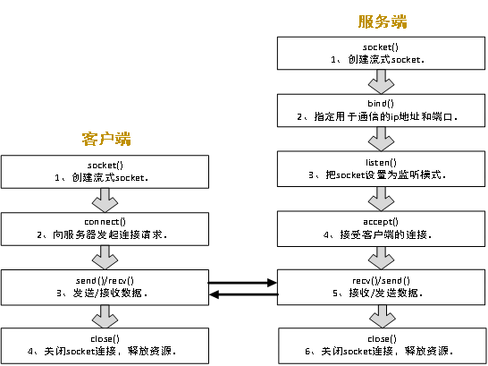
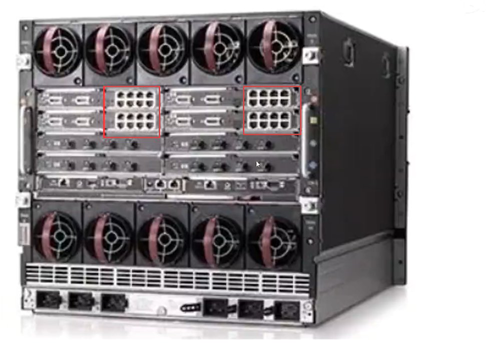
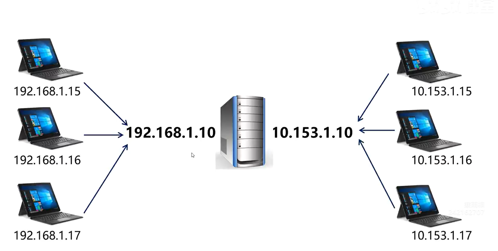
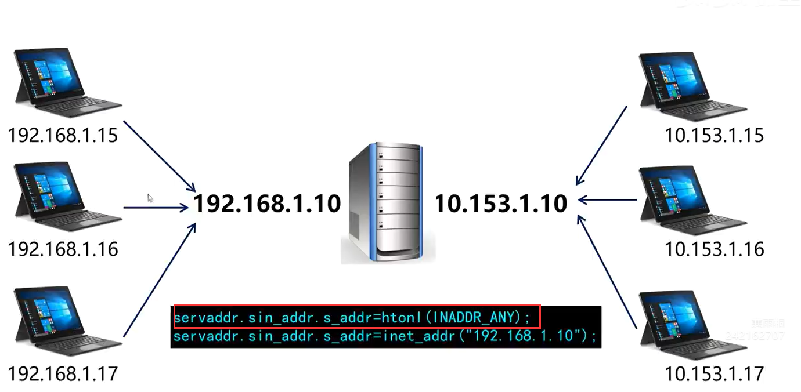
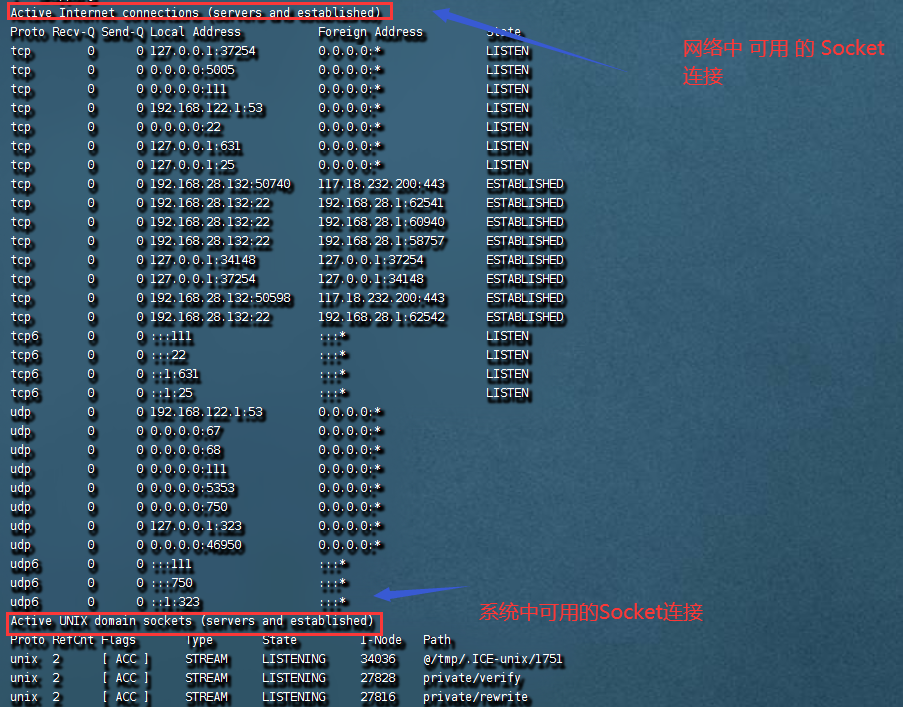
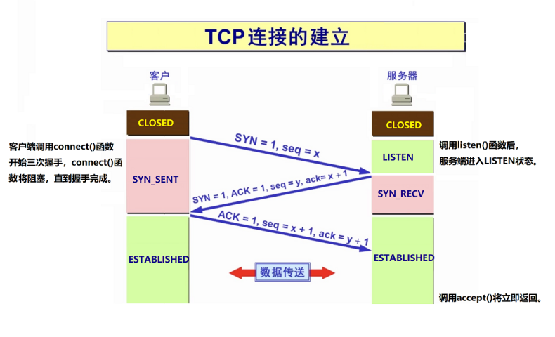
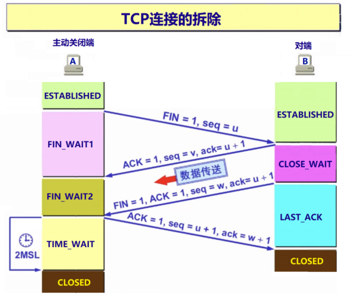
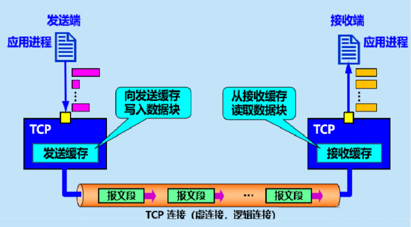

# 剑指网络编程基础


客户/服务器

网络通讯是指两台计算机中的程序进行传输数据的过程。

客户程序(端)︰指主动发起通讯的程序。

服务程序(端/器)︰指被动的等待，然后为向它发起通讯的客户端提供服务。

客户端必须提前知道服务端的IP地址和通讯端口。

服务端不需要知道客户端的IP地址。

# 第一个网络通讯程序

## 网络通讯的流程




```cpp
/*
 * 程序名：demo1.cpp，此程序用于演示socket的客户端
*/
#include <iostream>
#include <cstdio>
#include <cstring>
#include <cstdlib>
#include <unistd.h>
#include <netdb.h>
#include <sys/types.h>
#include <sys/socket.h>
#include <arpa/inet.h>
using namespace std;
 
int main(int argc,char *argv[])
{
  if (argc!=3)
  {
    cout << "Using:./demo1 服务端的IP 服务端的端口\nExample:./demo1 192.168.101.139 5005\n\n"; 
    return -1;
  }

  // 第1步：创建客户端的socket。  
  int sockfd = socket(AF_INET,SOCK_STREAM,0);
  if (sockfd==-1)
  {
    perror("socket"); return -1;
  }
 
  // 第2步：向服务器发起连接请求。 
  struct hostent* h;    // 用于存放服务端IP的结构体。
  if ( (h = gethostbyname(argv[1])) == 0 )  // 把字符串格式的IP转换成结构体。
  { 
    cout << "gethostbyname failed.\n" << endl; close(sockfd); return -1;
  }
  struct sockaddr_in servaddr;              // 用于存放服务端IP和端口的结构体。
  memset(&servaddr,0,sizeof(servaddr));
  servaddr.sin_family = AF_INET;
  memcpy(&servaddr.sin_addr,h->h_addr,h->h_length); // 指定服务端的IP地址。
  servaddr.sin_port = htons(atoi(argv[2]));         // 指定服务端的通信端口。
  
  if (connect(sockfd,(struct sockaddr *)&servaddr,sizeof(servaddr))!=0)  // 向服务端发起连接清求。
  { 
    perror("connect"); close(sockfd); return -1; 
  }
  
  // 第3步：与服务端通讯，客户发送一个请求报文后等待服务端的回复，收到回复后，再发下一个请求报文。
  char buffer[1024];
  for (int ii=0;ii<3;ii++)  // 循环3次，将与服务端进行三次通讯。
  {
    int iret;
    memset(buffer,0,sizeof(buffer));
    sprintf(buffer,"这是第%d个超级女生，编号%03d。",ii+1,ii+1);  // 生成请求报文内容。
    // 向服务端发送请求报文。
    if ( (iret=send(sockfd,buffer,strlen(buffer),0))<=0)
    { 
      perror("send"); break; 
    }
    cout << "发送：" << buffer << endl;

    memset(buffer,0,sizeof(buffer));
    // 接收服务端的回应报文，如果服务端没有发送回应报文，recv()函数将阻塞等待。
    if ( (iret=recv(sockfd,buffer,sizeof(buffer),0))<=0)
    {
       cout << "iret=" << iret << endl; break;
    }
    cout << "接收：" << buffer << endl;

    sleep(1);
  }
 
  // 第4步：关闭socket，释放资源。
  close(sockfd);
}
```

```cpp
/*
 * 程序名：demo2.cpp，此程序用于演示socket通信的服务端
*/
#include <iostream>
#include <cstdio>
#include <cstring>
#include <cstdlib>
#include <unistd.h>
#include <netdb.h>
#include <sys/types.h>
#include <sys/socket.h>
#include <arpa/inet.h>
using namespace std;
 
int main(int argc,char *argv[])
{
  if (argc!=2)
  {
    cout << "Using:./demo2 通讯端口\nExample:./demo2 5005\n\n";   // 端口大于1024，不与其它的重复。
    cout << "注意：运行服务端程序的Linux系统的防火墙必须要开通5005端口。\n";
    cout << "      如果是云服务器，还要开通云平台的访问策略。\n\n";
    return -1;
  }

  // 第1步：创建服务端的socket。 
  int listenfd = socket(AF_INET,SOCK_STREAM,0);
  if (listenfd==-1) 
  { 
    perror("socket"); return -1; 
  }
  
  // 第2步：把服务端用于通信的IP和端口绑定到socket上。 
  struct sockaddr_in servaddr;          // 用于存放服务端IP和端口的数据结构。
  memset(&servaddr,0,sizeof(servaddr));
  servaddr.sin_family = AF_INET;        // 指定协议。
  servaddr.sin_addr.s_addr = htonl(INADDR_ANY); // 服务端任意网卡的IP都可以用于通讯。
  servaddr.sin_port = htons(atoi(argv[1]));     // 指定通信端口，普通用户只能用1024以上的端口。
  // 绑定服务端的IP和端口。
  if (bind(listenfd,(struct sockaddr *)&servaddr,sizeof(servaddr)) != 0 )
  { 
    perror("bind"); close(listenfd); return -1; 
  }
 
  // 第3步：把socket设置为可连接（监听）的状态。
  if (listen(listenfd,5) != 0 ) 
  { 
    perror("listen"); close(listenfd); return -1; 
  }
 
  // 第4步：受理客户端的连接请求，如果没有客户端连上来，accept()函数将阻塞等待。
  int clientfd=accept(listenfd,0,0);
  if (clientfd==-1)
  {
    perror("accept"); close(listenfd); return -1; 
  }

  cout << "客户端已连接。\n";
 
  // 第5步：与客户端通信，接收客户端发过来的报文后，回复ok。
  char buffer[1024];
  while (true)
  {
    int iret;
    memset(buffer,0,sizeof(buffer));
    // 接收客户端的请求报文，如果客户端没有发送请求报文，recv()函数将阻塞等待。
    // 如果客户端已断开连接，recv()函数将返回0。
    if ( (iret=recv(clientfd,buffer,sizeof(buffer),0))<=0) 
    {
       cout << "iret=" << iret << endl;  break;   
    }
    cout << "接收：" << buffer << endl;
 
    strcpy(buffer,"ok");  // 生成回应报文内容。
    // 向客户端发送回应报文。
    if ( (iret=send(clientfd,buffer,strlen(buffer),0))<=0) 
    { 
      perror("send"); break; 
    }
    cout << "发送：" << buffer << endl;
  }
 
  // 第6步：关闭socket，释放资源。
  close(listenfd);   // 关闭服务端用于监听的socket。
  close(clientfd);   // 关闭客户端连上来的socket。
}
```

```shell
[root@localhost my_learn_test]# ./demo1 192.168.28.133 5005
connect: No route to host
[root@localhost my_learn_test]# ls
demo1  demo1.cpp  demo2.cpp
[root@localhost my_learn_test]# ./demo1 192.168.28.133 5005
发送：这是第1个超级女生，编号001。
接收：ok
发送：这是第2个超级女生，编号002。
接收：ok
发送：这是第3个超级女生，编号003。
接收：ok
[root@localhost my_learn_test]# 

```

```shell
[root@localhost ~]# firewall-cmd --zone=public --list-ports

[root@localhost ~]# 
[root@localhost ~]# firewall-cmd --zone=public --add-port=80/tcp --permanent
success
[root@localhost ~]# 
[root@localhost ~]# firewall-cmd --zone=public --add-port=5005/tcp --permanent
success
[root@localhost ~]# firewall-cmd --reload
success

```

```shell
[root@localhost my_learn_test]# ./demo2 5005
客户端已连接。
接收：这是第1个超级女生，编号001。
发送：ok
接收：这是第2个超级女生，编号002。
发送：ok
接收：这是第3个超级女生，编号003。
发送：ok
iret=0
[root@localhost my_learn_test]# 

```

客户端和服务端是逻辑上的概念，不一定是两台主机，也可以是一台主机。

```shell
[root@localhost my_learn_test]# ./demo2 5005
客户端已连接。
接收：这是第1个超级女生，编号001。
发送：ok
接收：这是第2个超级女生，编号002。
发送：ok
接收：这是第3个超级女生，编号003。
发送：ok
接收：这是第4个超级女生，编号004。
发送：ok
接收：这是第5个超级女生，编号005。
发送：ok
接收：这是第6个超级女生，编号006。
发送：ok
接收：这是第7个超级女生，编号007。
发送：ok
接收：这是第8个超级女生，编号008。
发送：ok
接收：这是第9个超级女生，编号009。
发送：ok
接收：这是第10个超级女生，编号010。
发送：ok
iret=0
[root@localhost my_learn_test]# 

```

```shell
[root@localhost my_learn_test]# ./demo1 192.168.28.132 5005
发送：这是第1个超级女生，编号001。
接收：ok
发送：这是第2个超级女生，编号002。
接收：ok
发送：这是第3个超级女生，编号003。
接收：ok
发送：这是第4个超级女生，编号004。
接收：ok
发送：这是第5个超级女生，编号005。
接收：ok
发送：这是第6个超级女生，编号006。
接收：ok
发送：这是第7个超级女生，编号007。
接收：ok
发送：这是第8个超级女生，编号008。
接收：ok
发送：这是第9个超级女生，编号009。
接收：ok
发送：这是第10个超级女生，编号010。
接收：ok
[root@localhost my_learn_test]# 

```


# 基于Linux的文件操作

```cpp
// demo3.cpp，本程序演示了Linux底层文件的操作-创建文件并写入数据。
#include <stdio.h>
#include <stdlib.h>
#include <string.h>
#include <fcntl.h>
#include <unistd.h>
using namespace std;

int main()
{
  int fd;    // 定义一个文件描述符/文件句柄。

  // 打开文件，注意，如果创建后的文件没有权限，可以手工授权chmod 777 data.txt。
  fd=open("data.txt",O_CREAT|O_RDWR|O_TRUNC);
  if (fd==-1)
  {
    perror("open(data.txt)"); return -1;
  }

  printf("文件描述符fd=%d\n",fd);

  char buffer[1024];
  strcpy(buffer,"我是一只傻傻鸟。\n");

  if (write(fd,buffer,strlen(buffer))==-1)    // 把数据写入文件。
  {
    perror("write()"); return -1;
  }

  close(fd);  // 关闭文件。
}
```

```cpp
// demo4.cpp，本程序演示了Linux底层文件的操作-读取文件。
#include <stdio.h>
#include <stdlib.h>
#include <string.h>
#include <fcntl.h>
#include <unistd.h>

int main()
{
  int fd;    // 定义一个文件描述符/文件句柄。

  fd=open("data.txt",O_RDONLY); // 打开文件。
  if (fd==-1)
  {
    perror("open(data.txt)"); return -1;
  }

  printf("文件描述符fd=%d\n",fd);

  char buffer[1024];
  memset(buffer,0,sizeof(buffer));
  if (read(fd,buffer,sizeof(buffer))==-1)    // 从文件中读取数据。
  {
    perror("write()"); return -1;
  }

  printf("%s",buffer);

  close(fd);  // 关闭文件。
}
```

文件打开，底层会给这个文件分配一个文件描述符。

```shell
[root@localhost my_learn_test]# ./demo3
文件描述符fd=3
[root@localhost my_learn_test]# cat data.txt 
我是一只傻傻鸟。
[root@localhost my_learn_test]# 
```

```shell
[root@localhost my_learn_test]# ./demo4
文件描述符fd=3
我是一只傻傻鸟。
[root@localhost my_learn_test]# 

```

`/proc` 目录下，每一个数字的文件夹都是一个正在运行的进程，我们打开shell进程（pid = 8826）,里面有fd文件夹，该文件夹中的数字子文件夹表示说，打开的文件描述符。

```shell
[root@localhost my_learn_test]# cd /proc
[root@localhost proc]# ls
1       1475  1860  20    2138  238   283    4      480    586   7448   96           irq           schedstat
10      1481  1870  2021  2139  2383  284    409    483    587   7831   acpi         kallsyms      scsi
1012    1485  1887  2023  2151  2387  285    41     485    589   8      asound       kcore         self
1015    15    1888  2027  2164  239   2856   43     487    592   8368   buddyinfo    keys          slabinfo
1017    1569  1892  2032  2184  24    286    43946  489    593   8425   bus          key-users     softirqs
1020    16    1897  2039  2188  241   2862   44     546    598   8428   cgroups      kmsg          stat
1027    1608  19    2046  2194  248   287    44054  548    599   8438   cmdline      kpagecount    swaps
1031    1638  1900  2048  2195  249   288    44062  550    6     8443   consoles     kpageflags    sys
1033    1652  1908  2053  22    250   289    44070  552    60    8453   cpuinfo      loadavg       sysrq-trigger
1034    1670  1910  2054  2201  252   290    44078  553    610   8454   crypto       locks         sysvipc
11      1683  1925  2059  2210  253   2998   44086  57179  611   8496   devices      mdstat        timer_list
119351  1684  1927  2070  2211  255   30     44094  57237  617   8498   diskstats    meminfo       timer_stats
1234    17    1940  2074  2213  259   31     45     57293  621   8524   dma          misc          tty
1236    1711  1944  2079  2226  260   32     459    57389  626   8628   driver       modules       uptime
1264    1715  1946  2080  2234  2609  3213   460    574    627   8769   execdomains  mounts        version
1272    1720  1958  2082  2239  2615  33     461    575    631   8826   fb           mpt           vmallocinfo
1273    18    1973  2085  2247  2616  3354   462    577    642   8881   filesystems  mtrr          vmstat
1280    1801  1974  2092  2270  279   3614   47     579    680   8882   fs           net           zoneinfo
13      1823  1986  2098  23    280   372    472    580    6927  9      interrupts   pagetypeinfo
14      1828  1995  2099  2304  281   39418  476    584    694   9017   iomem        partitions
1413    1833  2     21    237   282   399    477    585    7     91120  ioports      sched_debug
[root@localhost proc]# cd 8826
[root@localhost 8826]# ls
attr        cmdline          environ  io         mem         ns             pagemap      sched      stack    task
autogroup   comm             exe      limits     mountinfo   numa_maps      patch_state  schedstat  stat     timers
auxv        coredump_filter  fd       loginuid   mounts      oom_adj        personality  sessionid  statm    uid_map
cgroup      cpuset           fdinfo   map_files  mountstats  oom_score      projid_map   setgroups  status   wchan
clear_refs  cwd              gid_map  maps       net         oom_score_adj  root         smaps      syscall
[root@localhost 8826]# cd fd
[root@localhost fd]# ls
0  1  2  255
[root@localhost fd]# ps -ef|grep 8826
root       8826   8769  0 19:28 pts/3    00:00:00 -bash
root      18619  57237  0 20:23 pts/1    00:00:00 grep --color=auto 8826
[root@localhost fd]#
```

```c++
// demo3.cpp，本程序演示了Linux底层文件的操作-创建文件并写入数据。
#include <stdio.h>
#include <stdlib.h>
#include <string.h>
#include <fcntl.h>
#include <unistd.h>
using namespace std;

int main()
{
  int fd;    // 定义一个文件描述符/文件句柄。

  // 打开文件，注意，如果创建后的文件没有权限，可以手工授权chmod 777 data.txt。
  fd=open("data.txt",O_CREAT|O_RDWR|O_TRUNC);
  if (fd==-1)
  {
    perror("open(data.txt)"); return -1;
  }

  printf("文件描述符fd=%d\n",fd);

  char buffer[1024];
  strcpy(buffer,"我是一只傻傻鸟。\n");

  if (write(fd,buffer,strlen(buffer))==-1)    // 把数据写入文件。
  {
    perror("write()"); return -1;
  }

//方便我们自己查看该demo3进程打开的文件描述符
  sleep(100);

  close(fd);  // 关闭文件。
}
```

```shell
[root@localhost my_learn_test]# make
g++     demo3.cpp   -o demo3
[root@localhost my_learn_test]# ./demo3
文件描述符fd=3

```

```shell
[root@localhost fd]# ps -ef |grep demo3
root      28897   8826  0 20:27 pts/3    00:00:00 ./demo3
root      29550  57237  0 20:27 pts/1    00:00:00 grep --color=auto demo3
[root@localhost fd]# cd /proc/28897/fd
[root@localhost fd]# ls
0  1  2  3
[root@localhost fd]# 

```

在demo3进程中，我们只打开了一个文件。 0，1，2 表示？？

文件描述符的分配规则

- /proc/进程id/fd目录中，存放了每个进程打开的fd。

- Linux进程默认打开了三个文件描述符:0-标准输入(键盘)，1-标准输出(显示器)，2-标准错误（显示器)。cin cout cerr
- 文件描述符的分配规则是:找到最小的，没有被占用的文件描述符。

```shell
// demo3.cpp，本程序演示了Linux底层文件的操作-创建文件并写入数据。
#include <stdio.h>
#include <stdlib.h>
#include <string.h>
#include <fcntl.h>
#include <unistd.h>
#include <iostream>
using namespace std;

int main()
{

    int ii = 0;
    cin >> ii;
    cout << "ii = " << ii << endl;
    cerr << "ii = " << ii << endl;
    return 0;
  
  int fd;    // 定义一个文件描述符/文件句柄。

  // 打开文件，注意，如果创建后的文件没有权限，可以手工授权chmod 777 data.txt。
  fd=open("data.txt",O_CREAT|O_RDWR|O_TRUNC);
  if (fd==-1)
  {
    perror("open(data.txt)"); return -1;
  }

  printf("文件描述符fd=%d\n",fd);

  char buffer[1024];
  strcpy(buffer,"我是一只傻傻鸟。\n");

  if (write(fd,buffer,strlen(buffer))==-1)    // 把数据写入文件。
  {
    perror("write()"); return -1;
  }

//方便我们自己查看该demo3进程打开的文件描述符
  sleep(100);

  close(fd);  // 关闭文件。
}
```

```shell
[root@localhost my_learn_test]# make
g++     demo3.cpp   -o demo3
[root@localhost my_learn_test]# ./demo3
8
ii = 8
ii = 8
[root@localhost my_learn_test]# 

```

```shell
[root@localhost my_learn_test]# make
g++     demo3.cpp   -o demo3
[root@localhost my_learn_test]# ./demo3
ii = 0
ii = 0
[root@localhost my_learn_test]# 
```

```shell
[root@localhost my_learn_test]# make
g++     demo3.cpp   -o demo3
[root@localhost my_learn_test]# ./demo3
cerr ii = 0
[root@localhost my_learn_test]# 

```

```c++
// demo3.cpp，本程序演示了Linux底层文件的操作-创建文件并写入数据。
#include <stdio.h>
#include <stdlib.h>
#include <string.h>
#include <fcntl.h>
#include <unistd.h>
#include <iostream>
using namespace std;

int main()
{

    close(0);
    close(1);
    close(2);
    int ii = 0;
    cin >> ii;
    cout << "cout ii = " << ii << endl;
    cerr << "cerr ii = " << ii << endl;
    return 0;
  
  int fd;    // 定义一个文件描述符/文件句柄。

  // 打开文件，注意，如果创建后的文件没有权限，可以手工授权chmod 777 data.txt。
  fd=open("data.txt",O_CREAT|O_RDWR|O_TRUNC);
  if (fd==-1)
  {
    perror("open(data.txt)"); return -1;
  }

  printf("文件描述符fd=%d\n",fd);

  char buffer[1024];
  strcpy(buffer,"我是一只傻傻鸟。\n");

  if (write(fd,buffer,strlen(buffer))==-1)    // 把数据写入文件。
  {
    perror("write()"); return -1;
  }

//方便我们自己查看该demo3进程打开的文件描述符
  sleep(100);

  close(fd);  // 关闭文件。
}
```

```shell
[root@localhost my_learn_test]# make
g++     demo3.cpp   -o demo3
[root@localhost my_learn_test]# ./demo3
[root@localhost my_learn_test]# z
```

```c
// demo3.cpp，本程序演示了Linux底层文件的操作-创建文件并写入数据。
#include <stdio.h>
#include <stdlib.h>
#include <string.h>
#include <fcntl.h>
#include <unistd.h>
#include <iostream>
using namespace std;

int main()
{

    close(0);
    close(1);
    close(2);
    int ii = 0;
    cin >> ii;
    cout << "cout ii = " << ii << endl;
    cerr << "cerr ii = " << ii << endl;
    sleep(100);
    return 0;
  
  int fd;    // 定义一个文件描述符/文件句柄。

  // 打开文件，注意，如果创建后的文件没有权限，可以手工授权chmod 777 data.txt。
  fd=open("data.txt",O_CREAT|O_RDWR|O_TRUNC);
  if (fd==-1)
  {
    perror("open(data.txt)"); return -1;
  }

  printf("文件描述符fd=%d\n",fd);

  char buffer[1024];
  strcpy(buffer,"我是一只傻傻鸟。\n");

  if (write(fd,buffer,strlen(buffer))==-1)    // 把数据写入文件。
  {
    perror("write()"); return -1;
  }

//方便我们自己查看该demo3进程打开的文件描述符
  sleep(100);

  close(fd);  // 关闭文件。
}
```

```shell
[root@localhost fd]# ps -ef |grep demo3
root      50425   8826  0 20:35 pts/3    00:00:00 ./demo3
root      50789  57237  0 20:35 pts/1    00:00:00 grep --color=auto demo3
[root@localhost fd]# cd /proc/50425/fd
[root@localhost fd]# ls
[root@localhost fd]# 

```

可以看到文件描述符0，1，2 没有了。

```shell
// demo3.cpp，本程序演示了Linux底层文件的操作-创建文件并写入数据。
#include <stdio.h>
#include <stdlib.h>
#include <string.h>
#include <fcntl.h>
#include <unistd.h>
#include <iostream>
using namespace std;

int main()
{

    close(0);
    close(1);
    close(2);

  
  int fd;    // 定义一个文件描述符/文件句柄。

  // 打开文件，注意，如果创建后的文件没有权限，可以手工授权chmod 777 data.txt。
  fd=open("data.txt",O_CREAT|O_RDWR|O_TRUNC);
  if (fd==-1)
  {
    perror("open(data.txt)"); return -1;
  }

  printf("文件描述符fd=%d\n",fd);

  char buffer[1024];
  strcpy(buffer,"我是一只傻傻鸟。\n");

  if (write(fd,buffer,strlen(buffer))==-1)    // 把数据写入文件。
  {
    perror("write()"); return -1;
  }

//方便我们自己查看该demo3进程打开的文件描述符
  sleep(100);

  close(fd);  // 关闭文件。
}
```

```shell
[root@localhost my_learn_test]# ./demo3
[root@localhost my_learn_test]# make
g++     demo3.cpp   -o demo3
[root@localhost my_learn_test]# ./demo3

```

```shell
[root@localhost fd]# ps -ef |grep demo3
root      55051   8826  0 20:37 pts/3    00:00:00 ./demo3
root      56794  57237  0 20:38 pts/1    00:00:00 grep --color=auto demo3
[root@localhost fd]# cd /proc/55051/fd
[root@localhost fd]# ls
0
[root@localhost fd]# 

```

```cpp
// demo3.cpp，本程序演示了Linux底层文件的操作-创建文件并写入数据。
#include <stdio.h>
#include <stdlib.h>
#include <string.h>
#include <fcntl.h>
#include <unistd.h>
#include <iostream>
#include <sys/socket.h>
#include <arpa/inet.h>
using namespace std;

int main()
{

 
  int fd;    // 定义一个文件描述符/文件句柄。

  // 打开文件，注意，如果创建后的文件没有权限，可以手工授权chmod 777 data.txt。
  fd=open("data.txt",O_CREAT|O_RDWR|O_TRUNC);
  if (fd==-1)
  {
    perror("open(data.txt)"); return -1;
  }

  printf("文件描述符fd=%d\n",fd);
  int sockfd = socket(AF_INET,SOCK_STREAM,0);
  printf("sockfd=%d\n",sockfd);

  char buffer[1024];
  strcpy(buffer,"我是一只傻傻鸟。\n");

  if (write(fd,buffer,strlen(buffer))==-1)    // 把数据写入文件。
  {
    perror("write()"); return -1;
  }

//方便我们自己查看该demo3进程打开的文件描述符
  sleep(100);

  close(fd);  // 关闭文件。
}
```

```shell
[root@localhost my_learn_test]# make
g++     demo3.cpp   -o demo3
[root@localhost my_learn_test]# ./demo3
文件描述符fd=3
sockfd=4
```

```shell
[root@localhost fd]# ps -ef |grep demo3
root      72294   8826  0 20:44 pts/3    00:00:00 ./demo3
root      75254  57237  0 20:45 pts/1    00:00:00 grep --color=auto demo3
[root@localhost fd]# cd /proc/72294
[root@localhost 72294]# cd fd
[root@localhost fd]# ls
0  1  2  3  4
[root@localhost fd]# 

```

通过上面的实验，文件就是socket.


对Linux来说，socket操作与文件操作没有区别。

在网络传输数据的过程中，可以使用文件的I/O函数。

文件描述符是Linux分配给文件或socket的整数。


我们直接用文件的读写文件函数，也没有问题。

```cpp
/*
 * 程序名：demo1.cpp，此程序用于演示socket的客户端
*/
#include <iostream>
#include <cstdio>
#include <cstring>
#include <cstdlib>
#include <unistd.h>
#include <netdb.h>
#include <sys/types.h>
#include <sys/socket.h>
#include <arpa/inet.h>
using namespace std;
 
int main(int argc,char *argv[])
{
  if (argc!=3)
  {
    cout << "Using:./demo1 服务端的IP 服务端的端口\nExample:./demo1 192.168.101.139 5005\n\n"; 
    return -1;
  }

  // 第1步：创建客户端的socket。 打电话->准备电话机  
  int sockfd = socket(AF_INET,SOCK_STREAM,0);
  if (sockfd==-1)
  {
    perror("socket"); return -1;
  }
 
  // 第2步：向服务器发起连接请求。  打电话 -> 拨号
  struct hostent* h;    // 用于存放服务端IP的结构体。
  if ( (h = gethostbyname(argv[1])) == 0 )  // 把字符串格式的IP转换成结构体。
  { 
    cout << "gethostbyname failed.\n" << endl; close(sockfd); return -1;
  }
  struct sockaddr_in servaddr;              // 用于存放服务端IP和端口的结构体。
  memset(&servaddr,0,sizeof(servaddr));
  servaddr.sin_family = AF_INET;
  memcpy(&servaddr.sin_addr,h->h_addr,h->h_length); // 指定服务端的IP地址。
  servaddr.sin_port = htons(atoi(argv[2]));         // 指定服务端的通信端口。
  
  //地址：192.168.28.133 端口：5005
  if (connect(sockfd,(struct sockaddr *)&servaddr,sizeof(servaddr))!=0)  // 向服务端发起连接清求。
  { 
    perror("connect"); close(sockfd); return -1; 
  }
  
  // 打电话 -> 传输数据
  // 第3步：与服务端通讯，客户发送一个请求报文后等待服务端的回复，收到回复后，再发下一个请求报文。
  char buffer[1024];
  for (int ii=0;ii<1;ii++)  // 循环3次，将与服务端进行三次通讯。
  {
    int iret;
    memset(buffer,0,sizeof(buffer));
    sprintf(buffer,"这是第%d个超级女生，编号%03d。",ii+1,ii+1);  // 生成请求报文内容。
  
    // 向服务端发送请求报文。
   // if ( (iret=send(sockfd,buffer,strlen(buffer),0))<=0)
   if ( (iret=write(sockfd,buffer,strlen(buffer)))<=0)
    { 
      perror("send"); break; 
    }
    cout << "发送：" << buffer << endl;

    memset(buffer,0,sizeof(buffer));
    // 接收服务端的回应报文，如果服务端没有发送回应报文，recv()函数将阻塞等待。
    //if ( (iret=recv(sockfd,buffer,sizeof(buffer),0))<=0)
    if ( (iret=read(sockfd,buffer,sizeof(buffer)))<=0)
    {
       cout << "iret=" << iret << endl; break;
    }
    cout << "接收：" << buffer << endl;

    sleep(1);
  }
 
  // 第4步：关闭socket，释放资源。
  close(sockfd);
}
```

```shell
[root@localhost my_learn_test]# g++ -o demo1 demo1.cpp
[root@localhost my_learn_test]# ./demo1 192.168.28.133 5005
发送：这是第1个超级女生，编号001。
接收：ok
发送：这是第2个超级女生，编号002。
接收：ok
发送：这是第3个超级女生，编号003。
接收：ok
发送：这是第4个超级女生，编号004。
接收：ok
发送：这是第5个超级女生，编号005。
接收：ok
发送：这是第6个超级女生，编号006。
接收：ok
发送：这是第7个超级女生，编号007。
接收：ok
发送：这是第8个超级女生，编号008。
接收：ok
发送：这是第9个超级女生，编号009。
接收：ok
发送：这是第10个超级女生，编号010。
接收：ok
[root@localhost my_learn_test]# 

```

```shell
[root@localhost my_learn_test]# ./demo2 5005
客户端已连接。
接收：这是第1个超级女生，编号001。
发送：ok
接收：这是第2个超级女生，编号002。
发送：ok
接收：这是第3个超级女生，编号003。
发送：ok
接收：这是第4个超级女生，编号004。
发送：ok
接收：这是第5个超级女生，编号005。
发送：ok
接收：这是第6个超级女生，编号006。
发送：ok
接收：这是第7个超级女生，编号007。
发送：ok
接收：这是第8个超级女生，编号008。
发送：ok
接收：这是第9个超级女生，编号009。
发送：ok
接收：这是第10个超级女生，编号010。
发送：ok
iret=0
[root@localhost my_learn_test]# 

```


# socket函数详解

## 什么是协议

人与人沟通的方式有很多种：书信、电话、QQ、微信。如果两个人想沟通，必须先选择一种沟通的方式，如果一方使用电话，另一方也应该使用电话，而不是书信。

协议是网络通讯的规则，是约定。


## 创建socket

```cpp
int socket(int domain, int type, int protocol);
```

成功返回一个有效的socket，失败返回-1，errno被设置。

全部网络编程的函数，失败时基本上都是返回-1，errno被设置。

只要参数没填错，基本上不会失败。


不过，单个进程中创建的socket数量与受系统参数open files的限制。（ulimit -a ）

```shell
[root@localhost my_learn_test]# ulimit -a
core file size          (blocks, -c) 0
data seg size           (kbytes, -d) unlimited
scheduling priority             (-e) 0
file size               (blocks, -f) unlimited
pending signals                 (-i) 3766
max locked memory       (kbytes, -l) 64
max memory size         (kbytes, -m) unlimited
open files                      (-n) 1024
pipe size            (512 bytes, -p) 8
POSIX message queues     (bytes, -q) 819200
real-time priority              (-r) 0
stack size              (kbytes, -s) 8192
cpu time               (seconds, -t) unlimited
max user processes              (-u) 3766
virtual memory          (kbytes, -v) unlimited
file locks                      (-x) unlimited
[root@localhost my_learn_test]# 

```

在创建的进程中，打开或者创建的Socket不能超过1024个。超过就会报错

```shell
/*
 * 程序名：demo1.cpp，此程序用于演示socket的客户端
*/
#include <iostream>
#include <cstdio>
#include <cstring>
#include <cstdlib>
#include <unistd.h>
#include <netdb.h>
#include <sys/types.h>
#include <sys/socket.h>
#include <arpa/inet.h>
using namespace std;
 
int main(int argc,char *argv[])
{
  if (argc!=3)
  {
    cout << "Using:./demo1 服务端的IP 服务端的端口\nExample:./demo1 192.168.101.139 5005\n\n"; 
    return -1;
  }

  // 第1步：创建客户端的socket。 打电话->准备电话机  
  int sockfd;
 
  while (true)
  {
    sockfd = socket(AF_INET,SOCK_STREAM,0);
    if (sockfd==-1)
    {
      perror("socket"); return -1;
    }
    cout << "sockfd = " << sockfd<< endl;
  }
  


  // 第2步：向服务器发起连接请求。  打电话 -> 拨号
  struct hostent* h;    // 用于存放服务端IP的结构体。
  if ( (h = gethostbyname(argv[1])) == 0 )  // 把字符串格式的IP转换成结构体。
  { 
    cout << "gethostbyname failed.\n" << endl; close(sockfd); return -1;
  }
  struct sockaddr_in servaddr;              // 用于存放服务端IP和端口的结构体。
  memset(&servaddr,0,sizeof(servaddr));
  servaddr.sin_family = AF_INET;
  memcpy(&servaddr.sin_addr,h->h_addr,h->h_length); // 指定服务端的IP地址。
  servaddr.sin_port = htons(atoi(argv[2]));         // 指定服务端的通信端口。
  
  //地址：192.168.28.133 端口：5005
  if (connect(sockfd,(struct sockaddr *)&servaddr,sizeof(servaddr))!=0)  // 向服务端发起连接清求。
  { 
    perror("connect"); close(sockfd); return -1; 
  }
  
  // 打电话 -> 传输数据
  // 第3步：与服务端通讯，客户发送一个请求报文后等待服务端的回复，收到回复后，再发下一个请求报文。
  char buffer[1024];
  for (int ii=0;ii<10;ii++)  // 循环3次，将与服务端进行三次通讯。
  {
    int iret;
    memset(buffer,0,sizeof(buffer));
    sprintf(buffer,"这是第%d个超级女生，编号%03d。",ii+1,ii+1);  // 生成请求报文内容。
  
    // 向服务端发送请求报文。
   // if ( (iret=send(sockfd,buffer,strlen(buffer),0))<=0)
   if ( (iret=write(sockfd,buffer,strlen(buffer)))<=0)
    { 
      perror("send"); break; 
    }
    cout << "发送：" << buffer << endl;

    memset(buffer,0,sizeof(buffer));
    // 接收服务端的回应报文，如果服务端没有发送回应报文，recv()函数将阻塞等待。
    //if ( (iret=recv(sockfd,buffer,sizeof(buffer),0))<=0)
    if ( (iret=read(sockfd,buffer,sizeof(buffer)))<=0)
    {
       cout << "iret=" << iret << endl; break;
    }
    cout << "接收：" << buffer << endl;

    sleep(1);
  }
 
  // 第4步：关闭socket，释放资源。
  close(sockfd);
}
```

```shell
[root@localhost my_learn_test]# g++ -o demo1 demo1.cpp
[root@localhost my_learn_test]# ./demo1 192.168.28.133 5005
sockfd = 3
sockfd = 4
sockfd = 5
sockfd = 6
sockfd = 7
sockfd = 8
sockfd = 9
sockfd = 10
sockfd = 11
sockfd = 12
....
sockfd = 1021
sockfd = 1022
sockfd = 1023
socket: Too many open files
[root@localhost my_learn_test]# 

```

### domain 通讯的协议家族

| `PF_INET` | IPv4互联网协议族。 |
| :-------: | :----------------: |
| PF_INET6  | IPv6互联网协议族。 |
| PF_LOCAL  | 本地通信的协议族。 |
| PF_PACKET | 内核底层的协议族。 |
|  PF_IPX   | IPX Novell协议族。 |

IPv6尚未普及，其它的不常用。


### type 数据传输的类型

SOCK_STREAM		面向连接的socket

- 数据不会丢失
- 数据的顺序不会错乱
- 双向通道。

SOCK_DGRAM	无连接的socket

- 数据可能会丢失
- 数据的顺序可能会错乱
- 传输的效率更高。


### protocol 最终使用的协议

在IPv4网络协议家族中，数据传输方式为SOCK_STREAM的协议只有IPPROTO_TCP，数据传输方式为SOCK_DGRAM的协议只有IPPROTO_UDP。

本参数也可以填0。

```cpp
socket(PF_INET, SOCK_STREAM, IPPROTO_TCP);    // 创建tcp的sock
socket(PF_INET, SOCK_DGRAM, IPPROTO_UDP);    // 创建udp的sock
```

## TCP和UDP

### TCP和UDP的区别

**TCP**

- TCP面向连接，通过三次握手建立连接，四次挥手断开连接；  ***面试的重点**
- TCP是可靠的通信方式，通过超时重传、数据校验等方式来确保数据无差错，不丢失，不重复，并且按序到达；
- TCP把数据当成字节流，当网络出现波动时，连接可能出现响应延迟的问题；
- TCP只支持点对点通信；
- TCP报文的首部较大，为20字节；
- TCP是全双工的可靠信道。

**UDP**

- UDP是无连接的，即发送数据之前不需要建立连接，这种方式为UDP带来了高效的传输效率，但也导致无法确保数据的发送成功；
- UDP以最大的速率进行传输，但不保证可靠交付，会出现丢失、重复等等问题；
- UDP没有拥塞控制，当网络出现拥塞时，发送方不会降低发送速率；
- UDP支持一对一，一对多，多对一和多对多的通信；
- UDP报文的首部比较小，只有8字节；
- UDP是不可靠信道。


### TCP保证自身可靠的方式

- 数据分片：在发送端对用户数据进行分片，在接收端进行重组，由TCP确定分片的大小并控制分片和重组；
- 到达确认：接收端接收到分片数据时，根据分片的序号向对端回复一个确认包；
- 超时重发：发送方在发送分片后开始计时，若超时却没有收到对端的确认包，将会重发分片；
- 滑动窗口：TCP 中采用滑动窗口来进行传输控制，发送方可以通过滑动窗口的大小来确定应该发送多少字节的数据。当滑动窗口为 0 时，发送方不会再发送数据；
- 失序处理：TCP的接收端会把接收到的数据重新排序；
- 重复处理：如果传输的分片出现重复，TCP的接收端会丢弃重复的数据；
- 数据校验：TCP通过数据的检验和来判断数据在传输过程中是否正确。

### UDP不可靠的原因

没有上述TCP的机制，如果校验和出错，UDP会将该报文丢弃。


### TCP和UDP使用场景


**TCP 使用场景**

TCP实现了数据传输过程中的各种控制，适合对可靠性有要求的场景。


**UDP 使用场景**

可以容忍数据丢失的场景：

- **视频、音频等多媒体通信（即时通信）；**

- 广播信息。


### UDP能实现可靠传输吗？ 


这是个伪命题，如果用UDP实现可靠传输，那么，应用程序必须实现重传和排序等功能，非常麻烦，还不如直接用TCP。谁能保证自己写的算法比写TCP协议的人更牛？


# 主机字节序与网络字节序

## 大端序/小端序

如果数据类型占用的内存空间大于1字节，CPU把数据存放在内存中的方式有两种：


- 大端序（Big Endian）：低位字节存放在高位，高位字节存放在低位。
-  小端序（Little Endia）：低位字节存放在低位，高位字节存放在高位。

假设从内存地址0x00000001处开始存储十六进制数0x12345678，那么：


Bit-endian（按原来顺序存储）

0x00000001      0x12 

0x00000002      0x34

0x00000003      0x56

0x00000004      0x78


Little-endian（颠倒顺序储存）

0x00000001      0x78

0x00000002      0x56

0x00000003      0x34

0x00000004      0x12


Intel系列的CPU以小端序方式保存数据，其它型号的CPU不一定。


操作文件的本质是把内存中的数据写入磁盘，在网络编程中，传输数据的本质也是把数据写入文件（socket也是文件描述符）。


这样的话，字节序不同的计算机之间传输数据，可能会出现问题。


## 网络字节序

为了解决不同字节序的计算机之间传输数据的问题，约定采用网络字节序（大端序）。


C语言提供了四个库函数，用于在主机字节序和网络字节序之间转换：

```cpp
uint16_t h to n s(uint16_t hostshort);   // uint16_t  2字节的整数 unsigned short
uint32_t htonl(uint32_t hostlong);    // uint32_t  4字节的整数 unsigned int
uint16_t ntohs(uint16_t netshort);
uint32_t n to h l(uint32_t netlong);
```

h	host（主机）；

to   转换；

n	network（网络）；

s	short（2字节，16位的整数）；

l	 long（4字节，32位的整数）；


## IP地址和通讯端口

在计算机中，IPv4的地址用4字节的整数存放，通讯端口用2字节的整数（0-65535）存放。


例如：192.168.190.134    3232284294   255.255.255.255


192   168    190    134

大端：11000000 10101000 10111110 10000110

小端：10000110 10111110 10101000 11000000


## 如何处理大小端序

在网络编程中，数据收发的时候有自动转换机制，不需要程序员手动转换，只有向sockaddr_in结体成员变量填充数据时，才需要考虑字节序的问题。


# 万恶的结构体

## sockaddr结构体

存放协议族、端口和地址信息，客户端和connect()函数和服务端的bind()函数需要这个结构体。

```cpp
struct sockaddr 
{
  unsigned short sa_family;	// 协议族，与socket()函数的第一个参数相同，填AF_INET。
  unsigned char sa_data[14];	// 14字节的端口和地址。
};
```

## sockaddr_in结构体

sockaddr结构体是为了统一地址结构的表示方法，统一接口函数，但是，操作不方便，所以定义了等价的sockaddr_in结构体，它的大小与sockaddr相同，可以强制转换成sockaddr。

```cpp
struct sockaddr_in
{  
  unsigned short sin_family;	// 协议族，与socket()函数的第一个参数相同，填AF_INET。
  unsigned short sin_port;		// 16位端口号，大端序。用htons(整数的端口)转换。
  struct in_addr sin_addr;		// IP地址的结构体。192.168.101.138
  unsigned char sin_zero[8];	// 未使用，为了保持与struct sockaddr一样的长度而添加。
};

struct in_addr 
{				// IP地址的结构体。
  unsigned int s_addr;		// 32位的IP地址，大端序。
};
```

## gethostbyname函数

根据域名/主机名/字符串IP获取大端序IP，用于网络通讯的客户端程序中。

```cpp
struct hostent *gethostbyname(const char *name);
```

```cpp
struct hostent 
{ 
  char *h_name;     	// 主机名。
  char **h_aliases;    	// 主机所有别名构成的字符串数组，同一IP可绑定多个域名。 
  short h_addrtype; 	// 主机IP地址的类型，例如IPV4（AF_INET）还是IPV6。
  short h_length;     	// 主机IP地址长度，IPV4地址为4，IPV6地址则为16。
  char **h_addr_list; 	// 主机的ip地址，以网络字节序存储。 
};
#define h_addr h_addr_list[0] 	// for backward compatibility.
```

转换后，用以下代码把大端序的地址复制到sockaddr_in结构体的sin_addr成员中。

```cpp
memcpy(&servaddr.sin_addr,h->h_addr,h->h_length);
```

## 字符串IP与大端序IP的转换

C语言提供了几个库函数，用于字符串格式的IP和大端序IP的互相转换，用于网络通讯的服务端程序中。

```cpp
typedef unsigned int in_addr_t;    // 32位大端序的IP地址。

// 把字符串格式的IP转换成大端序的IP，转换后的IP赋给sockaddr_in.in_addr.s_addr。
in_addr_t inet_addr(const char *cp); 

// 把字符串格式的IP转换成大端序的IP，转换后的IP将填充到sockaddr_in.in_addr成员。
int inet_aton(const char *cp, struct in_addr *inp);	

// 把大端序IP转换成字符串格式的IP，用于在服务端程序中解析客户端的IP地址。
char *inet_ntoa(struct in_addr in);
```


```cpp
/*
 * 程序名：demo5.cpp，此程序用于演示socket的客户端
*/
#include <iostream>
#include <cstdio>
#include <cstring>
#include <cstdlib>
#include <unistd.h>
#include <netdb.h>
#include <sys/types.h>
#include <sys/socket.h>
#include <arpa/inet.h>
using namespace std;
 
int main(int argc,char *argv[])
{
  if (argc!=3)
  {
    cout << "Using:./demo5 服务端的IP 服务端的端口\nExample:./demo5 192.168.101.138 5005\n\n"; 
    return -1;
  }

  // 第1步：创建客户端的socket。  
  int sockfd = socket(AF_INET,SOCK_STREAM,0);
  if (sockfd==-1)
  {
    perror("socket"); return -1;
  }
 
  // 第2步：向服务器发起连接请求。 
  struct sockaddr_in servaddr;               // 用于存放协议、端口和IP地址的结构体。
  memset(&servaddr,0,sizeof(servaddr));
  servaddr.sin_family = AF_INET;             // ①协议族，固定填AF_INET。
  servaddr.sin_port = htons(atoi(argv[2]));  // ②指定服务端的通信端口。

  struct hostent* h;                         // 用于存放服务端IP地址(大端序)的结构体的指针。
  if ( (h = gethostbyname(argv[1])) == nullptr )  // 把域名/主机名/字符串格式的IP转换成结构体。
  { 
    cout << "gethostbyname failed.\n" << endl; close(sockfd); return -1;
  }
 // memcpy(&servaddr.sin_addr,h->h_addr,h->h_length); // ③指定服务端的IP(大端序)。
  servaddr.sin_addr.s_addr=inet_addr(argv[1]); // ③指定服务端的IP，只能用IP，不能用域名和主机名。
  if (connect(sockfd,(struct sockaddr *)&servaddr,sizeof(servaddr))==-1)  // 向服务端发起连接清求。
  { 
    perror("connect"); close(sockfd); return -1; 
  }
  
  // 第3步：与服务端通讯，客户发送一个请求报文后等待服务端的回复，收到回复后，再发下一个请求报文。
  char buffer[1024];
  for (int ii=0;ii<10;ii++)  // 循环3次，将与服务端进行三次通讯。
  {
    int iret;
    memset(buffer,0,sizeof(buffer));
    sprintf(buffer,"这是第%d个超级女生，编号%03d。",ii+1,ii+1);  // 生成请求报文内容。
    // 向服务端发送请求报文。
    if ( (iret=send(sockfd,buffer,strlen(buffer),0))<=0)
    { 
      perror("send"); break; 
    }
    cout << "发送：" << buffer << endl;

    memset(buffer,0,sizeof(buffer));
    // 接收服务端的回应报文，如果服务端没有发送回应报文，recv()函数将阻塞等待。
    if ( (iret=recv(sockfd,buffer,sizeof(buffer),0))<=0)
    {
       cout << "iret=" << iret << endl; break;
    }
    cout << "接收：" << buffer << endl;

    sleep(1);
  }
 
  // 第4步：关闭socket，释放资源。
  close(sockfd);
}
```

```shell
[root@localhost fd]# ping www.sina.com.cn
PING ww1.sinaimg.cn.w.alikunlun.com (119.147.111.222) 56(84) bytes of data.
64 bytes from 119.147.111.222 (119.147.111.222): icmp_seq=1 ttl=128 time=14.3 ms
64 bytes from 119.147.111.222 (119.147.111.222): icmp_seq=2 ttl=128 time=7.44 ms
64 bytes from 119.147.111.222 (119.147.111.222): icmp_seq=3 ttl=128 time=9.07 ms
64 bytes from 119.147.111.222 (119.147.111.222): icmp_seq=4 ttl=128 time=8.36 ms
^C
--- ww1.sinaimg.cn.w.alikunlun.com ping statistics ---
5 packets transmitted, 4 received, 20% packet loss, time 5047ms
rtt min/avg/max/mdev = 7.440/9.794/14.304/2.669 ms
[root@localhost fd]# 

```

```shell
[root@localhost my_learn_test]# ./demo5 119.147.111.222 80
发送：这是第1个超级女生，编号001。
接收：HTTP/1.1 400 Bad Request
Server: Tengine
Date: Sun, 17 Mar 2024 04:17:04 GMT
Content-Type: text/html
Content-Length: 249
Connection: close
Via: cache16.cn1623[,0]
Timing-Allow-Origin: *
EagleId: 0000000017106490245841193e

<!DOCTYPE HTML PUBLIC "-//IETF//DTD HTML 2.0//EN">
<html>
<head><title>400 Bad Request</title></head>
<body>
<h1>400 Bad Request</h1>
<p>Your browser sent a request that this server could not understand.<hr/>Powered by Tengine</body>
</html>

发送：这是第2个超级女生，编号002。
iret=0
[root@localhost my_learn_test]# 

```

```shell
[root@localhost my_learn_test]# ./demo5 www.sina.com.cn 80
connect: Network is unreachable
[root@localhost my_learn_test]# 

```

```cpp
/*
 * 程序名：demo5.cpp，此程序用于演示socket的客户端
*/
#include <iostream>
#include <cstdio>
#include <cstring>
#include <cstdlib>
#include <unistd.h>
#include <netdb.h>
#include <sys/types.h>
#include <sys/socket.h>
#include <arpa/inet.h>
using namespace std;
 
int main(int argc,char *argv[])
{
  if (argc!=3)
  {
    cout << "Using:./demo5 服务端的IP 服务端的端口\nExample:./demo5 192.168.101.138 5005\n\n"; 
    return -1;
  }

  // 第1步：创建客户端的socket。  
  int sockfd = socket(AF_INET,SOCK_STREAM,0);
  if (sockfd==-1)
  {
    perror("socket"); return -1;
  }
 
  // 第2步：向服务器发起连接请求。 
  struct sockaddr_in servaddr;               // 用于存放协议、端口和IP地址的结构体。
  memset(&servaddr,0,sizeof(servaddr));
  servaddr.sin_family = AF_INET;             // ①协议族，固定填AF_INET。
  servaddr.sin_port = htons(atoi(argv[2]));  // ②指定服务端的通信端口。

  struct hostent* h;                         // 用于存放服务端IP地址(大端序)的结构体的指针。
  if ( (h = gethostbyname(argv[1])) == nullptr )  // 把域名/主机名/字符串格式的IP转换成结构体。
  { 
    cout << "gethostbyname failed.\n" << endl; close(sockfd); return -1;
  }
  memcpy(&servaddr.sin_addr,h->h_addr,h->h_length); // ③指定服务端的IP(大端序)。
 // servaddr.sin_addr.s_addr=inet_addr(argv[1]); // ③指定服务端的IP，只能用IP，不能用域名和主机名。
  if (connect(sockfd,(struct sockaddr *)&servaddr,sizeof(servaddr))==-1)  // 向服务端发起连接清求。
  { 
    perror("connect"); close(sockfd); return -1; 
  }
  
  // 第3步：与服务端通讯，客户发送一个请求报文后等待服务端的回复，收到回复后，再发下一个请求报文。
  char buffer[1024];
  for (int ii=0;ii<10;ii++)  // 循环3次，将与服务端进行三次通讯。
  {
    int iret;
    memset(buffer,0,sizeof(buffer));
    sprintf(buffer,"这是第%d个超级女生，编号%03d。",ii+1,ii+1);  // 生成请求报文内容。
    // 向服务端发送请求报文。
    if ( (iret=send(sockfd,buffer,strlen(buffer),0))<=0)
    { 
      perror("send"); break; 
    }
    cout << "发送：" << buffer << endl;

    memset(buffer,0,sizeof(buffer));
    // 接收服务端的回应报文，如果服务端没有发送回应报文，recv()函数将阻塞等待。
    if ( (iret=recv(sockfd,buffer,sizeof(buffer),0))<=0)
    {
       cout << "iret=" << iret << endl; break;
    }
    cout << "接收：" << buffer << endl;

    sleep(1);
  }
 
  // 第4步：关闭socket，释放资源。
  close(sockfd);
}
```

```shell
[root@localhost my_learn_test]# ./demo5 119.147.111.222 80
发送：这是第1个超级女生，编号001。
接收：HTTP/1.1 400 Bad Request
Server: Tengine
Date: Sun, 17 Mar 2024 04:17:04 GMT
Content-Type: text/html
Content-Length: 249
Connection: close
Via: cache16.cn1623[,0]
Timing-Allow-Origin: *
EagleId: 0000000017106490245841193e

<!DOCTYPE HTML PUBLIC "-//IETF//DTD HTML 2.0//EN">
<html>
<head><title>400 Bad Request</title></head>
<body>
<h1>400 Bad Request</h1>
<p>Your browser sent a request that this server could not understand.<hr/>Powered by Tengine</body>
</html>

发送：这是第2个超级女生，编号002。
iret=0
[root@localhost my_learn_test]# ./demo5 www.sina.com.cn
Using:./demo5 服务端的IP 服务端的端口
Example:./demo5 192.168.101.138 5005

[root@localhost my_learn_test]# ./demo5 www.sina.com.cn 80
connect: Network is unreachable
[root@localhost my_learn_test]# make
g++     demo5.cpp   -o demo5
[root@localhost my_learn_test]# ./demo5 www.sina.com.cn 80
发送：这是第1个超级女生，编号001。
接收：HTTP/1.1 400 Bad Request
Server: Tengine
Date: Sun, 17 Mar 2024 04:18:35 GMT
Content-Type: text/html
Content-Length: 249
Connection: close
Via: cache18.cn1623[,0]
Timing-Allow-Origin: *
EagleId: 0000000017106491150874022e

<!DOCTYPE HTML PUBLIC "-//IETF//DTD HTML 2.0//EN">
<html>
<head><title>400 Bad Request</title></head>
<body>
<h1>400 Bad Request</h1>
<p>Your browser sent a request that this server could not understand.<hr/>Powered by Tengine</body>
</html>

发送：这是第2个超级女生，编号002。
iret=0
[root@localhost my_learn_test]# 

```

可以看到用了`hostent` 结构体，支持了域名，IP的Socket请求连接，都可以被新浪的服务器建立起来Socket连接。如果写死用IP,则不支持域名了。实际开发，我们都是用`gethostbyname()` 转一下。


一台服务器，真实的样子。每一次接口都是一个网卡，意味着都是可以分配IP的。




如果分配了两个网卡，`192.168.1.10（网段A）`  `192.153.1.10(网段B)` 。 对于左边的客户端，只能访问网段A,而不能访问网段B，即左边的客户端访问服务器，只能使用 IP 192.168.1.10

而不能使用 192.153.1.10。





如果服务端程序，采用的是红线处写法，则上面的限制就不会存在！



```cpp
/*
 * 程序名：demo5.cpp，此程序用于演示socket的客户端
*/
#include <iostream>
#include <cstdio>
#include <cstring>
#include <cstdlib>
#include <unistd.h>
#include <netdb.h>
#include <sys/types.h>
#include <sys/socket.h>
#include <arpa/inet.h>
using namespace std;
 
int main(int argc,char *argv[])
{
  if (argc!=3)
  {
    cout << "Using:./demo5 服务端的IP 服务端的端口\nExample:./demo5 192.168.101.138 5005\n\n"; 
    return -1;
  }

  // 第1步：创建客户端的socket。  
  int sockfd = socket(AF_INET,SOCK_STREAM,0);
  if (sockfd==-1)
  {
    perror("socket"); return -1;
  }
 
  // 第2步：向服务器发起连接请求。 
  struct sockaddr_in servaddr;               // 用于存放协议、端口和IP地址的结构体。
  memset(&servaddr,0,sizeof(servaddr));
  servaddr.sin_family = AF_INET;             // ①协议族，固定填AF_INET。
  servaddr.sin_port = htons(atoi(argv[2]));  // ②指定服务端的通信端口。

  struct hostent* h;                         // 用于存放服务端IP地址(大端序)的结构体的指针。
  if ( (h = gethostbyname(argv[1])) == nullptr )  // 把域名/主机名/字符串格式的IP转换成结构体。
  { 
    cout << "gethostbyname failed.\n" << endl; close(sockfd); return -1;
  }
  memcpy(&servaddr.sin_addr,h->h_addr,h->h_length); // ③指定服务端的IP(大端序)。
  
  //servaddr.sin_addr.s_addr=inet_addr(argv[1]); // ③指定服务端的IP，只能用IP，不能用域名和主机名。
  if (connect(sockfd,(struct sockaddr *)&servaddr,sizeof(servaddr))==-1)  // 向服务端发起连接清求。
  { 
    perror("connect"); close(sockfd); return -1; 
  }
  
  // 第3步：与服务端通讯，客户发送一个请求报文后等待服务端的回复，收到回复后，再发下一个请求报文。
  char buffer[1024];
  for (int ii=0;ii<10;ii++)  // 循环3次，将与服务端进行三次通讯。
  {
    int iret;
    memset(buffer,0,sizeof(buffer));
    sprintf(buffer,"这是第%d个超级女生，编号%03d。",ii+1,ii+1);  // 生成请求报文内容。
    // 向服务端发送请求报文。
    if ( (iret=send(sockfd,buffer,strlen(buffer),0))<=0)
    { 
      perror("send"); break; 
    }
    cout << "发送：" << buffer << endl;

    memset(buffer,0,sizeof(buffer));
    // 接收服务端的回应报文，如果服务端没有发送回应报文，recv()函数将阻塞等待。
    if ( (iret=recv(sockfd,buffer,sizeof(buffer),0))<=0)
    {
       cout << "iret=" << iret << endl; break;
    }
    cout << "接收：" << buffer << endl;

    sleep(1);
  }
 
  // 第4步：关闭socket，释放资源。
  close(sockfd);
}
```

```cpp
/*
 * 程序名：demo6.cpp，此程序用于演示socket通信的服务端
*/
#include <iostream>
#include <cstdio>
#include <cstring>
#include <cstdlib>
#include <unistd.h>
#include <netdb.h>
#include <sys/types.h>
#include <sys/socket.h>
#include <arpa/inet.h>
using namespace std;
 
int main(int argc,char *argv[])
{
  if (argc!=2)
  {
    cout << "Using:./demo6 通讯端口\nExample:./demo6 5005\n\n";   // 端口大于1024，不与其它的重复。
    cout << "注意：运行服务端程序的Linux系统的防火墙必须要开通5005端口。\n";
    cout << "      如果是云服务器，还要开通云平台的访问策略。\n\n";
    return -1;
  }

  // 第1步：创建服务端的socket。 
  int listenfd = socket(AF_INET,SOCK_STREAM,0);
  if (listenfd==-1) 
  { 
    perror("socket"); return -1; 
  }
  
  // 第2步：把服务端用于通信的IP和端口绑定到socket上。 
  struct sockaddr_in servaddr;                // 用于存放协议、端口和IP地址的结构体。
  memset(&servaddr,0,sizeof(servaddr));
  servaddr.sin_family=AF_INET;                // ①协议族，固定填AF_INET。
  servaddr.sin_port=htons(atoi(argv[1]));     // ②指定服务端的通信端口。
  servaddr.sin_addr.s_addr=htonl(INADDR_ANY); // ③如果操作系统有多个IP，全部的IP都可以用于通讯。
  //servaddr.sin_addr.s_addr=inet_addr("192.168.101.138"); // ③指定服务端用于通讯的IP(大端序)。
  // 绑定服务端的IP和端口。
  if (bind(listenfd,(struct sockaddr *)&servaddr,sizeof(servaddr))==-1)
  { 
    perror("bind"); close(listenfd); return -1; 
  }
 
  // 第3步：把socket设置为可连接（监听）的状态。
  if (listen(listenfd,5) == -1 ) 
  { 
    perror("listen"); close(listenfd); return -1; 
  }
 
  // 第4步：受理客户端的连接请求，如果没有客户端连上来，accept()函数将阻塞等待。
  int clientfd=accept(listenfd,0,0);
  if (clientfd==-1)
  {
    perror("accept"); close(listenfd); return -1; 
  }

  cout << "客户端已连接。\n";
 
  // 第5步：与客户端通信，接收客户端发过来的报文后，回复ok。
  char buffer[1024];
  while (true)
  {
    int iret;
    memset(buffer,0,sizeof(buffer));
    // 接收客户端的请求报文，如果客户端没有发送请求报文，recv()函数将阻塞等待。
    // 如果客户端已断开连接，recv()函数将返回0。
    if ( (iret=recv(clientfd,buffer,sizeof(buffer),0))<=0) 
    {
       cout << "iret=" << iret << endl;  break;   
    }
    cout << "接收：" << buffer << endl;
 
    strcpy(buffer,"ok");  // 生成回应报文内容。
    // 向客户端发送回应报文。
    if ( (iret=send(clientfd,buffer,strlen(buffer),0))<=0) 
    { 
      perror("send"); break; 
    }
    cout << "发送：" << buffer << endl;
  }
 
  // 第6步：关闭socket，释放资源。
  close(listenfd);   // 关闭服务端用于监听的socket。
  close(clientfd);   // 关闭客户端连上来
```


# 封装socket

- 网络编程涉及到多个数据结构和函数，使用起来不方便。

- 把客户端程序用到的数据结构和函数封装成ctcpclient类。

- 把服务端程序用到的数据结构和函数封装成ctcpserver类。

```cpp
/*
 * 程序名：demo7.cpp，此程序用于演示封装socket通讯的客户端
*/
#include <iostream>
#include <cstdio>
#include <cstring>
#include <cstdlib>
#include <unistd.h>
#include <netdb.h>
#include <sys/types.h>
#include <sys/socket.h>
#include <arpa/inet.h>
using namespace std;

class ctcpclient         // TCP通讯的客户端类。
{
private:
  int m_clientfd;        // 客户端的socket，-1表示未连接或连接已断开；>=0表示有效的socket。
  string m_ip;           // 服务端的IP/域名。
  unsigned short m_port; // 通讯端口。
public:
  ctcpclient():m_clientfd(-1) {}
  
  // 向服务端发起连接请求，成功返回true，失败返回false。
  bool connect(const string &in_ip,const unsigned short in_port)
  {
    if (m_clientfd!=-1) return false; // 如果socket已连接，直接返回失败。

    m_ip=in_ip; m_port=in_port;       // 把服务端的IP和端口保存到成员变量中。

    // 第1步：创建客户端的socket。
    if ( (m_clientfd = socket(AF_INET,SOCK_STREAM,0))==-1) return false;

    // 第2步：向服务器发起连接请求。
    struct sockaddr_in servaddr;               // 用于存放协议、端口和IP地址的结构体。
    memset(&servaddr,0,sizeof(servaddr));
    servaddr.sin_family = AF_INET;             // ①协议族，固定填AF_INET。
    servaddr.sin_port = htons(m_port);         // ②指定服务端的通信端口。

    struct hostent* h;                         // 用于存放服务端IP地址(大端序)的结构体的指针。
    if ((h=gethostbyname(m_ip.c_str()))==nullptr ) // 把域名/主机名/字符串格式的IP转换成结构体。
    {
      ::close(m_clientfd); m_clientfd=-1; return false;
    }
    memcpy(&servaddr.sin_addr,h->h_addr,h->h_length); // ③指定服务端的IP(大端序)。
    
    // 向服务端发起连接清求。
    if (::connect(m_clientfd,(struct sockaddr *)&servaddr,sizeof(servaddr))==-1)  
    {
      ::close(m_clientfd); m_clientfd=-1; return false;
    }

    return true;
  }

  // 向服务端发送报文，成功返回true，失败返回false。
  bool send(const string &buffer)   // buffer不要用const char *
  {
    if (m_clientfd==-1) return false; // 如果socket的状态是未连接，直接返回失败。

    if ((::send(m_clientfd,buffer.data(),buffer.size(),0))<=0) return false;
    
    return true;
  }

  // 接收服务端的报文，成功返回true，失败返回false。
  // buffer-存放接收到的报文的内容，maxlen-本次接收报文的最大长度。
  bool recv(string &buffer,const size_t maxlen)
  { // 如果直接操作string对象的内存，必须保证：1)不能越界；2）操作后手动设置数据的大小。
    buffer.clear();         // 清空容器。
    buffer.resize(maxlen);  // 设置容器的大小为maxlen。
    int readn=::recv(m_clientfd,&buffer[0],buffer.size(),0);  // 直接操作buffer的内存。
    if (readn<=0) { buffer.clear(); return false; }
    buffer.resize(readn);   // 重置buffer的实际大小。

    return true;
  }

  // 断开与服务端的连接。
  bool close()
  {
    if (m_clientfd==-1) return false; // 如果socket的状态是未连接，直接返回失败。

    ::close(m_clientfd);
    m_clientfd=-1;
    return true;
  }

 ~ctcpclient(){ close(); }
};
 
int main(int argc,char *argv[])
{
  if (argc!=3)
  {
    cout << "Using:./demo7 服务端的IP 服务端的端口\nExample:./demo7 192.168.101.138 5005\n\n"; 
    return -1;
  }

  ctcpclient tcpclient;
  if (tcpclient.connect(argv[1],atoi(argv[2]))==false)  // 向服务端发起连接请求。
  {
    perror("connect()"); return -1;
  }

  // 第3步：与服务端通讯，客户发送一个请求报文后等待服务端的回复，收到回复后，再发下一个请求报文。
  string buffer;
  for (int ii=0;ii<10;ii++)  // 循环3次，将与服务端进行三次通讯。
  {
    buffer="这是第"+to_string(ii+1)+"个超级女生，编号"+to_string(ii+1)+"。";
    // 向服务端发送请求报文。
    if (tcpclient.send(buffer)==false)
    { 
      perror("send"); break; 
    }
    cout << "发送：" << buffer << endl;

    // 接收服务端的回应报文，如果服务端没有发送回应报文，recv()函数将阻塞等待。
    if (tcpclient.recv(buffer,1024)==false)
    {
      perror("recv()"); break;
    }
    cout << "接收：" << buffer << endl;

    sleep(1);
  }
}
```

```cpp
/*
 * 程序名：demo8.cpp，此程序用于演示封装socket通讯的服务端
*/
#include <iostream>
#include <cstdio>
#include <cstring>
#include <cstdlib>
#include <unistd.h>
#include <netdb.h>
#include <sys/types.h>
#include <sys/socket.h>
#include <arpa/inet.h>
using namespace std;

class ctcpserver         // TCP通讯的服务端类。
{
private:
  int    m_listenfd;        // 监听的socket，-1表示未初始化。
  int    m_clientfd;        // 客户端连上来的socket，-1表示客户端未连接。
  string m_clientip;        // 客户端字符串格式的IP。
  unsigned short m_port;    // 服务端用于通讯的端口。
public:
  ctcpserver():m_listenfd(-1),m_clientfd(-1) {}

  // 初始化服务端用于监听的socket。
  bool initserver(const unsigned short in_port)
  {
    // 第1步：创建服务端的socket。 
    if ( (m_listenfd=socket(AF_INET,SOCK_STREAM,0))==-1) return false;

    m_port=in_port;
  
    // 第2步：把服务端用于通信的IP和端口绑定到socket上。 
    struct sockaddr_in servaddr;                // 用于存放协议、端口和IP地址的结构体。
    memset(&servaddr,0,sizeof(servaddr));
    servaddr.sin_family=AF_INET;                // ①协议族，固定填AF_INET。
    servaddr.sin_port=htons(m_port);            // ②指定服务端的通信端口。
    servaddr.sin_addr.s_addr=htonl(INADDR_ANY); // ③如果操作系统有多个IP，全部的IP都可以用于通讯。

    // 绑定服务端的IP和端口（为socket分配IP和端口）。
    if (bind(m_listenfd,(struct sockaddr *)&servaddr,sizeof(servaddr))==-1)
    { 
      close(m_listenfd); m_listenfd=-1; return false; 
    }
 
    // 第3步：把socket设置为可连接（监听）的状态。
    if (listen(m_listenfd,5) == -1 ) 
    { 
      close(m_listenfd); m_listenfd=-1; return false;
    }

    return true;
  }

  // 受理客户端的连接（从已连接的客户端中取出一个客户端），
  // 如果没有已连接的客户端，accept()函数将阻塞等待。
  bool accept()
  {
    struct sockaddr_in caddr;        // 客户端的地址信息。  
    socklen_t addrlen=sizeof(caddr); // struct sockaddr_in的大小。
    if ((m_clientfd=::accept(m_listenfd,(struct sockaddr *)&caddr,&addrlen))==-1) return false;

    m_clientip=inet_ntoa(caddr.sin_addr);  // 把客户端的地址从大端序转换成字符串。

    return true;
  }

  // 获取客户端的IP(字符串格式)。
  const string & clientip() const
  {
    return m_clientip;
  }

  // 向对端发送报文，成功返回true，失败返回false。
  bool send(const string &buffer)   
  {
    if (m_clientfd==-1) return false;

    if ( (::send(m_clientfd,buffer.data(),buffer.size(),0))<=0) return false;
   
    return true;
  }

  // 接收对端的报文，成功返回true，失败返回false。
  // buffer-存放接收到的报文的内容，maxlen-本次接收报文的最大长度。
  bool recv(string &buffer,const size_t maxlen)
  { 
    buffer.clear();         // 清空容器。
    buffer.resize(maxlen);  // 设置容器的大小为maxlen。
    int readn=::recv(m_clientfd,&buffer[0],buffer.size(),0);  // 直接操作buffer的内存。
    if (readn<=0) { buffer.clear(); return false; }
    buffer.resize(readn);   // 重置buffer的实际大小。

    return true;
  }
  
  // 关闭监听的socket。
  bool closelisten()
  {
    if (m_listenfd==-1) return false; 

    ::close(m_listenfd);
    m_listenfd=-1;
    return true;
  }

  // 关闭客户端连上来的socket。
  bool closeclient()
  {
    if (m_clientfd==-1) return false;

    ::close(m_clientfd);
    m_clientfd=-1;
    return true;
  }

 ~ctcpserver() { closelisten(); closeclient(); }
};
 
int main(int argc,char *argv[])
{
  if (argc!=2)
  {
    cout << "Using:./demo8 通讯端口\nExample:./demo8 5005\n\n";   // 端口大于1024，不与其它的重复。
    cout << "注意：运行服务端程序的Linux系统的防火墙必须要开通5005端口。\n";
    cout << "      如果是云服务器，还要开通云平台的访问策略。\n\n";
    return -1;
  }

  ctcpserver tcpserver;
  if (tcpserver.initserver(atoi(argv[1]))==false) // 初始化服务端用于监听的socket。
  {
    perror("initserver()"); return -1;
  }

  // 受理客户端的连接（从已连接的客户端中取出一个客户端），  
  // 如果没有已连接的客户端，accept()函数将阻塞等待。
  if (tcpserver.accept()==false)
  {
    perror("accept()"); return -1;
  }
  cout << "客户端已连接(" << tcpserver.clientip() << ")。\n";

  string buffer;
  while (true)
  {
    // 接收对端的报文，如果对端没有发送报文，recv()函数将阻塞等待。
    if (tcpserver.recv(buffer,1024)==false)
    {
      perror("recv()"); break;
    }
    cout << "接收：" << buffer << endl;
 
    buffer="ok";  
    if (tcpserver.send(buffer)==false)  // 向对端发送报文。
    {
      perror("send"); break;
    }
    cout << "发送：" << buffer << endl;
  }
}

```

```shell
[root@localhost my_learn_test]# g++ -o demo7 demo7.cpp
[root@localhost my_learn_test]# g++ -o demo8 demo8.cpp
[root@localhost my_learn_test]# ./demo8
Using:./demo8 通讯端口
Example:./demo8 5005

注意：运行服务端程序的Linux系统的防火墙必须要开通5005端口。
      如果是云服务器，还要开通云平台的访问策略。

[root@localhost my_learn_test]# ./demo8 5005
客户端已连接(192.168.28.132)。
接收：这是第1个超级女生，编号1。
发送：ok
接收：这是第2个超级女生，编号2。
发送：ok
接收：这是第3个超级女生，编号3。
发送：ok
接收：这是第4个超级女生，编号4。
发送：ok
接收：这是第5个超级女生，编号5。
发送：ok
接收：这是第6个超级女生，编号6。
发送：ok
接收：这是第7个超级女生，编号7。
发送：ok
接收：这是第8个超级女生，编号8。
发送：ok
接收：这是第9个超级女生，编号9。
发送：ok
接收：这是第10个超级女生，编号10。
发送：ok
recv(): Success
[root@localhost my_learn_test]# 

```

```shell
[root@localhost my_learn_test]# ./demo7
Using:./demo7 服务端的IP 服务端的端口
Example:./demo7 192.168.101.138 5005

[root@localhost my_learn_test]# ./demo7 192.168.28.132 5005
发送：这是第1个超级女生，编号1。
接收：ok
发送：这是第2个超级女生，编号2。
接收：ok
发送：这是第3个超级女生，编号3。
接收：ok
发送：这是第4个超级女生，编号4。
接收：ok
发送：这是第5个超级女生，编号5。
接收：ok
发送：这是第6个超级女生，编号6。
接收：ok
发送：这是第7个超级女生，编号7。
接收：ok
发送：这是第8个超级女生，编号8。
接收：ok
发送：这是第9个超级女生，编号9。
接收：ok
发送：这是第10个超级女生，编号10。
接收：ok
[root@localhost my_learn_test]# 

```


# 多进程的网络服务端 

```cpp
/*
 * 程序名：demo10.cpp，此程序用于演示多进程的socket服务端
*/
#include <iostream>
#include <cstdio>
#include <cstring>
#include <cstdlib>
#include <unistd.h>
#include <netdb.h>
#include <signal.h>
#include <sys/types.h>
#include <sys/socket.h>
#include <arpa/inet.h>
using namespace std;

class ctcpserver         // TCP通讯的服务端类。
{
private:
  int    m_listenfd;        // 监听的socket，-1表示未初始化。
  int    m_clientfd;        // 客户端连上来的socket，-1表示客户端未连接。
  string m_clientip;        // 客户端字符串格式的IP。
  unsigned short m_port;    // 服务端用于通讯的端口。
public:
  ctcpserver():m_listenfd(-1),m_clientfd(-1) {}

  // 初始化服务端用于监听的socket。
  bool initserver(const unsigned short in_port)
  {
    // 第1步：创建服务端的socket。 
    if ( (m_listenfd=socket(AF_INET,SOCK_STREAM,0))==-1) return false;

    m_port=in_port;
  
    // 第2步：把服务端用于通信的IP和端口绑定到socket上。 
    struct sockaddr_in servaddr;                // 用于存放协议、端口和IP地址的结构体。
    memset(&servaddr,0,sizeof(servaddr));
    servaddr.sin_family=AF_INET;                // ①协议族，固定填AF_INET。
    servaddr.sin_port=htons(m_port);            // ②指定服务端的通信端口。
    servaddr.sin_addr.s_addr=htonl(INADDR_ANY); // ③如果操作系统有多个IP，全部的IP都可以用于通讯。

    // 绑定服务端的IP和端口（为socket分配IP和端口）。
    if (bind(m_listenfd,(struct sockaddr *)&servaddr,sizeof(servaddr))==-1)
    { 
      close(m_listenfd); m_listenfd=-1; return false; 
    }
 
    // 第3步：把socket设置为可连接（监听）的状态。
    if (listen(m_listenfd,5) == -1 ) 
    { 
      close(m_listenfd); m_listenfd=-1; return false;
    }

    return true;
  }

  // 受理客户端的连接（从已连接的客户端中取出一个客户端），
  // 如果没有已连接的客户端，accept()函数将阻塞等待。
  bool accept()
  {
    struct sockaddr_in caddr;        // 客户端的地址信息。  
    socklen_t addrlen=sizeof(caddr); // struct sockaddr_in的大小。
    if ((m_clientfd=::accept(m_listenfd,(struct sockaddr *)&caddr,&addrlen))==-1) return false;

    m_clientip=inet_ntoa(caddr.sin_addr);  // 把客户端的地址从大端序转换成字符串。

    return true;
  }

  // 获取客户端的IP(字符串格式)。
  const string & clientip() const
  {
    return m_clientip;
  }

  // 向对端发送报文，成功返回true，失败返回false。
  bool send(const string &buffer)   
  {
    if (m_clientfd==-1) return false;

    if ( (::send(m_clientfd,buffer.data(),buffer.size(),0))<=0) return false;
   
    return true;
  }

  // 接收对端的报文，成功返回true，失败返回false。
  // buffer-存放接收到的报文的内容，maxlen-本次接收报文的最大长度。
  bool recv(string &buffer,const size_t maxlen)
  { 
    buffer.clear();         // 清空容器。
    buffer.resize(maxlen);  // 设置容器的大小为maxlen。
    int readn=::recv(m_clientfd,&buffer[0],buffer.size(),0);  // 直接操作buffer的内存。
    if (readn<=0) { buffer.clear(); return false; }
    buffer.resize(readn);   // 重置buffer的实际大小。

    return true;
  }
  
  // 关闭监听的socket。
  bool closelisten()
  {
    if (m_listenfd==-1) return false; 

    ::close(m_listenfd);
    m_listenfd=-1;
    return true;
  }

  // 关闭客户端连上来的socket。
  bool closeclient()
  {
    if (m_clientfd==-1) return false;

    ::close(m_clientfd);
    m_clientfd=-1;
    return true;
  }

 ~ctcpserver() { closelisten(); closeclient(); }
};

ctcpserver tcpserver;

void FathEXIT(int sig);  // 父进程的信号处理函数。
void ChldEXIT(int sig);  // 子进程的信号处理函数。
 
int main(int argc,char *argv[])
{
  if (argc!=2)
  {
    cout << "Using:./demo10 通讯端口\nExample:./demo10 5005\n\n";
    cout << "注意：运行服务端程序的Linux系统的防火墙必须要开通5005端口。\n";
    cout << "      如果是云服务器，还要开通云平台的访问策略。\n\n";
    return -1;
  }

  // 忽略全部的信号，不希望被打扰。顺便解决了僵尸进程的问题。
  for (int ii=1;ii<=64;ii++) signal(ii,SIG_IGN);

  // 设置信号,在shell状态下可用 "kill 进程号" 或 "Ctrl+c" 正常终止些进程
  // 但请不要用 "kill -9 +进程号" 强行终止
  signal(SIGTERM,FathEXIT); signal(SIGINT,FathEXIT);  // SIGTERM 15 SIGINT 2

  if (tcpserver.initserver(atoi(argv[1]))==false) // 初始化服务端用于监听的socket。
  {
    perror("initserver()"); return -1;
  }

  while (true)
  {
    // 受理客户端的连接（从已连接的客户端中取出一个客户端），  
    // 如果没有已连接的客户端，accept()函数将阻塞等待。
    if (tcpserver.accept()==false)
    {
      perror("accept()"); return -1;
    }
	
    int pid=fork();
    if (pid==-1) { perror("fork()"); return -1; }  // 系统资源不足。
    if (pid>  0) 
    { // 父进程。
      tcpserver.closeclient();  // 父进程关闭客户端连接的socket。
      continue;                 // 父进程返回到循环开始的位置，继续受理客户端的连接。
    }
	
    tcpserver.closelisten();    // 子进程关闭监听的socket。
	
    // 子进程需要重新设置信号。
    signal(SIGTERM,ChldEXIT);   // 子进程的退出函数与父进程不一样。
    signal(SIGINT ,SIG_IGN);    // 子进程不需要捕获SIGINT信号。
	
    // 子进程负责与客户端进行通讯。
    cout << "客户端已连接(" << tcpserver.clientip() << ")。\n";
	
    string buffer;
    while (true)
    {
      // 接收对端的报文，如果对端没有发送报文，recv()函数将阻塞等待。
      if (tcpserver.recv(buffer,1024)==false)
      {
        perror("recv()"); break;
      }
      cout << "接收：" << buffer << endl;
 	
      buffer="ok";  
      if (tcpserver.send(buffer)==false)  // 向对端发送报文。
      {
        perror("send"); break;
      }
      cout << "发送：" << buffer << endl;
    }
	
    return 0;  // 数据交互完毕，子进程一定要退出，否则又会回到accept()函数的位置。
  }
}

// 父进程的信号处理函数。
void FathEXIT(int sig)
{
  // 以下代码是为了防止信号处理函数在执行的过程中再次被信号中断。
  signal(SIGINT,SIG_IGN); signal(SIGTERM,SIG_IGN);

  cout << "父进程退出，sig=" << sig << endl;

  kill(0,SIGTERM);     // 向全部的子进程发送15的信号，通知它们退出。

  // 在这里增加释放资源的代码（全局的资源）。
  tcpserver.closelisten();       // 父进程关闭监听的socket。

  exit(0);
}

// 子进程的信号处理函数。
void ChldEXIT(int sig)
{
  // 以下代码是为了防止信号处理函数在执行的过程中再次被信号中断。
  signal(SIGINT,SIG_IGN); signal(SIGTERM,SIG_IGN);

  cout << "子进程" << getpid() << "退出，sig=" << sig << endl;

  // 在这里增加释放资源的代码（只释放子进程的资源）。
  tcpserver.closeclient();       // 子进程关闭客户端连上来的socket。

  exit(0);
}
```

```shell
[root@localhost my_learn_test]# g++ -o demo10 demo10.cpp
[root@localhost my_learn_test]# ./demo10
Using:./demo10 通讯端口
Example:./demo10 5005

注意：运行服务端程序的Linux系统的防火墙必须要开通5005端口。
      如果是云服务器，还要开通云平台的访问策略。

[root@localhost my_learn_test]# ./demo10 5005
客户端已连接(192.168.28.132)。
接收：这是第1个超级女生，编号1。
发送：ok
接收：这是第2个超级女生，编号2。
发送：ok
接收：这是第3个超级女生，编号3。
发送：ok
接收：这是第4个超级女生，编号4。
发送：ok
接收：这是第5个超级女生，编号5。
发送：ok
接收：这是第6个超级女生，编号6。
发送：ok
接收：这是第7个超级女生，编号7。
发送：ok
接收：这是第8个超级女生，编号8。
发送：ok
接收：这是第9个超级女生，编号9。
发送：ok
接收：这是第10个超级女生，编号10。
发送：ok
recv(): Invalid argument
客户端已连接(192.168.28.132)。
接收：这是第1个超级女生，编号1。
发送：ok
接收：这是第2个超级女生，编号2。
发送：ok
接收：这是第3个超级女生，编号3。
发送：ok
接收：这是第4个超级女生，编号4。
发送：ok
接收：这是第5个超级女生，编号5。
发送：ok
接收：这是第6个超级女生，编号6。
发送：ok
接收：这是第7个超级女生，编号7。
发送：ok
接收：这是第8个超级女生，编号8。
发送：ok
接收：这是第9个超级女生，编号9。
发送：ok
接收：这是第10个超级女生，编号10。
发送：ok
recv(): Invalid argument

```

```shell
[root@localhost my_learn_test]# ./demo7 192.168.28.132 5005
发送：这是第1个超级女生，编号1。
接收：ok
发送：这是第2个超级女生，编号2。
接收：ok
发送：这是第3个超级女生，编号3。
接收：ok
发送：这是第4个超级女生，编号4。
接收：ok
发送：这是第5个超级女生，编号5。
接收：ok
发送：这是第6个超级女生，编号6。
接收：ok
发送：这是第7个超级女生，编号7。
接收：ok
发送：这是第8个超级女生，编号8。
接收：ok
发送：这是第9个超级女生，编号9。
接收：ok
发送：这是第10个超级女生，编号10。
接收：ok
[root@localhost my_learn_test]# 

```

```shell
[root@localhost my_learn_test]# ./demo7 192.168.28.132 5005
发送：这是第1个超级女生，编号1。
接收：ok
发送：这是第2个超级女生，编号2。
接收：ok
发送：这是第3个超级女生，编号3。
接收：ok
发送：这是第4个超级女生，编号4。
接收：ok
发送：这是第5个超级女生，编号5。
接收：ok
发送：这是第6个超级女生，编号6。
接收：ok
发送：这是第7个超级女生，编号7。
接收：ok
发送：这是第8个超级女生，编号8。
接收：ok
发送：这是第9个超级女生，编号9。
接收：ok
发送：这是第10个超级女生，编号10。
接收：ok
[root@localhost my_learn_test]# 

```

当需要客户端已经连接之后，通过fork出子进程，来实现和这个已经连接、正在对接处理的客户端进行数据通信。


```shell
[root@localhost my_learn_test]# ps -ef|grep demo10
root      69905  10247  0 18:30 pts/2    00:00:00 ./demo10 5005
root     100989  69905  0 18:38 pts/2    00:00:00 ./demo10 5005
root     102124  34880  0 18:38 pts/4    00:00:00 grep --color=auto demo10
[root@localhost my_learn_test]# ls /proc/69905/fd
0  1  2  3
[root@localhost my_learn_test]# ls /proc/100989/fd
0  1  2  4

```

主进程只需要处理客户端的连接，子进程只需要处理客户端的数据交互。所以主进程不需要客户端的Socket,应该关闭。子进程不需要监听的Socket,必须关闭。


```c++
/*
 * 程序名：demo7.cpp，此程序用于演示封装socket通讯的客户端
*/
#include <iostream>
#include <cstdio>
#include <cstring>
#include <cstdlib>
#include <unistd.h>
#include <netdb.h>
#include <sys/types.h>
#include <sys/socket.h>
#include <arpa/inet.h>
using namespace std;

class ctcpclient         // TCP通讯的客户端类。
{
private:
  int m_clientfd;        // 客户端的socket，-1表示未连接或连接已断开；>=0表示有效的socket。
  string m_ip;           // 服务端的IP/域名。
  unsigned short m_port; // 通讯端口。
public:
  ctcpclient():m_clientfd(-1) {}
 ~ctcpclient(){ close(); }
  
  // 向服务端发起连接请求，成功返回true，失败返回false。
  bool connect(const string &in_ip,const unsigned short in_port)
  {
    if (m_clientfd!=-1) return false; // 如果socket已连接，直接返回失败。

    m_ip=in_ip; m_port=in_port;       // 把服务端的IP和端口保存到成员变量中。

    // 第1步：创建客户端的socket。
    if ( (m_clientfd = socket(AF_INET,SOCK_STREAM,0))==-1) return false;

    // 第2步：向服务器发起连接请求。
    struct sockaddr_in servaddr;               // 用于存放协议、端口和IP地址的结构体。
    memset(&servaddr,0,sizeof(servaddr));
    servaddr.sin_family = AF_INET;             // ①协议族，固定填AF_INET。
    servaddr.sin_port = htons(m_port);         // ②指定服务端的通信端口。

    struct hostent* h;                         // 用于存放服务端IP地址(大端序)的结构体的指针。
    if ((h=gethostbyname(m_ip.c_str()))==nullptr ) // 把域名/主机名/字符串格式的IP转换成结构体。
    {
      ::close(m_clientfd); m_clientfd=-1; return false;
    }
    memcpy(&servaddr.sin_addr,h->h_addr,h->h_length); // ③指定服务端的IP(大端序)。
    
    // 向服务端发起连接清求。
    if (::connect(m_clientfd,(struct sockaddr *)&servaddr,sizeof(servaddr))==-1)  
    {
      ::close(m_clientfd); m_clientfd=-1; return false;
    }

    return true;
  }

  // 向服务端发送报文，成功返回true，失败返回false。
  bool send(const string &buffer)   // buffer不要用const char *
  {
    if (m_clientfd==-1) return false; // 如果socket的状态是未连接，直接返回失败。

    if ((::send(m_clientfd,buffer.data(),buffer.size(),0))<=0) return false;
    
    return true;
  }

  // 接收服务端的报文，成功返回true，失败返回false。
  // buffer-存放接收到的报文的内容，maxlen-本次接收报文的最大长度。
  bool recv(string &buffer,const size_t maxlen)
  { 
    // 如果直接操作string对象的内存，必须保证：1)不能越界；2）操作后手动设置数据的大小。
    buffer.clear();         // 清空容器。
    buffer.resize(maxlen);  // 设置容器的大小为maxlen。
    int readn=::recv(m_clientfd,&buffer[0],buffer.size(),0);  // 直接操作buffer的内存。
                    //.data() .c_str() => const char*  还得强制类型转换，不好用。直接取地址
    if (readn<=0) { buffer.clear(); return false; }
    buffer.resize(readn);   // 重置buffer的实际大小。
    return true;
  }

  // 断开与服务端的连接。
  bool close()
  {
    if (m_clientfd==-1) return false; // 如果socket的状态是未连接，直接返回失败。

    ::close(m_clientfd);
    m_clientfd=-1;
    return true;
  }

};
 
int main(int argc,char *argv[])
{
  if (argc!=3)
  {
    cout << "Using:./demo7 服务端的IP 服务端的端口\nExample:./demo7 192.168.101.138 5005\n\n"; 
    return -1;
  }

  ctcpclient tcpclient;
  if (tcpclient.connect(argv[1],atoi(argv[2]))==false)  // 向服务端发起连接请求。
  {
    perror("connect()"); return -1;
  }

  // 第3步：与服务端通讯，客户发送一个请求报文后等待服务端的回复，收到回复后，再发下一个请求报文。
    
    //加大循环次数，让其一直保持通信。
  string buffer;
  for (int ii=0;ii<10000000000;ii++)  // 循环3次，将与服务端进行三次通讯。
  {
    buffer="这是第"+to_string(ii+1)+"个超级女生，编号"+to_string(ii+1)+"。";
   
    // 向服务端发送请求报文。
    if (tcpclient.send(buffer)==false)
    { 
      perror("send"); break; 
    }
    cout << "发送：" << buffer << endl;

    // 接收服务端的回应报文，如果服务端没有发送回应报文，recv()函数将阻塞等待。
    if (tcpclient.recv(buffer,1024)==false)
    {
      perror("recv()"); break;
    }

    cout << "接收：" << buffer << endl;

    sleep(1);
  }
}
```


# 实现文件传输功能 

熟悉网络编程。

演示网络编程的常用技巧。

功能需求:采用socket通讯，客户端把指定文件传输给服务端（(支持文本文件和二进制文件)。


客户端：以下是发送文件的流程

- 把待传输文件名和文件的大小告诉服务端。
- 等待服务端的确认报文（文件名和文件的大小的确认）。
- 发送文件内容。
- 等待服务端的确认报文（服务端已接收完文件）。

服务端：以下是接收文件的流程。

- 接收文件名和文件大小信息。
- 给客户端回复确认报文，表示客户端可以发送文件了。
- 接收文件内容。
- 给客户端回复确认报文，表示文件已接收成功。

```cpp
/* 
 * 程序名：demo11.cpp，此程序用于演示文件传输的客户端。
*/
#include <iostream>
#include <fstream>
#include <cstdio>
#include <cstring>
#include <cstdlib>
#include <unistd.h>
#include <netdb.h>
#include <sys/types.h>
#include <sys/socket.h>
#include <arpa/inet.h>
using namespace std;

class ctcpclient         // TCP通讯的客户端类。
{
private:
  int m_clientfd;        // 客户端的socket，-1表示未连接或连接已断开；>=0表示有效的socket。
  string m_ip;           // 服务端的IP/域名。
  unsigned short m_port; // 通讯端口。
public:
  ctcpclient():m_clientfd(-1) {}
  
  // 向服务端发起连接请求，成功返回true，失败返回false。
  bool connect(const string &in_ip,const unsigned short in_port)
  {
    if (m_clientfd!=-1) return false; // 如果socket已连接，直接返回失败。

    m_ip=in_ip; m_port=in_port;       // 把服务端的IP和端口保存到成员变量中。

    // 第1步：创建客户端的socket。
    if ( (m_clientfd = socket(AF_INET,SOCK_STREAM,0))==-1) return false;

    // 第2步：向服务器发起连接请求。
    struct sockaddr_in servaddr;               // 用于存放协议、端口和IP地址的结构体。
    memset(&servaddr,0,sizeof(servaddr));
    servaddr.sin_family = AF_INET;             // ①协议族，固定填AF_INET。
    servaddr.sin_port = htons(m_port);         // ②指定服务端的通信端口。

    struct hostent* h;                         // 用于存放服务端IP地址(大端序)的结构体的指针。
    if ((h=gethostbyname(m_ip.c_str()))==nullptr ) // 把域名/主机名/字符串格式的IP转换成结构体。
    {
      ::close(m_clientfd); m_clientfd=-1; return false;
    }
    memcpy(&servaddr.sin_addr,h->h_addr,h->h_length); // ③指定服务端的IP(大端序)。
    
    // 向服务端发起连接清求。
    if (::connect(m_clientfd,(struct sockaddr *)&servaddr,sizeof(servaddr))==-1)  
    {
      ::close(m_clientfd); m_clientfd=-1; return false;
    }

    return true;
  }

  // 向服务端发送报文（字符串），成功返回true，失败返回false。
  bool send(const string &buffer)   // buffer不要用const char *
  {
    if (m_clientfd==-1) return false; // 如果socket的状态是未连接，直接返回失败。

    if ((::send(m_clientfd,buffer.data(),buffer.size(),0))<=0) return false;
    
    return true;
  }

  // 向服务端发送报文（二进制数据），成功返回true，失败返回false。      
  bool send(void *buffer,const size_t size)   
  {
    if (m_clientfd==-1) return false; // 如果socket的状态是未连接，直接返回失败。

    if ((::send(m_clientfd,buffer,size,0))<=0) return false;

    return true;
  }

  // 接收服务端的报文，成功返回true，失败返回false。
  // buffer-存放接收到的报文的内容，maxlen-本次接收报文的最大长度。
  bool recv(string &buffer,const size_t maxlen)
  { // 如果直接操作string对象的内存，必须保证：1)不能越界；2）操作后手动设置数据的大小。
    buffer.clear();         // 清空容器。
    buffer.resize(maxlen);  // 设置容器的大小为maxlen。
    int readn=::recv(m_clientfd,&buffer[0],buffer.size(),0);  // 直接操作buffer的内存。
    if (readn<=0) { buffer.clear(); return false; }
    buffer.resize(readn);   // 重置buffer的实际大小。

    return true;
  }

  // 断开与服务端的连接。
  bool close()
  {
    if (m_clientfd==-1) return false; // 如果socket的状态是未连接，直接返回失败。

    ::close(m_clientfd);
    m_clientfd=-1;
    return true;
  }

  // 向服务端发送文件内容。
  bool sendfile(const string &filename,const size_t filesize)
  {
    // 以二进制的方式打开文件。
    ifstream fin(filename,ios::binary);
    if (fin.is_open() == false) { cout << "打开文件" << filename << "失败。\n";  return false; }

    int  onread=0;        // 每次调用fin.read()时打算读取的字节数。  每次应搬砖头数。
    int  totalbytes=0;    // 从文件中已读取的字节总数。 已搬砖头数。
    char buffer[4096];       // 存放读取数据的buffer。     每次搬七块砖头。

    while (true)
    {
      memset(buffer,0,sizeof(buffer));

      // 计算本次应该读取的字节数，如果剩余的数据超过4096字节，就读4096字节。
      if (filesize-totalbytes>4096) onread=4096;
      else onread=filesize-totalbytes;

      // 从文件中读取数据。
      fin.read(buffer,onread);

      // 把读取到的数据发送给对端。
      if (send(buffer,onread)==false) return false;

      // 计算文件已读取的字节总数，如果文件已读完，跳出循环。
      totalbytes=totalbytes+onread;

      if (totalbytes==filesize) break;
    }

    return true;
  }

 ~ctcpclient(){ close(); }
};
 
int main(int argc,char *argv[])
{
  if (argc!=5)
  {
    cout << "Using:./demo11 服务端的IP 服务端的端口 文件名 文件大小\n";
    cout << "Example:./demo11 192.168.101.138 5005 aaa.txt 2424\n\n";
    return -1;
  }

  ctcpclient tcpclient;
  if (tcpclient.connect(argv[1],atoi(argv[2]))==false)  // 向服务端发起连接请求。
  {
    perror("connect()"); return -1;
  }

  // 以下是发送文件的流程。
  // 1）把待传输文件名和文件的大小告诉服务端。
  // 定义文件信息的结构体。
  struct st_fileinfo{
    char filename[256];  // 文件名。
    int  filesize;       // 文件大小。
  }fileinfo;
  memset(&fileinfo,0,sizeof(fileinfo));
  strcpy(fileinfo.filename,argv[3]);     // 文件名。
  fileinfo.filesize=atoi(argv[4]);       // 文件大小。
  // 把文件信息的结构体发送给服务端。
  if (tcpclient.send(&fileinfo,sizeof(fileinfo))==false) { perror("send"); return -1; }
  cout << "发送文件信息的结构体" << fileinfo.filename << "(" << fileinfo.filesize <<")。"<< endl;

  // 2）等待服务端的确认报文（文件名和文件的大小的确认）。
  string buffer;
  if (tcpclient.recv(buffer,2)==false) { perror("recv()"); return -1; }
  if (buffer!="ok") { cout << "服务端没有回复ok。\n"; return -1; }

  // 3）发送文件内容。
  if (tcpclient.sendfile(fileinfo.filename,fileinfo.filesize)==false)
  { 
    perror("sendfile()"); return -1;
  }
  
  // 4）等待服务端的确认报文（服务端已接收完文件）。
  if (tcpclient.recv(buffer,2)==false) { perror("recv()"); return -1; }
  if (buffer!="ok") { cout << "发送文件内容失败。\n"; return -1; }

  cout << "发送文件内容成功。\n";
}
```

```cpp
/*
 * 程序名：demo12.cpp，此程序用于演示文件传输的服务端。
*/
#include <iostream>
#include <fstream>
#include <cstdio>
#include <cstring>
#include <cstdlib>
#include <unistd.h>
#include <netdb.h>
#include <signal.h>
#include <sys/types.h>
#include <sys/socket.h>
#include <arpa/inet.h>
using namespace std;

class ctcpserver         // TCP通讯的服务端类。
{
private:
  int    m_listenfd;        // 监听的socket，-1表示未初始化。
  int    m_clientfd;        // 客户端连上来的socket，-1表示客户端未连接。
  string m_clientip;        // 客户端字符串格式的IP。
  unsigned short m_port;    // 服务端用于通讯的端口。
public:
  ctcpserver():m_listenfd(-1),m_clientfd(-1) {}

  // 初始化服务端用于监听的socket。
  bool initserver(const unsigned short in_port)
  {
    // 第1步：创建服务端的socket。 
    if ( (m_listenfd=socket(AF_INET,SOCK_STREAM,0))==-1) return false;

    m_port=in_port;
  
    // 第2步：把服务端用于通信的IP和端口绑定到socket上。 
    struct sockaddr_in servaddr;                // 用于存放协议、端口和IP地址的结构体。
    memset(&servaddr,0,sizeof(servaddr));
    servaddr.sin_family=AF_INET;                // ①协议族，固定填AF_INET。
    servaddr.sin_port=htons(m_port);            // ②指定服务端的通信端口。
    servaddr.sin_addr.s_addr=htonl(INADDR_ANY); // ③如果操作系统有多个IP，全部的IP都可以用于通讯。

    // 绑定服务端的IP和端口（为socket分配IP和端口）。
    if (bind(m_listenfd,(struct sockaddr *)&servaddr,sizeof(servaddr))==-1)
    { 
      close(m_listenfd); m_listenfd=-1; return false; 
    }
 
    // 第3步：把socket设置为可连接（监听）的状态。
    if (listen(m_listenfd,5) == -1 ) 
    { 
      close(m_listenfd); m_listenfd=-1; return false;
    }

    return true;
  }

  // 受理客户端的连接（从已连接的客户端中取出一个客户端），
  // 如果没有已连接的客户端，accept()函数将阻塞等待。
  bool accept()
  {
    struct sockaddr_in caddr;        // 客户端的地址信息。  
    socklen_t addrlen=sizeof(caddr); // struct sockaddr_in的大小。
    if ((m_clientfd=::accept(m_listenfd,(struct sockaddr *)&caddr,&addrlen))==-1) return false;

    m_clientip=inet_ntoa(caddr.sin_addr);  // 把客户端的地址从大端序转换成字符串。

    return true;
  }

  // 获取客户端的IP(字符串格式)。
  const string & clientip() const
  {
    return m_clientip;
  }

  // 向对端发送报文，成功返回true，失败返回false。
  bool send(const string &buffer)   
  {
    if (m_clientfd==-1) return false;

    if ( (::send(m_clientfd,buffer.data(),buffer.size(),0))<=0) return false;
   
    return true;
  }

  // 接收对端的报文（字符串），成功返回true，失败返回false。
  // buffer-存放接收到的报文的内容，maxlen-本次接收报文的最大长度。
  bool recv(string &buffer,const size_t maxlen)
  { 
    buffer.clear();         // 清空容器。
    buffer.resize(maxlen);  // 设置容器的大小为maxlen。
    int readn=::recv(m_clientfd,&buffer[0],buffer.size(),0);  // 直接操作buffer的内存。
    if (readn<=0) { buffer.clear(); return false; }
    buffer.resize(readn);   // 重置buffer的实际大小。

    return true;
  }

  // 接收客户端的报文（二进制数据），成功返回true，失败返回false。
  // buffer-存放接收到的报文的内容，size-本次接收报文的最大长度。
  bool recv(void *buffer,const size_t size)
  {
    if (::recv(m_clientfd,buffer,size,0)<=0) return false;

    return true;
  }
  
  // 关闭监听的socket。
  bool closelisten()
  {
    if (m_listenfd==-1) return false; 

    ::close(m_listenfd);
    m_listenfd=-1;
    return true;
  }

  // 关闭客户端连上来的socket。
  bool closeclient()
  {
    if (m_clientfd==-1) return false;

    ::close(m_clientfd);
    m_clientfd=-1;
    return true;
  }

  // 接收文件内容。
  bool recvfile(const string &filename,const size_t filesize)
  {
    ofstream fout;
    fout.open(filename,ios::binary);
    if (fout.is_open() == false) { cout << "打开文件" << filename << "失败。\n";  return false; }

    int  totalbytes=0;        // 已接收文件的总字节数。
    int  onread=0;            // 本次打算接收的字节数。
    char buffer[4096];           // 接收文件内容的缓冲区。

    while (true)
    {
      // 计算本次应该接收的字节数。
      if (filesize-totalbytes>4096) onread=4096;
      else onread=filesize-totalbytes;

      // 接收文件内容。
      if (recv(buffer,onread)==false) return false;

      // 把接收到的内容写入文件。
      fout.write(buffer,onread);

      // 计算已接收文件的总字节数，如果文件接收完，跳出循环。
      totalbytes=totalbytes+onread;

      if (totalbytes==filesize) break;
    }

    return true;
  }

 ~ctcpserver() { closelisten(); closeclient(); }
};

ctcpserver tcpserver;

void FathEXIT(int sig);  // 父进程的信号处理函数。
void ChldEXIT(int sig);  // 子进程的信号处理函数。
 
int main(int argc,char *argv[])
{
  if (argc!=3)
  {
    cout << "Using:./demo12 通讯端口 文件存放的目录\n";
    cout << "Example:./demo12 5005 /tmp\n\n";
    cout << "注意：运行服务端程序的Linux系统的防火墙必须要开通5005端口。\n";
    cout << "      如果是云服务器，还要开通云平台的访问策略。\n\n";
    return -1;
  }

  // 忽略全部的信号，不希望被打扰。顺便解决了僵尸进程的问题。
  for (int ii=1;ii<=64;ii++) signal(ii,SIG_IGN);

  // 设置信号,在shell状态下可用 "kill 进程号" 或 "Ctrl+c" 正常终止些进程
  // 但请不要用 "kill -9 +进程号" 强行终止
  signal(SIGTERM,FathEXIT); signal(SIGINT,FathEXIT);  // SIGTERM 15 SIGINT 2

  if (tcpserver.initserver(atoi(argv[1]))==false) // 初始化服务端用于监听的socket。
  {
    perror("initserver()"); return -1;
  }

  while (true)
  {
    // 受理客户端的连接（从已连接的客户端中取出一个客户端），  
    // 如果没有已连接的客户端，accept()函数将阻塞等待。
    if (tcpserver.accept()==false)
    {
      perror("accept()"); return -1;
    }

    int pid=fork();
    if (pid==-1) { perror("fork()"); return -1; }  // 系统资源不足。
    if (pid>  0) 
    { // 父进程。
      tcpserver.closeclient();  // 父进程关闭客户端连接的socket。
      continue;                 // 父进程返回到循环开始的位置，继续受理客户端的连接。
    }

    tcpserver.closelisten();    // 子进程关闭监听的socket。

    // 子进程需要重新设置信号。
    signal(SIGTERM,ChldEXIT);   // 子进程的退出函数与父进程不一样。
    signal(SIGINT ,SIG_IGN);    // 子进程不需要捕获SIGINT信号。

    // 子进程负责与客户端进行通讯。
    cout << "客户端已连接(" << tcpserver.clientip() << ")。\n";

    // 以下是接收文件的流程。
    // 1）接收文件名和文件大小信息。
    // 定义文件信息的结构体。
    struct st_fileinfo{
      char filename[256];  // 文件名。
      int  filesize;       // 文件大小。
    }fileinfo;
    memset(&fileinfo,0,sizeof(fileinfo));
    // 用结构体存放接收报文的内容。
    if (tcpserver.recv(&fileinfo,sizeof(fileinfo))==false) { perror("recv()"); return -1; }
    cout << "文件信息结构体" << fileinfo.filename << "(" << fileinfo.filesize <<")。"<< endl;

    // 2）给客户端回复确认报文，表示客户端可以发送文件了。
    if (tcpserver.send("ok")==false)  { perror("send"); break; }

    // 3）接收文件内容。  string   char * + const char * + char *
    if (tcpserver.recvfile(string(argv[2])+"/"+fileinfo.filename,fileinfo.filesize)==false)
    { 
      cout << "接收文件内容失败。\n"; return -1; 
    }

    cout << "接收文件内容成功。\n";

    // 4）给客户端回复确认报文，表示文件已接收成功。
    tcpserver.send("ok");

    return 0;  // 子进程一定要退出，否则又会回到accept()函数的位置。
  }
}

// 父进程的信号处理函数。
void FathEXIT(int sig)
{
  // 以下代码是为了防止信号处理函数在执行的过程中再次被信号中断。
  signal(SIGINT,SIG_IGN); signal(SIGTERM,SIG_IGN);

  cout << "父进程退出，sig=" << sig << endl;

  kill(0,SIGTERM);     // 向全部的子进程发送15的信号，通知它们退出。

  // 在这里增加释放资源的代码（全局的资源）。
  tcpserver.closelisten();       // 父进程关闭监听的socket。

  exit(0);
}

// 子进程的信号处理函数。
void ChldEXIT(int sig)
{
  // 以下代码是为了防止信号处理函数在执行的过程中再次被信号中断。
  signal(SIGINT,SIG_IGN); signal(SIGTERM,SIG_IGN);

  cout << "子进程" << getpid() << "退出，sig=" << sig << endl;

  // 在这里增加释放资源的代码（只释放子进程的资源）。
  tcpserver.closeclient();       // 子进程关闭客户端连上来的socket。

  exit(0);
}
```

```shell
[root@localhost my_learn_test]# make
g++     demo11.cpp   -o demo11
g++     demo12.cpp   -o demo12
[root@localhost my_learn_test]# ./demo12
Using:./demo12 通讯端口 文件存放的目录
Example:./demo12 5005 /tmp

注意：运行服务端程序的Linux系统的防火墙必须要开通5005端口。
      如果是云服务器，还要开通云平台的访问策略。

[root@localhost my_learn_test]# ./demo12 5005 /tmp
客户端已连接(192.168.28.132)。
文件信息结构体demo5(13824)。
接收文件内容成功。

```

```shell
[root@localhost my_learn_test]# ./demo11
Using:./demo11 服务端的IP 服务端的端口 文件名 文件大小
Example:./demo11 192.168.101.138 5005 aaa.txt 2424

[root@localhost my_learn_test]# ./demo11 192.168.28.132 5005 demo5 13824
发送文件信息的结构体demo5(13824)。
发送文件内容成功。

```

```shell
[root@localhost tmp]# ll /tmp/demo5 
-rw-r--r--. 1 root root 13824 3月  23 19:08 /tmp/demo5
[root@localhost tmp]# 

```


# 三次握手与四次挥手

TCP是面向连接的、可靠的协议，建立TCP连接需要三次对话（三次握手），拆除TCP连接需要四次对话（四次握/挥手）。

- Proto 协议
- Recv-Q 接收队列
- Send-Q 发送队列
- Local Address 本地的地址
- Foreign Address 外部的地址
- state 外部的状态

```shell
[root@localhost ~]# netstat -na
[root@localhost ~]# netstat -na | less
```




```c++
/*
 * 程序名：demo2.cpp，此程序用于演示socket通信的服务端
*/
#include <iostream>
#include <cstdio>
#include <cstring>
#include <cstdlib>
#include <unistd.h>
#include <netdb.h>
#include <sys/types.h>
#include <sys/socket.h>
#include <arpa/inet.h>
using namespace std;
 
int main(int argc,char *argv[])
{
  if (argc!=2)
  {
    cout << "Using:./demo2 通讯端口\nExample:./demo2 5005\n\n";   // 端口大于1024，不与其它的重复。
    cout << "注意：运行服务端程序的Linux系统的防火墙必须要开通5005端口。\n";
    cout << "      如果是云服务器，还要开通云平台的访问策略。\n\n";
    return -1;
  }

  // 第1步：创建服务端的socket。 打电话 -->准备电话机
  int listenfd = socket(AF_INET,SOCK_STREAM,0);
  if (listenfd==-1) 
  { 
    perror("socket"); return -1; 
  }
  
  // 第2步：把服务端用于通信的IP和端口绑定到socket上。   打电话 -> 分配电话号码
  struct sockaddr_in servaddr;          // 用于存放服务端IP和端口的数据结构。
  memset(&servaddr,0,sizeof(servaddr));
  servaddr.sin_family = AF_INET;        // 指定协议。
  servaddr.sin_addr.s_addr = htonl(INADDR_ANY); // 服务端任意网卡的IP都可以用于通讯。
  servaddr.sin_port = htons(atoi(argv[1]));     // 指定通信端口，普通用户只能用1024以上的端口。
  // 绑定服务端的IP和端口。
  if (bind(listenfd,(struct sockaddr *)&servaddr,sizeof(servaddr)) != 0 )
  { 
    perror("bind"); close(listenfd); return -1; 
  }
 
  // 第3步：把socket设置为可连接（监听）的状态。
  if (listen(listenfd,5) != 0 ) 
  { 
    perror("listen"); close(listenfd); return -1; 
  }
 
  // 第4步：受理客户端的连接请求，如果没有客户端连上来，accept()函数将阻塞等待。
  int clientfd=accept(listenfd,0,0);
  if (clientfd==-1)
  {
    perror("accept"); close(listenfd); return -1; 
  }

  cout << "客户端已连接。\n";
 
  // 第5步：与客户端通信，接收客户端发过来的报文后，回复ok。
  char buffer[1024];
  while (true)
  {
    int iret;
    memset(buffer,0,sizeof(buffer));
    // 接收客户端的请求报文，如果客户端没有发送请求报文，recv()函数将阻塞等待。
    // 如果客户端已断开连接，recv()函数将返回0。
    if ( (iret=recv(clientfd,buffer,sizeof(buffer),0))<=0) 
    {
       cout << "iret=" << iret << endl;  break;   
    }
    cout << "接收：" << buffer << endl;
 
    strcpy(buffer,"ok");  // 生成回应报文内容。
    // 向客户端发送回应报文。
    if ( (iret=send(clientfd,buffer,strlen(buffer),0))<=0) 
    { 
      perror("send"); break; 
    }
    cout << "发送：" << buffer << endl;
  }
 
  // 第6步：关闭socket，释放资源。
  close(listenfd);   // 关闭服务端用于监听的socket。
  close(clientfd);   // 关闭客户端连上来的socket。
}
```

```shell
[root@localhost my_learn_test]# ./demo2 5005
```

```shell
[root@localhost my_learn_test]# netstat -na |less
Active Internet connections (servers and established)
Proto Recv-Q Send-Q Local Address           Foreign Address         State      
tcp        0      0 127.0.0.1:37254         0.0.0.0:*               LISTEN     
tcp        0      0 0.0.0.0:5005            0.0.0.0:*               LISTEN     
```


## 三次握手

服务端调用listen()函数后进入监听（等待连接）状态，这时候，客户端就可以调用connect()函数发起TCP连接请求，connect()函数会触发三次握手，三次握手完成后，客户端和服务端将建立一个双向的传输通道。



情景类似：

1、客户端对服务端说：我可以给你发送数据吗？

2、服务端回复：ok，不过，我也要给你发送数据。（这时候，客户端至服务端的单向传输通道已建立）

3、客户端回复：ok。（这时候，服务端至客户端的单向传输通道已建立）


**细节**

- 客户端的socket也有端口号，对程序员来说，不必关心客户端socket的端口号，所以系统随机分配。（socket通讯中的地址包括ip和端口号，但是，习惯中的地址仅指ip地址）
- 服务端的bind()函数，普通用户只能使用1024以上的端口，root用户可以使用任意端口。
- listen()函数的第二个参数+1为已连接队列（ESTABLISHED状态，三次握手已完成但是没有被accept()的socket，只存在于服务端）的大小。（在高并发的服务程序中，该参数应该调大一些）
- SYN_RECV状态的连接也称为半连接。
- CLOSED是假想状态，实际上不存在。

```c++
/*
 * 程序名：demo1.cpp，此程序用于演示socket的客户端
*/
#include <iostream>
#include <cstdio>
#include <cstring>
#include <cstdlib>
#include <unistd.h>
#include <netdb.h>
#include <sys/types.h>
#include <sys/socket.h>
#include <arpa/inet.h>
using namespace std;
 
int main(int argc,char *argv[])
{
  if (argc!=3)
  {
    cout << "Using:./demo1 服务端的IP 服务端的端口\nExample:./demo1 192.168.101.139 5005\n\n"; 
    return -1;
  }

  // 第1步：创建客户端的socket。 打电话->准备电话机  
  int sockfd;
  sockfd = socket(AF_INET,SOCK_STREAM,0);
  if (sockfd==-1)
  {
      perror("socket"); return -1;
  }


  // 第2步：向服务器发起连接请求。  打电话 -> 拨号
  struct hostent* h;    // 用于存放服务端IP的结构体。
  if ( (h = gethostbyname(argv[1])) == 0 )  // 把字符串格式的IP转换成结构体。
  { 
    cout << "gethostbyname failed.\n" << endl; close(sockfd); return -1;
  }
  struct sockaddr_in servaddr;              // 用于存放服务端IP和端口的结构体。
  memset(&servaddr,0,sizeof(servaddr));
  servaddr.sin_family = AF_INET;
  memcpy(&servaddr.sin_addr,h->h_addr,h->h_length); // 指定服务端的IP地址。
  servaddr.sin_port = htons(atoi(argv[2]));         // 指定服务端的通信端口。
  
  //地址：192.168.28.133 端口：5005
  if (connect(sockfd,(struct sockaddr *)&servaddr,sizeof(servaddr))!=0)  // 向服务端发起连接清求。
  { 
    perror("connect"); close(sockfd); return -1; 
  }
  
  // 打电话 -> 传输数据
  // 第3步：与服务端通讯，客户发送一个请求报文后等待服务端的回复，收到回复后，再发下一个请求报文。
  char buffer[1024];
  for (int ii=0;ii<10;ii++)  // 循环3次，将与服务端进行三次通讯。
  {
    int iret;
    memset(buffer,0,sizeof(buffer));
    sprintf(buffer,"这是第%d个超级女生，编号%03d。",ii+1,ii+1);  // 生成请求报文内容。
  
    // 向服务端发送请求报文。
   // if ( (iret=send(sockfd,buffer,strlen(buffer),0))<=0)
   if ( (iret=write(sockfd,buffer,strlen(buffer)))<=0)
    { 
      perror("send"); break; 
    }
    cout << "发送：" << buffer << endl;

    memset(buffer,0,sizeof(buffer));
    // 接收服务端的回应报文，如果服务端没有发送回应报文，recv()函数将阻塞等待。
    //if ( (iret=recv(sockfd,buffer,sizeof(buffer),0))<=0)
    if ( (iret=read(sockfd,buffer,sizeof(buffer)))<=0)
    {
       cout << "iret=" << iret << endl; break;
    }
    cout << "接收：" << buffer << endl;

    sleep(1);
  }
 
  // 第4步：关闭socket，释放资源。
  close(sockfd);
}
```

```c++
/*
 * 程序名：demo2.cpp，此程序用于演示socket通信的服务端
*/
#include <iostream>
#include <cstdio>
#include <cstring>
#include <cstdlib>
#include <unistd.h>
#include <netdb.h>
#include <sys/types.h>
#include <sys/socket.h>
#include <arpa/inet.h>
using namespace std;
 
int main(int argc,char *argv[])
{
  if (argc!=2)
  {
    cout << "Using:./demo2 通讯端口\nExample:./demo2 5005\n\n";   // 端口大于1024，不与其它的重复。
    cout << "注意：运行服务端程序的Linux系统的防火墙必须要开通5005端口。\n";
    cout << "      如果是云服务器，还要开通云平台的访问策略。\n\n";
    return -1;
  }

  // 第1步：创建服务端的socket。 打电话 -->准备电话机
  int listenfd = socket(AF_INET,SOCK_STREAM,0);
  if (listenfd==-1) 
  { 
    perror("socket"); return -1; 
  }
  
  // 第2步：把服务端用于通信的IP和端口绑定到socket上。   打电话 -> 分配电话号码
  struct sockaddr_in servaddr;          // 用于存放服务端IP和端口的数据结构。
  memset(&servaddr,0,sizeof(servaddr));
  servaddr.sin_family = AF_INET;        // 指定协议。
  servaddr.sin_addr.s_addr = htonl(INADDR_ANY); // 服务端任意网卡的IP都可以用于通讯。
  servaddr.sin_port = htons(atoi(argv[1]));     // 指定通信端口，普通用户只能用1024以上的端口。
  // 绑定服务端的IP和端口。
  if (bind(listenfd,(struct sockaddr *)&servaddr,sizeof(servaddr)) != 0 )
  { 
    perror("bind"); close(listenfd); return -1; 
  }
 
  // 第3步：把socket设置为可连接（监听）的状态。
  if (listen(listenfd,5) != 0 ) 
  { 
    perror("listen"); close(listenfd); return -1; 
  }

 
  // 第4步：受理客户端的连接请求，如果没有客户端连上来，accept()函数将阻塞等待。
  int clientfd=accept(listenfd,0,0);
  if (clientfd==-1)
  {
    perror("accept"); close(listenfd); return -1; 
  }

  cout << "客户端已连接。\n";
 
  // 第5步：与客户端通信，接收客户端发过来的报文后，回复ok。
  char buffer[1024];
  while (true)
  {
    int iret;
    memset(buffer,0,sizeof(buffer));
    // 接收客户端的请求报文，如果客户端没有发送请求报文，recv()函数将阻塞等待。
    // 如果客户端已断开连接，recv()函数将返回0。
    if ( (iret=recv(clientfd,buffer,sizeof(buffer),0))<=0) 
    {
       cout << "iret=" << iret << endl;  break;   
    }
    cout << "接收：" << buffer << endl;
 
    strcpy(buffer,"ok");  // 生成回应报文内容。
    // 向客户端发送回应报文。
    if ( (iret=send(clientfd,buffer,strlen(buffer),0))<=0) 
    { 
      perror("send"); break; 
    }
    cout << "发送：" << buffer << endl;
  }
 
  // 第6步：关闭socket，释放资源。
  close(listenfd);   // 关闭服务端用于监听的socket。
  close(clientfd);   // 关闭客户端连上来的socket。
}
```

开启132服务器，Socket处于`LISTEN`态，使用133客户机连接132服务器，再通过`netstat -na |less` 去查服务端网络Socket情况，可以看到Socket变成了`ESTABLISHED` 态。

```
[root@localhost my_learn_test]# ./demo2 5005
```

```
[root@localhost my_learn_test]# ./demo1 192.168.28.132 5005
```

```
tcp        0      0 0.0.0.0:5005            0.0.0.0:*               LISTEN  
tcp        0      0 192.168.28.132:5005     192.168.28.133:59548    ESTABLISHED
```

随后再查客户端Socket情况。

```
tcp        0      0 192.168.28.133:59550    192.168.28.132:5005     ESTABLISHED
```

```c++
/*
 * 程序名：demo2.cpp，此程序用于演示socket通信的服务端
*/
#include <iostream>
#include <cstdio>
#include <cstring>
#include <cstdlib>
#include <unistd.h>
#include <netdb.h>
#include <sys/types.h>
#include <sys/socket.h>
#include <arpa/inet.h>
using namespace std;
 
int main(int argc,char *argv[])
{
  if (argc!=2)
  {
    cout << "Using:./demo2 通讯端口\nExample:./demo2 5005\n\n";   // 端口大于1024，不与其它的重复。
    cout << "注意：运行服务端程序的Linux系统的防火墙必须要开通5005端口。\n";
    cout << "      如果是云服务器，还要开通云平台的访问策略。\n\n";
    return -1;
  }

  // 第1步：创建服务端的socket。 打电话 -->准备电话机
  int listenfd = socket(AF_INET,SOCK_STREAM,0);
  if (listenfd==-1) 
  { 
    perror("socket"); return -1; 
  }
  
  // 第2步：把服务端用于通信的IP和端口绑定到socket上。   打电话 -> 分配电话号码
  struct sockaddr_in servaddr;          // 用于存放服务端IP和端口的数据结构。
  memset(&servaddr,0,sizeof(servaddr));
  servaddr.sin_family = AF_INET;        // 指定协议。
  servaddr.sin_addr.s_addr = htonl(INADDR_ANY); // 服务端任意网卡的IP都可以用于通讯。
  servaddr.sin_port = htons(atoi(argv[1]));     // 指定通信端口，普通用户只能用1024以上的端口。
  // 绑定服务端的IP和端口。
  if (bind(listenfd,(struct sockaddr *)&servaddr,sizeof(servaddr)) != 0 )
  { 
    perror("bind"); close(listenfd); return -1; 
  }
 
  // 第3步：把socket设置为可连接（监听）的状态。
  if (listen(listenfd,5) != 0 ) 
  { 
    perror("listen"); close(listenfd); return -1; 
  }

  //验证listen 方法的第二个参数 是已连接的Socket的个数。
  sleep(100000);
 
  // 第4步：受理客户端的连接请求，如果没有客户端连上来，accept()函数将阻塞等待。
  int clientfd=accept(listenfd,0,0);
  if (clientfd==-1)
  {
    perror("accept"); close(listenfd); return -1; 
  }

  cout << "客户端已连接。\n";
 
  // 第5步：与客户端通信，接收客户端发过来的报文后，回复ok。
  char buffer[1024];
  while (true)
  {
    int iret;
    memset(buffer,0,sizeof(buffer));
    // 接收客户端的请求报文，如果客户端没有发送请求报文，recv()函数将阻塞等待。
    // 如果客户端已断开连接，recv()函数将返回0。
    if ( (iret=recv(clientfd,buffer,sizeof(buffer),0))<=0) 
    {
       cout << "iret=" << iret << endl;  break;   
    }
    cout << "接收：" << buffer << endl;
 
    strcpy(buffer,"ok");  // 生成回应报文内容。
    // 向客户端发送回应报文。
    if ( (iret=send(clientfd,buffer,strlen(buffer),0))<=0) 
    { 
      perror("send"); break; 
    }
    cout << "发送：" << buffer << endl;
  }
 
  // 第6步：关闭socket，释放资源。
  close(listenfd);   // 关闭服务端用于监听的socket。
  close(clientfd);   // 关闭客户端连上来的socket。
}
```

如果服务端程序很忙，建立连接的队列已经满了，后面来的Socket会处于半连接状态，也就是`SYN_RECV`态。

```shell
Active Internet connections (servers and established)
Proto Recv-Q Send-Q Local Address           Foreign Address         State      
tcp        0      0 127.0.0.1:37254         0.0.0.0:*               LISTEN     
tcp        6      0 0.0.0.0:5005            0.0.0.0:*               LISTEN     
tcp        0      0 192.168.28.132:5005     192.168.28.133:59564    SYN_RECV   
tcp        0      0 192.168.28.132:5005     192.168.28.133:59566    SYN_RECV   
tcp        0      0 192.168.28.132:5005     192.168.28.133:59570    SYN_RECV   
tcp        0      0 192.168.28.132:5005     192.168.28.133:59568    SYN_RECV     
tcp        0     52 192.168.28.132:22       192.168.28.1:62541      ESTABLISHED
tcp       40      0 192.168.28.132:5005     192.168.28.133:59556    ESTABLISHED
tcp        0      0 192.168.28.132:22       192.168.28.1:64054      ESTABLISHED
tcp        0      0 192.168.28.132:22       192.168.28.1:60940      ESTABLISHED
tcp        0      0 192.168.28.132:22       192.168.28.1:58757      ESTABLISHED
tcp       40      0 192.168.28.132:5005     192.168.28.133:59560    ESTABLISHED
tcp       40      0 192.168.28.132:5005     192.168.28.133:59554    ESTABLISHED
tcp        0      0 127.0.0.1:34148         127.0.0.1:37254         ESTABLISHED
tcp       40      0 192.168.28.132:5005     192.168.28.133:59558    ESTABLISHED


```


## 四次挥手（握手）

断开一个TCP连接时，客户端和服务端需要相互总共发送四个包以确认连接的断开。在socket编程中，这一过程由客户端或服务端任一方执行close()函数触发。




情景类似：


1、一端（A）对另一端（B）说：我不会给你发数据了，断开连接吧。 

2、B回复：ok。（这时候A不能对B发数据了，但是，B仍可以对A发数据）

3、B发完数据了，对A说：我也不会给你发数据了。（这时候B也不能对A发数据了）。

4、A回复：ok。


**细节：**

- 主动断开的端在四次挥手后，socket的状态为TIME_WAIT，该状态将持续2MSL（30秒/1分钟/`2分钟`）。 MSL（Maximum Segment Lifetime）报文在网络上存在的最长时间，超过这个时间报文将被丢弃。
- 如果是客户端主动断开，TIME_WAIT状态的socket几乎不会造成危害。
  - 客户端程序的socket很少，服务端程序的socket很多（成千上万）
  - 客户端的端口是随机分配的，不存在重用的问题。
- 如果是服务端主动断开，有两方面的危害。
    - socket没有立即释放
    - 端口号只能在2MSL后才能重用。

```cpp
/*
 * 程序名：demo2.cpp，此程序用于演示socket通信的服务端
*/
#include <iostream>
#include <cstdio>
#include <cstring>
#include <cstdlib>
#include <unistd.h>
#include <netdb.h>
#include <sys/types.h>
#include <sys/socket.h>
#include <arpa/inet.h>
using namespace std;
 
int main(int argc,char *argv[])
{
  if (argc!=2)
  {
    cout << "Using:./demo2 通讯端口\nExample:./demo2 5005\n\n";   // 端口大于1024，不与其它的重复。
    cout << "注意：运行服务端程序的Linux系统的防火墙必须要开通5005端口。\n";
    cout << "      如果是云服务器，还要开通云平台的访问策略。\n\n";
    return -1;
  }

  // 第1步：创建服务端的socket。 打电话 -->准备电话机
  int listenfd = socket(AF_INET,SOCK_STREAM,0);
  if (listenfd==-1) 
  { 
    perror("socket"); return -1; 
  }
  
  // 第2步：把服务端用于通信的IP和端口绑定到socket上。   打电话 -> 分配电话号码
  struct sockaddr_in servaddr;          // 用于存放服务端IP和端口的数据结构。
  memset(&servaddr,0,sizeof(servaddr));
  servaddr.sin_family = AF_INET;        // 指定协议。
  servaddr.sin_addr.s_addr = htonl(INADDR_ANY); // 服务端任意网卡的IP都可以用于通讯。
  servaddr.sin_port = htons(atoi(argv[1]));     // 指定通信端口，普通用户只能用1024以上的端口。
  // 绑定服务端的IP和端口。
  if (bind(listenfd,(struct sockaddr *)&servaddr,sizeof(servaddr)) != 0 )
  { 
    perror("bind"); close(listenfd); return -1; 
  }
 
  // 第3步：把socket设置为可连接（监听）的状态。
  if (listen(listenfd,5) != 0 ) 
  { 
    perror("listen"); close(listenfd); return -1; 
  }

 
  // 第4步：受理客户端的连接请求，如果没有客户端连上来，accept()函数将阻塞等待。
  int clientfd=accept(listenfd,0,0);
  if (clientfd==-1)
  {
    perror("accept"); close(listenfd); return -1; 
  }

  cout << "客户端已连接。\n";
 
  //复现服务端主动断开连接的情况
  close(listenfd);
  close(clientfd);
  return 0;

  // 第5步：与客户端通信，接收客户端发过来的报文后，回复ok。
  char buffer[1024];
  while (true)
  {
    int iret;
    memset(buffer,0,sizeof(buffer));
    // 接收客户端的请求报文，如果客户端没有发送请求报文，recv()函数将阻塞等待。
    // 如果客户端已断开连接，recv()函数将返回0。
    if ( (iret=recv(clientfd,buffer,sizeof(buffer),0))<=0) 
    {
       cout << "iret=" << iret << endl;  break;   
    }
    cout << "接收：" << buffer << endl;
 
    strcpy(buffer,"ok");  // 生成回应报文内容。
    // 向客户端发送回应报文。
    if ( (iret=send(clientfd,buffer,strlen(buffer),0))<=0) 
    { 
      perror("send"); break; 
    }
    cout << "发送：" << buffer << endl;
  }
 
  // 第6步：关闭socket，释放资源。
  close(listenfd);   // 关闭服务端用于监听的socket。
  close(clientfd);   // 关闭客户端连上来的socket。
}
```


```cpp
/*
 * 程序名：demo1.cpp，此程序用于演示socket的客户端
*/
#include <iostream>
#include <cstdio>
#include <cstring>
#include <cstdlib>
#include <unistd.h>
#include <netdb.h>
#include <sys/types.h>
#include <sys/socket.h>
#include <arpa/inet.h>
using namespace std;
 
int main(int argc,char *argv[])
{
  if (argc!=3)
  {
    cout << "Using:./demo1 服务端的IP 服务端的端口\nExample:./demo1 192.168.101.139 5005\n\n"; 
    return -1;
  }

  // 第1步：创建客户端的socket。 打电话->准备电话机  
  int sockfd;
  sockfd = socket(AF_INET,SOCK_STREAM,0);
  if (sockfd==-1)
  {
      perror("socket"); return -1;
  }


  // 第2步：向服务器发起连接请求。  打电话 -> 拨号
  struct hostent* h;    // 用于存放服务端IP的结构体。
  if ( (h = gethostbyname(argv[1])) == 0 )  // 把字符串格式的IP转换成结构体。
  { 
    cout << "gethostbyname failed.\n" << endl; close(sockfd); return -1;
  }
  struct sockaddr_in servaddr;              // 用于存放服务端IP和端口的结构体。
  memset(&servaddr,0,sizeof(servaddr));
  servaddr.sin_family = AF_INET;
  memcpy(&servaddr.sin_addr,h->h_addr,h->h_length); // 指定服务端的IP地址。
  servaddr.sin_port = htons(atoi(argv[2]));         // 指定服务端的通信端口。
  
  //地址：192.168.28.133 端口：5005
  if (connect(sockfd,(struct sockaddr *)&servaddr,sizeof(servaddr))!=0)  // 向服务端发起连接清求。
  { 
    perror("connect"); close(sockfd); return -1; 
  }
  

  //客户端连接上服务器之后，睡1000秒
  sleep(1000);

  // 打电话 -> 传输数据
  // 第3步：与服务端通讯，客户发送一个请求报文后等待服务端的回复，收到回复后，再发下一个请求报文。
  char buffer[1024];
  for (int ii=0;ii<10;ii++)  // 循环3次，将与服务端进行三次通讯。
  {
    int iret;
    memset(buffer,0,sizeof(buffer));
    sprintf(buffer,"这是第%d个超级女生，编号%03d。",ii+1,ii+1);  // 生成请求报文内容。
  
    // 向服务端发送请求报文。
   // if ( (iret=send(sockfd,buffer,strlen(buffer),0))<=0)
   if ( (iret=write(sockfd,buffer,strlen(buffer)))<=0)
    { 
      perror("send"); break; 
    }
    cout << "发送：" << buffer << endl;

    memset(buffer,0,sizeof(buffer));
    // 接收服务端的回应报文，如果服务端没有发送回应报文，recv()函数将阻塞等待。
    //if ( (iret=recv(sockfd,buffer,sizeof(buffer),0))<=0)
    if ( (iret=read(sockfd,buffer,sizeof(buffer)))<=0)
    {
       cout << "iret=" << iret << endl; break;
    }
    cout << "接收：" << buffer << endl;

    sleep(1);
  }
 
  // 第4步：关闭socket，释放资源。
  close(sockfd);
}
```

我们希望即使服务端主动断开连接了，同样也不会让端口被占用，可以立刻再启动服务端程序。

```shell
[root@localhost my_learn_test]# ./demo2 5005
bind: Address already in use
[root@localhost my_learn_test]# 
```

解决方案：在服务端程序中，用setsockopt()函数设置socket的属性（一定要放在bind()之前）。

```cpp
int opt = 1;   
setsockopt(m_listenfd,SOL_SOCKET,SO_REUSEADDR,&opt,sizeof(opt));
```

```cpp
/*
 * 程序名：demo2.cpp，此程序用于演示socket通信的服务端
*/
#include <iostream>
#include <cstdio>
#include <cstring>
#include <cstdlib>
#include <unistd.h>
#include <netdb.h>
#include <sys/types.h>
#include <sys/socket.h>
#include <arpa/inet.h>
using namespace std;
 
int main(int argc,char *argv[])
{
  if (argc!=2)
  {
    cout << "Using:./demo2 通讯端口\nExample:./demo2 5005\n\n";   // 端口大于1024，不与其它的重复。
    cout << "注意：运行服务端程序的Linux系统的防火墙必须要开通5005端口。\n";
    cout << "      如果是云服务器，还要开通云平台的访问策略。\n\n";
    return -1;
  }

  // 第1步：创建服务端的socket。 打电话 -->准备电话机
  int listenfd = socket(AF_INET,SOCK_STREAM,0);
  if (listenfd==-1) 
  { 
    perror("socket"); return -1; 
  }
  
  
  // 第2步：把服务端用于通信的IP和端口绑定到socket上。   打电话 -> 分配电话号码
  struct sockaddr_in servaddr;          // 用于存放服务端IP和端口的数据结构。
  memset(&servaddr,0,sizeof(servaddr));
  servaddr.sin_family = AF_INET;        // 指定协议。
  servaddr.sin_addr.s_addr = htonl(INADDR_ANY); // 服务端任意网卡的IP都可以用于通讯。
  servaddr.sin_port = htons(atoi(argv[1]));     // 指定通信端口，普通用户只能用1024以上的端口。


  //避免端口占用，增加这一行解决问题。
  int opt = 1;   
  setsockopt(listenfd,SOL_SOCKET,SO_REUSEADDR,&opt,sizeof(opt));


  // 绑定服务端的IP和端口。
  if (bind(listenfd,(struct sockaddr *)&servaddr,sizeof(servaddr)) != 0 )
  { 
    perror("bind"); close(listenfd); return -1; 
  }
 
  // 第3步：把socket设置为可连接（监听）的状态。
  if (listen(listenfd,5) != 0 ) 
  { 
    perror("listen"); close(listenfd); return -1; 
  }

 
  // 第4步：受理客户端的连接请求，如果没有客户端连上来，accept()函数将阻塞等待。
  int clientfd=accept(listenfd,0,0);
  if (clientfd==-1)
  {
    perror("accept"); close(listenfd); return -1; 
  }

  cout << "客户端已连接。\n";
 
  //复现服务端主动断开连接的情况
  close(listenfd);
  close(clientfd);
  return 0;

  // 第5步：与客户端通信，接收客户端发过来的报文后，回复ok。
  char buffer[1024];
  while (true)
  {
    int iret;
    memset(buffer,0,sizeof(buffer));
    // 接收客户端的请求报文，如果客户端没有发送请求报文，recv()函数将阻塞等待。
    // 如果客户端已断开连接，recv()函数将返回0。
    if ( (iret=recv(clientfd,buffer,sizeof(buffer),0))<=0) 
    {
       cout << "iret=" << iret << endl;  break;   
    }
    cout << "接收：" << buffer << endl;
 
    strcpy(buffer,"ok");  // 生成回应报文内容。
    // 向客户端发送回应报文。
    if ( (iret=send(clientfd,buffer,strlen(buffer),0))<=0) 
    { 
      perror("send"); break; 
    }
    cout << "发送：" << buffer << endl;
  }
 
  // 第6步：关闭socket，释放资源。
  close(listenfd);   // 关闭服务端用于监听的socket。
  close(clientfd);   // 关闭客户端连上来的socket。
}
```

```shell
[root@localhost my_learn_test]# g++ -o demo2 demo2.cpp
[root@localhost my_learn_test]# ./demo2 5005
客户端已连接。
[root@localhost my_learn_test]# 

```

```shell
[root@localhost my_learn_test]# g++ -o demo1 demo1.cpp
[root@localhost my_learn_test]# ./demo1
Using:./demo1 服务端的IP 服务端的端口
Example:./demo1 192.168.101.139 5005

[root@localhost my_learn_test]# ./demo1 192.168.28.132 5005

```

```
tcp        1      0 192.168.28.133:59572    192.168.28.132:5005     CLOSE_WAIT 
```

继续启动，不会报错`Address already in use`

```shell
[root@localhost my_learn_test]# ./demo2 5005
```


# TCP缓存

系统为每个socket创建了发送缓冲区和接收缓冲区，应用程序调用send()/write()函数发送数据的时候，内核把数据从应用进程拷贝socket的发送缓冲区中；应用程序调用recv()/read()函数接收数据的时候，内核把数据从socket的接收缓冲区拷贝应用进程中。

发送数据即把数据放入发送缓冲区中。

接收数据即从接收缓冲区中取数据。





查看socket缓存的大小：

```cpp
int bufsize = 0;
socklen_t optlen = sizeof(bufsize); 

getsockopt(sockfd, SOL_SOCKET, SO_SNDBUF, &bufsize, &optlen); // 获取发送缓冲区的大小。
cout << "send bufsize=" << bufsize << endl;

getsockopt(sockfd, SOL_SOCKET, SO_RCVBUF, &bufsize, &optlen); // 获取接收缓冲区的大小。
cout << "recv bufsize=" << bufsize << endl;
```

```cpp
/*
 * 程序名：demo2.cpp，此程序用于演示socket通信的服务端
*/
#include <iostream>
#include <cstdio>
#include <cstring>
#include <cstdlib>
#include <unistd.h>
#include <netdb.h>
#include <sys/types.h>
#include <sys/socket.h>
#include <arpa/inet.h>
using namespace std;
 
int main(int argc,char *argv[])
{
  if (argc!=2)
  {
    cout << "Using:./demo2 通讯端口\nExample:./demo2 5005\n\n";   // 端口大于1024，不与其它的重复。
    cout << "注意：运行服务端程序的Linux系统的防火墙必须要开通5005端口。\n";
    cout << "      如果是云服务器，还要开通云平台的访问策略。\n\n";
    return -1;
  }

  // 第1步：创建服务端的socket。 打电话 -->准备电话机
  int listenfd = socket(AF_INET,SOCK_STREAM,0);
  if (listenfd==-1) 
  { 
    perror("socket"); return -1; 
  }
  
  
  // 第2步：把服务端用于通信的IP和端口绑定到socket上。   打电话 -> 分配电话号码
  struct sockaddr_in servaddr;          // 用于存放服务端IP和端口的数据结构。
  memset(&servaddr,0,sizeof(servaddr));
  servaddr.sin_family = AF_INET;        // 指定协议。
  servaddr.sin_addr.s_addr = htonl(INADDR_ANY); // 服务端任意网卡的IP都可以用于通讯。
  servaddr.sin_port = htons(atoi(argv[1]));     // 指定通信端口，普通用户只能用1024以上的端口。


  //避免端口占用，增加这一行解决问题。
  int opt = 1;   
  setsockopt(listenfd,SOL_SOCKET,SO_REUSEADDR,&opt,sizeof(opt));


  // 绑定服务端的IP和端口。
  if (bind(listenfd,(struct sockaddr *)&servaddr,sizeof(servaddr)) != 0 )
  { 
    perror("bind"); close(listenfd); return -1; 
  }
 
  // 第3步：把socket设置为可连接（监听）的状态。
  if (listen(listenfd,5) != 0 ) 
  { 
    perror("listen"); close(listenfd); return -1; 
  }

 
  // 第4步：受理客户端的连接请求，如果没有客户端连上来，accept()函数将阻塞等待。
  int clientfd=accept(listenfd,0,0);
  if (clientfd==-1)
  {
    perror("accept"); close(listenfd); return -1; 
  }

  cout << "客户端已连接。\n";


  // 第5步：与客户端通信，接收客户端发过来的报文后，回复ok。
  char buffer[1024];
  while (true)
  {
    int iret;
    memset(buffer,0,sizeof(buffer));
    // 接收客户端的请求报文，如果客户端没有发送请求报文，recv()函数将阻塞等待。
    // 如果客户端已断开连接，recv()函数将返回0。
    if ( (iret=recv(clientfd,buffer,sizeof(buffer),0))<=0) 
    {
       cout << "iret=" << iret << endl;  break;   
    }
    cout << "接收：" << buffer << endl;
 
    strcpy(buffer,"ok");  // 生成回应报文内容。
    // 向客户端发送回应报文。
    if ( (iret=send(clientfd,buffer,strlen(buffer),0))<=0) 
    { 
      perror("send"); break; 
    }
    cout << "发送：" << buffer << endl;
  }
 
  // 第6步：关闭socket，释放资源。
  close(listenfd);   // 关闭服务端用于监听的socket。
  close(clientfd);   // 关闭客户端连上来的socket。
}
```

```shell
[root@localhost my_learn_test]# g++ -o demo2 demo2.cpp
[root@localhost my_learn_test]# ./demo2 5005

```

```shell
[root@localhost my_learn_test]# g++ -o demo1 demo1.cpp
[root@localhost my_learn_test]# ./demo1 192.168.28.132 5005
send bufsize=87040
recv bufsize=367360
发送：这是第1个超级女生，编号001。
接收：ok
发送：这是第2个超级女生，编号002。
接收：ok

^C
[root@localhost my_learn_test]# 

```

问题：

- send()函数有可能会阻塞吗？ 如果自己的发送缓冲区和对端的接收缓冲区都满了，会阻塞。
- 向socket中写入数据后，如果关闭了socket，对端还能接收到数据吗？可以。


**Nagle算法**


在TCP协议中，无论发送多少数据，都要在数据前面加上协议头，同时，对方收到数据后，也需要回复ACK表示确认。为了尽可能的利用网络带宽，TCP希望每次都能够以MSS（Maximum Segment Size，最大报文长度）的数据块来发送数据。


Nagle算法就是为了尽可能发送大块的数据，避免网络中充斥着小数据块。

Nagle算法的定义是：任意时刻，最多只能有一个未被确认的小段，小段是指小于MSS的数据块，未被确认是指一个数据块发送出去后，没有收到对端回复的ACK。


举个例子：发送端调用send()函数将一个int型数据（称之为A数据块）写入到socket中，A数据块会被马上发送到接收端，接着，发送端又调用send()函数写入一个int型数据（称之为B数据块），这时候，A块的ACK没有返回（已经存在了一个未被确认的小段），所以B块不会立即被发送，而是等A块的ACK返回之后（大概40ms）才发送。


TCP协议中不仅仅有Nagle算法，还有一个ACK延迟机制：当接收端收到数据之后，并不会马上向发送端回复ACK，而是延迟40ms后再回复，它希望在40ms内接收端会向发送端回复应答数据，这样ACK就可以和应答数据一起发送，把ACK捎带过去。


如果TCP连接的一端启用了Nagle算法，另一端启用了ACK延时机制，而发送的数据包又比较小，则可能会出现这样的情况：发送端在等待上一个包的ACK，而接收端正好延迟了此ACK，那么这个正要被发送的包就会延迟40ms。


**解决方案**

开启TCP_NODELAY选项，这个选项的作用就是禁用Nagle算法。

```cpp
#include <netinet/tcp.h>   // 注意，要包含这个头文件。
int opt = 1;   
setsockopt(sockfd, IPPROTO_TCP, TCP_NODELAY,&opt,sizeof(opt));
```

对时效要求很高的系统，例如联机游戏、证券交易，一般会禁用Nagle算法。

