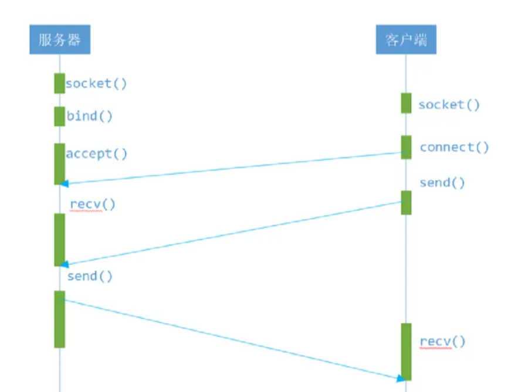

# socket+epoll封装 服务器/客户端举例


## 什么是高并发？




**高并发** 是一种系统运行过程中遇到的一种  **“短时间内遇到大量操作请求”** 的情况，主要发生在web系统集中大量访问收到大量请求。举个例子：12306的抢票情况；天猫双十一活动【突然下单一万张票，上万人下单购物】该情况发生会导致系统在这段时间内执行大量操作，例如，对资源的请求，数据库的操作等。


高并发的处理指标？

- 响应时间（Response Time）

系统对请求做出响应的时间，举个例子：系统处理一个HTTP请求需要200ms，这个200ms就是系统的响应时间。

- 吞吐量（Throughput）

含义：单位时间内处理的请求数量

- 每秒查询率QPS（Query Per Second）

含义 ：每秒响应请求数，在互联网领域，这个指标和吞吐量区分的没有这么明显。

- 并发用户数

含义：同时承载正常使用系统功能的用户数量，举个例子：例如一个即时通讯系统，同时在线量一定程度上代表了系统的并发用户数。


## 高并发和多线程的关系和区别？

**“高并发和多线程”**  总是被一起提起，给人感觉两者好像相等，实则   【**高并发 ≠ 多线程】**


**多线程**


- 多线程是java的特性，因为现在CPU都是多核多线程的，可以同时执行几个任务，为了提高jvm的执行效率，java提供了这种多线程的机制，以增强数据处理效率
- 多线程对应的是CPU，高并发对应的是访问请求，可以用单线程处理所有访问请求，也可以用多线程同时处理访问请求
- 在过去单CPU时代，单任务在一个时间点只能执行单一程序。之后发展到多任务阶段，计算机能在同一时间点并行执行多任务或多进程
- 虽然并不是真正意义上的 “同一时间点”，而是多个任务或进程共享一个CPU，并交由操作系统来完成多任务间对CPU的运行切换，以使得每个任务都有机会获得一定的时间片运行
- 再后来发展到多线程技术，使得在一个程序内部能拥有多个线程并行执行。一个线程的执行可以被认为是一个CPU在执行该程序。当一个程序运行在多线程下，就好像有多个CPU在同时执行该程序


**高并发**


- 高并发不是JAVA的专有的东西，是语言无关的广义的，为提供更好互联网服务而提出的概念
- 典型的场景：例如，12306抢火车票，天猫双十一秒杀活动等。该情况的发生会导致系统在这段时间内执行大量操作，例如对资源的请求，数据库的操作等。
- 如果高并发处理不好，不仅仅降低了用户的体验度（请求响应时间过长），同时可能导致系统宕机，严重的甚至导致OOM异常，系统停止工作等
- 如果，要想系统能够适应高并发状态，则需要从各个方面进行系统优化，包括，硬件、网络、系统架构、开发语言的选取、数据结构的运用、算法优化、数据库优化等，而多线程只是其中解决方法之一

## 搭建服务器/客户端

服务端代码，提供了四个类的封装。

- **地址类**  `CHostAddress`
- **socket基类**   `CBaseSocket`
- **TCP派生类**  `CTcpServer`
- **epoll类**  `CEpollServer`

- CHostAddress.h

```cpp
#pragma once
#include <sys/types.h>          
#include <sys/socket.h>
#include <netinet/in.h>
#include <string.h>
#include <arpa/inet.h>
 class CHostAddress;

class CHostAddress
{
public:
	CHostAddress(char* ip, unsigned short port);
	~CHostAddress();
 
 public:
	char* getIp();
	void setIp(char* ip);
	unsigned short getPort();
	void setPort(unsigned short port);
 
public:
	struct sockaddr_in getAddr_in();
	struct sockaddr* getAddr();
	int getLength();
 
private:
	char ip[16]; 
    unsigned short port; 
	int length; //保存 sockaddr_in 结构体长度
	struct sockaddr_in s_addr;
};

```

- CBaseSocket.h

```cpp
#pragma once
#include <sys/types.h>      
#include <sys/socket.h> 
#include <netinet/in.h>
#include <stdio.h>
 class CBaseSocket;
class CBaseSocket
{
public:
	CBaseSocket(char* ip, unsigned short port);
	~CBaseSocket();
	void Start();
	int getSocketFd();
	virtual bool Run() = 0;
	virtual void Stop() = 0;
 
protected:
	int socketFd;
 
};
```

- CTcpServer.h

```cpp
#pragma once
#include<iostream>
#include "CBaseSocket.h"
#include "CHostAddress.h"
#include <netinet/in.h>
#include <unistd.h>
#include <stdio.h>
#include <sys/types.h>        
#include <sys/socket.h>
using namespace std;
class CTcpServer; //TCP服务器

#define LISTEN_MAX_NUM 10   //最大连接Socket数量
class CTcpServer; 
class CTcpServer : public CBaseSocket
{
public:
    CTcpServer(char* ip, unsigned short port);
    ~CTcpServer();

public:
    bool Run();
    void Stop();

public:
    CHostAddress* getAddress(); //服务器主机地址（IP+端口）
    void setAddress(CHostAddress* address);
 
private:
    CHostAddress* address;//地址类
};
```

- CEpollServer.h

```cpp
#pragma once
#include <sys/epoll.h>
#include <iostream>
#include "CTcpServer.h"

#define EPOLL_SIZE 5
using namespace std;

class  CEpollServer; 
class CEpollServer
{
public:
	CEpollServer(char* ip, unsigned short port);
	~CEpollServer();
	void Start();
 
private:
	int epollfd;
	int epollwaitefd;
	int acceptFd;
	char buf[1024]; //存放客户端发来的消息
	struct epoll_event epollEvent;
	struct epoll_event epollEventArray[5];
	CTcpServer* tcp;
};
```

对应实现。

- CHostAddress.cpp

```cpp
#include "CHostAddress.h"
 
CHostAddress::CHostAddress(char* ip, unsigned short port)
{
    memset(this->ip, 0, sizeof(this->ip));
    strcpy(this->ip, ip);
    this->port = port;
    this->s_addr.sin_family = AF_INET; 
    this->s_addr.sin_port = htons(this->port); //指定服务端端口
    this->s_addr.sin_addr.s_addr = inet_addr(this->ip); //指定服务器指定网卡的IP 能用于通信。
    this->length = sizeof(this->s_addr);
}
CHostAddress::~CHostAddress()
{
 
}
char* CHostAddress::getIp()
{
    return this->ip;
}
void CHostAddress::setIp(char* ip)
{
    strcpy(this->ip, ip);
    this->s_addr.sin_addr.s_addr = inet_addr(this->ip);
}
unsigned short CHostAddress::getPort()
{
    return this->port;
}
void CHostAddress::setPort(unsigned short port)
{
    this->port = port;
    this->s_addr.sin_port = htons(this->port);
}
 
sockaddr_in CHostAddress::getAddr_in()
{
    return this->s_addr;
}
 
sockaddr* CHostAddress::getAddr()
{
    // bind函数需要用到struct sockaddr *，直接对sockaddr_in* 做强转
    return (struct sockaddr*)&(this->s_addr);
}
 
int CHostAddress::getLength()
{
    return this->length;
}
```

- CBaseSocket.cpp

```cpp
#include "CBaseSocket.h"
 
CBaseSocket::CBaseSocket(char* ip, unsigned short port)
{
	this->socketFd = 0;
}
 
CBaseSocket::~CBaseSocket()
{
}
 
void CBaseSocket::Start()
{

    //创建服务端的Socket
	this->socketFd = socket(AF_INET, SOCK_STREAM, 0);
	if (this->socketFd == -1)
	{
		perror("socket error");//socket创建失败
	}
	this->Run();
}
 
int CBaseSocket::getSocketFd()
{
	return this->socketFd;
}
```

- CTcpServer.cpp

```cpp
#include "CTcpServer.h"
 
CTcpServer::CTcpServer(char* ip, unsigned short port):CBaseSocket(ip, port)
{
    this->address = new CHostAddress(ip, port);
}
 
CTcpServer::~CTcpServer()
{
}
 
bool CTcpServer::Run()
{
    int opt_val = 1;
    int res = 0;
 
    //端口复用 解决出现 adress already use的问题
    res = setsockopt(this->socketFd, SOL_SOCKET, SO_REUSEADDR, (const void*)&opt_val, sizeof(opt_val));
    if (res == -1)
    {
        perror("setsockopt error");
        return false;
    }
    //绑定服务端的IP和端口
    res = bind(this->socketFd, this->address->getAddr(), this->address->getLength());
    if (res == -1)
    {
        perror("bind error");
        Stop();
        return false;
    }

    //将Socket设置为可连接（监听）的状态
    if(listen(this->socketFd, LISTEN_MAX_NUM) != 0)
    {
        perror("listen error");
        Stop();
        return false;

    }
    cout << "Server start success socketFd = " << this->socketFd << endl;
}
 
void CTcpServer::Stop()
{
    if (this->socketFd != 0)
    {
        close(this->socketFd);
        this->socketFd = 0;
    }
}
 
CHostAddress* CTcpServer::getAddress()
{
    return this->address;
}
 
void CTcpServer::setAddress(CHostAddress* address)
{
    this->address = address;
}
```

- CEpollServer.cpp

```cpp
#include "CEpollServer.h"
 
CEpollServer::CEpollServer(char* ip, unsigned short port)
{
	//初始化 TcpServer类
	this->tcp = new CTcpServer(ip, port);
	this->tcp->Start();
	cout << "socketFd = " << this->tcp->getSocketFd() << endl;
 
	//初始化数据成员
	this->epollfd = 0;
	this->epollwaitefd = 0;
	this->acceptFd = 0;
	bzero(this->buf, sizeof(this, buf));
 
	//事件结构体初始化
	bzero(&(this->epollEvent), sizeof(this->epollEvent));

	//绑定当前准备好的sockedfd（可用网络对象）
	this->epollEvent.data.fd = this->tcp->getSocketFd();
	
    //绑定事件为客户端接入事件
	this->epollEvent.events = EPOLLIN;

	//创建epoll
	this->epollfd = epoll_create(EPOLL_SIZE);
	
    //将已经准备好的网络描述符添加到epoll事件队列中
	epoll_ctl(this->epollfd, EPOLL_CTL_ADD, this->tcp->getSocketFd(), &(this->epollEvent));
}
 
CEpollServer::~CEpollServer()
{
}
 
void CEpollServer::Start()
{
	while (1)
	{
		cout << "epoll wait client" << endl;
		this->epollwaitefd = epoll_wait(this->epollfd, epollEventArray, EPOLL_SIZE, -1);
		if (this->epollwaitefd < 0)
		{
			perror("epoll wait error");
		}

		for (int i = 0; i < this->epollwaitefd; i++)
		{
			//判断是否有客户端上线
			if (epollEventArray[i].data.fd == this->tcp->getSocketFd())
			{
				cout << "网络_开始工作_等待客户端_上线" << endl;
				this->acceptFd = accept(this->tcp->getSocketFd(), NULL, NULL);
				cout << "acceptfd = " << this->acceptFd << endl;
 
				//上线的客户端描述符是acceptfd 绑定事件添加到epoll
				epollEvent.data.fd = this->acceptFd;
				epollEvent.events = EPOLLIN; //EPOLLIN表示对应的文件描述符可以读
				epoll_ctl(this->epollfd, EPOLL_CTL_ADD, this->acceptFd, &epollEvent);
			}
			else if (epollEventArray[i].events & EPOLLIN)
			{
				bzero(this->buf, sizeof(this->buf));
				int res = read(epollEventArray[i].data.fd, this->buf, sizeof(this->buf));
				if (res > 0)
				{
					cout << "服务器_收到 fd = " << epollEventArray[i].data.fd << "  送达数据: buf = " << this->buf << endl;
				}
				else if (res <= 0)
				{
					cout << "客户端 fd = " << epollEventArray[i].data.fd << " _掉线_" << endl;
					close(epollEventArray[i].data.fd);

					//从epoll中删除客户端描述符
					epollEvent.data.fd = epollEvent.data.fd;
					epollEvent.events = EPOLLIN;
					epoll_ctl(this->epollfd, EPOLL_CTL_DEL, epollEventArray[i].data.fd, &epollEvent);
				}
			}
		}
	}
}
```

### 客户端代码

- demo9.cpp

```cpp
//客户端代码
#include <iostream>
#include <cstdio>
#include <cstring>
#include <cstdlib>
#include <unistd.h>
#include <netdb.h>
#include <sys/types.h>
#include <sys/socket.h>
#include <arpa/inet.h>
 
using namespace std;
 
int main(int argc,char *argv[])
{

    if (argc!=3)
    {
        cout << "Using:./demo9 服务端的IP 服务端的端口\nExample:./demo9 192.168.28.132 12345\n\n"; 
        return -1;
    }

	int socketfd = 0;
	int acceptfd = 0;
	int len = 0;
	int res = 0;
	char buf[255] = { 0 };

    struct hostent* h;  
	struct sockaddr_in s_addr;


    //获取客户端的Socket
	socketfd = socket(AF_INET, SOCK_STREAM, 0);
	if (socketfd == -1)
	{
		perror("socket error"); 
        return -1;

	}

    if ( (h = gethostbyname(argv[1])) == 0 ) 
    {
         cout << "gethostbyname failed.\n" << endl; 
         close(socketfd); 
         return -1;
    }
	memset(&s_addr,0,sizeof(s_addr));
	s_addr.sin_family = AF_INET;
    memcpy(&s_addr.sin_addr,h->h_addr,h->h_length);  //注入服务端IP
	s_addr.sin_port = htons(atoi(argv[2]));    //注入服务端端口
 

    //向服务端发起连接请求
    if(connect(socketfd, (struct sockaddr*)&s_addr, sizeof(s_addr)) !=0)
    {
         perror("connect"); 
         close(socketfd); 
         return -1; 

    }
 
    //不断向服务端发送控制台输入的内容
	while (1)
	{
		cout << "请输入内容：" << endl;
		cin >> buf;
		write(socketfd, buf, sizeof(buf));
		bzero(buf, sizeof(buf));
			
	}
	
	return 0;
}
```

- demo10.cpp

```cpp
#include <iostream>
#include "CEpollServer.h"
 
using namespace std;
 
int main()
{
	CEpollServer* epoll = new CEpollServer("192.168.28.132", 12345);
	epoll->Start();
	return 0;
}
```

## 案例测试

```shell
[root@localhost my_learn_test]# g++ -o demo10 demo10.cpp CEpollServer.cpp CHostAddress.cpp CBaseSocket.cpp CTcpServer.cpp
demo10.cpp: In function ‘int main()’:
demo10.cpp:8:64: warning: ISO C++ forbids converting a string constant to ‘char*’ [-Wwrite-strings]
  CEpollServer* epoll = new CEpollServer("192.168.28.132", 12345);
                                                                ^
CTcpServer.cpp: In member function ‘virtual bool CTcpServer::Run()’:
CTcpServer.cpp:42:1: warning: control reaches end of non-void function [-Wreturn-type]
 }
 ^
[root@localhost my_learn_test]# ./demo10
Server start success socketFd = 3
socketFd = 3
epoll wait client
网络_开始工作_等待客户端_上线
acceptfd = 5
epoll wait client
网络_开始工作_等待客户端_上线
acceptfd = 6
epoll wait client
服务器_收到 fd = 6  送达数据: buf = zhangsan
epoll wait client
服务器_收到 fd = 5  送达数据: buf = jackson
epoll wait client


```

```shell
[root@localhost my_learn_test]# g++ -o demo9 demo9.cpp
[root@localhost my_learn_test]# ./demo9
Using:./demo9 服务端的IP 服务端的端口
Example:./demo9 192.168.28.132 12345

[root@localhost my_learn_test]# ./demo9 192.168.28.132 12345
请输入内容：
jackson
```

```shell
[root@localhost my_learn_test]# ./demo9 192.168.28.132 12345
请输入内容：
zhangsan                                              
```


